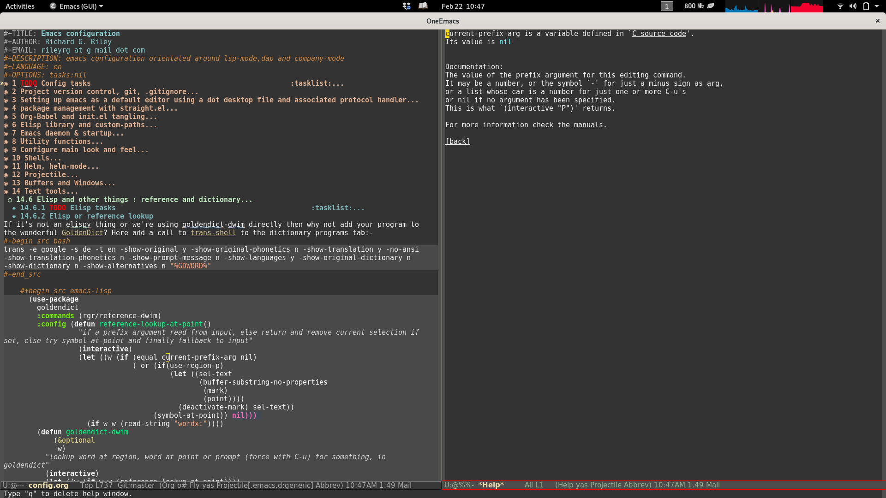
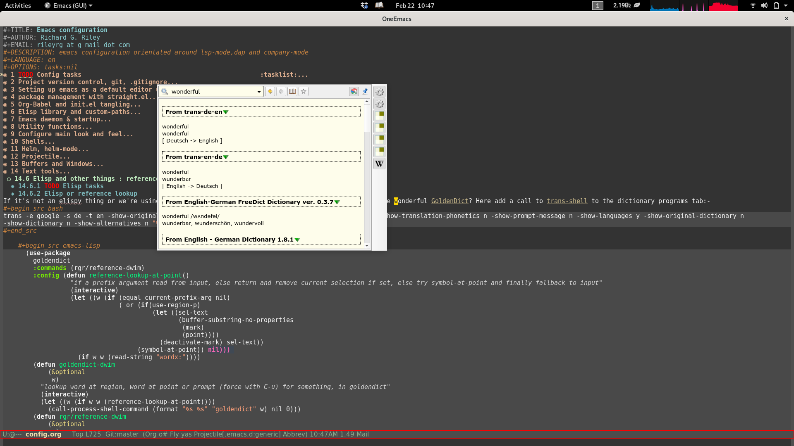

# Introduction

Emacs customisation generates [init.el](init.el) and other [emacs elisp utility files](etc/elisp/)  using [org-babel-tangle](https://orgmode.org/manual/Extracting-Source-Code.html).

## scratch

    (let ((foo "foo")
          (bar "bar"))
      (concat bar foo))

## Own libraries

These libraries are seperate stand alone github libraries.

### el-docstring-sap

Provides docstring help for symbol at point.

[https://github.com/rileyrg/el-docstring-sap](https://github.com/rileyrg/el-docstring-sap)

### lazy-lang-learn

A small "game" like utility that displays snippets to glance at. You can then
invoke google translate on them. Stores history.

<https://github.com/rileyrg/lazy-lang-learn>

# early stuff

## early-init.el

<https://www.gnu.org/software/emacs/manual/html_node/emacs/Early-Init-File.html>

    ;;; early-init.el --- early bird  -*- no-byte-compile: t -*-
    ;; Maintained in emacs-config.org
    (setq max-specpdl-size 13000)

### debug init utility function

    ;; look for a debug init file and load, trigger the debugger
    (defun debug-init (&optional fname)
      (let* ((fname (if fname fname "debug-init.el"))
             (debug-init (expand-file-name fname user-emacs-directory)))
        (if (file-exists-p debug-init)
            (progn
              (message "A debug-init, %s, was found, so loading." debug-init)
              (let ((rgr/debug-init-debugger t)) ;; can set rgr/debug-init-debugger to false in the debug init to avoid triggering the debugger
                (load-file debug-init)
                (if rgr/debug-init-debugger
                    (debug)
                  (message " After loading %s `rgr/debug-init-debugger was set to nil so not debugging." debug-init))))
          (message "No debug initfile, %s, found so ignoring" debug-init))))

### straight.el package management

[straight.el](https://github.com/raxod502/straight.el#features): next-generation, purely functional package manager for the Emacs hacker.

    
    (setq package-enabled-at-startup nil)
    
    (defvar bootstrap-version)
    
    (defvar bootstrap-version)
    (let ((bootstrap-file
           (expand-file-name "straight/repos/straight.el/bootstrap.el" user-emacs-directory))
          (bootstrap-version 6))
      (unless (file-exists-p bootstrap-file)
        (with-current-buffer
            (url-retrieve-synchronously
             "https://raw.githubusercontent.com/radian-software/straight.el/develop/install.el"
             'silent 'inhibit-cookies)
          (goto-char (point-max))
          (eval-print-last-sexp)))
      (load bootstrap-file nil 'nomessage))
    
    (straight-use-package `(use-package ,@(when (>= emacs-major-version 29) '(:type built-in))))
    
    (use-package straight
      :custom
      (straight-use-package-by-default t)
      (straight-vc-git-default-protocol 'ssh))
    
    (use-package notifications
      :demand t
      :config
      (notifications-notify
       :title "Emacs"
       :body " ... is starting up..."))
    
    (use-package no-littering
      :init
      (setq backup-directory-alist
        `(("." . ,(no-littering-expand-var-file-name "backup/"))))
      (when (boundp 'native-comp-eln-load-path)
        (startup-redirect-eln-cache (no-littering-expand-var-file-name "eln-cache"))))
    
    
    ;;; early-init.el ends here

## custom.el

    (setq custom-file  (expand-file-name  "custom.el" user-emacs-directory)) ;;
    (load custom-file 'noerror)

## debug init

    (debug-init)

# config

## post straight debug init

Here can load a "bare bones" init. When hit debug can "c" to continue or "q" to abort.

    ;; look for a debug init file and load, trigger the debugger
    (debug-init "debug-init-straight.el")

## Paths

### Path to our own elisp

    (defvar elisp-dir (expand-file-name "elisp" no-littering-etc-directory) "my elisp directory. directories are recursively added to path.")
    (add-to-list 'load-path elisp-dir)
    (let ((default-directory elisp-dir))
      (normal-top-level-add-subdirs-to-load-path))

## Load early stuff / gpg

Load all files in certain directories.

    (defun load-el-gpg (load-dir)
      (message "attempting mass load from %s." load-dir)
      (when (file-exists-p load-dir)
        (dolist (f (directory-files-recursively load-dir "\.[el|gpg]$"))
          (condition-case nil
              (progn
                (message "load-el-gpg loading %s" f)
                (load f 'no-error))
            (error nil)))))
    (load-el-gpg (no-littering-expand-etc-file-name "early-load"))

## host specific

Stick a custom in here. eg my thinkpad [custom file](./etc/hosts/thinkpadx270/custom.el).

    (load-el-gpg (expand-file-name (system-name)  (no-littering-expand-etc-file-name "hosts")))

## Security

    (require 'rgr/security "rgr-security" 'NOERROR)

### rgr-security library

1.  Auth-Sources, get-auth-info

    Let emacs take care of security things automagically.
    example:
    
        (setq passw (get-auth-info "licenses" "my-auth-token"))
    
        (require 'transient)
        (require 'auth-source)
        (defun get-auth-info (host user &optional port)
          "Interface to `auth-source-search' to fetch a secret for the HOST and USER."
          (let* ((info (nth 0 (auth-source-search
                               :host host
                               :user user
                               :port port
                               :require '(:user :secret)
                               :create nil)))
                 (secret (plist-get info :secret)))
            (if (functionp secret)
                (funcall secret)
              secret)))

2.  1password

        (use-package auth-source-1password
          :config
          (auth-source-1password-enable))

3.  Pass

    Uses the unix command line `pass` utility. Can be used via `process-lines`  e.g
    
        (car (process-lines "pass" "Chat/slack-api-token"))
    
        (use-package pass)

4.  provide

        (provide 'rgr/security)

## Utilities

Raw: [rgr-utils](etc/elisp/rgr-utils.el).

    (require 'rgr/utils "rgr-utils" 'NOERROR)

### rgr-utils library

1.  linux journal utility

    <https://github.com/SebastianMeisel/journalctl-mode>
    This Emacs major mode is designed for viewing the output from systemd’s journalctl within Emacs. It provides a convenient way to interact with journalctl logs, including features like fontification, chunked loading for performance, and custom keyword highlighting.
    
        (use-package journalctl-mode
        :ensure t)

2.  thing at point or region or input

        (defun rgr/region-symbol-query()
          "if a prefix argument (4)(C-u) read from input, else if we have a region select then return that and deselect the region, else try symbol-at-point and finally fallback to input"
          (let* ((w (if (or  (not current-prefix-arg) (not (listp current-prefix-arg)))
                        (if(use-region-p)
                            (let ((sel-text
                                   (buffer-substring-no-properties
                                    (mark)
                                    (point))))
                              sel-text)
                          (thing-at-point 'symbol)) nil))
                 (result (if w w (read-string "lookup:"))))
            result))

3.  read and write elisp vars to file

        
        (defun rgr/elisp-write-var (f v)
          (with-temp-file f
            (prin1 v (current-buffer))))
        
        (defun rgr/elisp-read-var (f)
          (with-temp-buffer
            (insert-file-contents f)
            (cl-assert (eq (point) (point-min)))
            (read (current-buffer))))

4.  provide

        (provide 'rgr/utils)

## Emacs startup

Load up the daemon if not loaded, amongst other things.

Raw: [rgr/startup](etc/elisp/rgr-startup.el)

    (require 'rgr/startup "rgr-startup" 'NOERROR)

### rgr-startup library

1.  persistence  and history

    \#+begin\_src emacs-lisp
      (use-package emacs
    
    :bind
    (("C-c x" . rgr/quit-or-close-emacs))
    
    :init
    
    (recentf-mode 1)
    (savehist-mode 1)
    (save-place-mode 1)
    
    (defun rgr/quit-or-close-emacs(&optional kill)
      (interactive)
      (if (or current-prefix-arg kill)
          (rgr/server-shutdown)
        (delete-frame)))
    
    (defun rgr/server-shutdown ()
      "Save buffers, Quit, and Shutdown (kill) server"
      (interactive)
      (clean-buffer-list)
      ;;(savehist-save)
      (save-buffers-kill-emacs))
    
    )

2.  rest of startup

        (provide 'rgr/startup)

## Minibuffer Enrichment (search, sudo edit&#x2026;)

Various plugins for minibuffer enrichment

Raw: [rgr/minibuffer](etc/elisp/rgr-minibuffer.el)

    (require 'rgr/minibuffer "rgr-minibuffer" 'NOERROR)

### library

1.  [TRAMP](https://www.emacswiki.org/emacs/TrampMode) (Transparent Remote Access, Multiple Protocols)

    is a package for editing remote files, similar to AngeFtp or efs. Whereas the others use FTP to connect to the remote host and to transfer the files, TRAMP uses a remote shell connection (rlogin, telnet, ssh). It can transfer the files using rcp or a similar program, or it can encode the file contents (using uuencode or base64) and transfer them right through the shell connection.
    
        ;;(require 'tramp)
        ;; (use-package tramp
        ;;   :custom
        ;;   (tramp-default-method "ssh")
        ;;   )

2.  file opening

    1.  read only by default
    
        Increasingly editing by mistake. Can use [read-only-mode](read-only-mode) to edit it.
        
            (defun maybe-read-only-mode()
              (when (cond ((eq major-mode 'org-mode) t))
                (message "Setting readonly mode for %s buffer" major-mode)
                (read-only-mode +1)))
                                                    ;(add-hook 'find-file-hook 'maybe-read-only-mode)
    
    2.  [sudo-edit](https://github.com/nflath/sudo-edit) Priviliged file editing
    
            (use-package sudo-edit)
    
    3.  find file at point
    
            (use-package ffap
              :custom
              (ffap-require-prefix nil)
              :init
              (ffap-bindings)
              (defun rgr/ffap()
                (interactive)
                (let ((url (ffap-url-at-point)))
                  (if (and url current-prefix-arg)
                      (browse-url-generic url)
                    (call-interactively 'find-file-at-point))))
              :bind
              ( "C-x C-f" . rgr/ffap))

3.  [Prescient](https://github.com/raxod502/prescient.el) provides sorting and filtering.

    Disabled as I cant get my head around it. It doesnt seem to do much thats important to me
    that corfu and orderless and vertico do. Corfu and vertico already do recency ordering.
    
        (use-package prescient )

4.  Consult

    Consult]] Provides various commands based on the Emacs completion function completing-read
    
    :ID:       ec5375c7-4387-42a1-8938-5fad532be79b
    
        ;; Example configuration for Consult
        (use-package consult
          ;; Replace bindings. Lazily loaded due by `use-package'.
          :bind (;; C-c bindings (mode-specific-map)
                 ("C-c M-x" . consult-mode-command)
                 ("C-c h" . consult-history)
                 ("C-c k" . consult-kmacro)
                 ("C-c m" . consult-man)
                 ("C-c i" . consult-info)
                 ([remap Info-search] . consult-info)
                 ;; C-x bindings (ctl-x-map)
                 ("C-x M-:" . consult-complex-command)     ;; orig. repeat-complex-command
                 ("C-x b" . consult-buffer)                ;; orig. switch-to-buffer
                 ("C-x 4 b" . consult-buffer-other-window) ;; orig. switch-to-buffer-other-window
                 ("C-x 5 b" . consult-buffer-other-frame)  ;; orig. switch-to-buffer-other-frame
                 ("C-x r b" . consult-bookmark)            ;; orig. bookmark-jump
                 ("C-x p b" . consult-project-buffer)      ;; orig. project-switch-to-buffer
                 ;; Custom M-# bindings for fast register access
                 ("M-#" . consult-register-load)
                 ("M-'" . consult-register-store)          ;; orig. abbrev-prefix-mark (unrelated)
                 ("C-M-#" . consult-register)
                 ;; Other custom bindings
                 ("M-y" . consult-yank-pop)                ;; orig. yank-pop
                 ;; M-g bindings (goto-map)
                 ("M-g e" . consult-compile-error)
                 ("M-g f" . consult-flymake)               ;; Alternative: consult-flycheck
                 ("M-g g" . consult-goto-line)             ;; orig. goto-line
                 ("M-g M-g" . consult-goto-line)           ;; orig. goto-line
                 ("M-g o" . consult-outline)               ;; Alternative: consult-org-heading
                 ("M-g m" . consult-mark)
                 ("M-g k" . consult-global-mark)
                 ("M-g i" . consult-imenu)
                 ("M-g I" . consult-imenu-multi)
                 ;; M-s bindings (search-map)
                 ("M-s d" . consult-find)
                 ("M-s D" . consult-locate)
                 ("M-s G" . consult-grep)
                 ("M-s g" . consult-git-grep)
                 ("M-s r" . consult-ripgrep)
                 ("M-s l" . consult-line)
                 ("M-s L" . consult-line-multi)
                 ("M-s k" . consult-keep-lines)
                 ("M-s u" . consult-focus-lines)
                 ;; Isearch integration
                 ("M-s e" . consult-isearch-history)
                 :map isearch-mode-map
                 ("M-e" . consult-isearch-history)         ;; orig. isearch-edit-string
                 ("M-s e" . consult-isearch-history)       ;; orig. isearch-edit-string
                 ("M-s l" . consult-line)                  ;; needed by consult-line to detect isearch
                 ("M-s L" . consult-line-multi)            ;; needed by consult-line to detect isearch
                 ;; Minibuffer history
                 :map minibuffer-local-map
                 ("M-s" . consult-history)                 ;; orig. next-matching-history-element
                 ("M-r" . consult-history))                ;; orig. previous-matching-history-element
        
          ;; Enable automatic preview at point in the *Completions* buffer. This is
          ;; relevant when you use the default completion UI.
          :hook (completion-list-mode . consult-preview-at-point-mode)
        
          ;; The :init configuration is always executed (Not lazy)
          :init
        
          ;; Optionally configure the register formatting. This improves the register
          ;; preview for `consult-register', `consult-register-load',
          ;; `consult-register-store' and the Emacs built-ins.
          (setq register-preview-delay 0.5
                register-preview-function #'consult-register-format)
        
          ;; Optionally tweak the register preview window.
          ;; This adds thin lines, sorting and hides the mode line of the window.
          (advice-add #'register-preview :override #'consult-register-window)
        
          ;; Use Consult to select xref locations with preview
          (setq xref-show-xrefs-function #'consult-xref
                xref-show-definitions-function #'consult-xref)
        
          ;; Configure other variables and modes in the :config section,
          ;; after lazily loading the package.
          :config
        
          ;; Optionally configure preview. The default value
          ;; is 'any, such that any key triggers the preview.
          ;; (setq consult-preview-key 'any)
          ;; (setq consult-preview-key "M-.")
          ;; (setq consult-preview-key '("S-<down>" "S-<up>"))
          ;; For some commands and buffer sources it is useful to configure the
          ;; :preview-key on a per-command basis using the `consult-customize' macro.
          (consult-customize
           consult-theme :preview-key '(:debounce 0.2 any)
           consult-ripgrep consult-git-grep consult-grep
           consult-bookmark consult-recent-file consult-xref
           consult--source-bookmark consult--source-file-register
           consult--source-recent-file consult--source-project-recent-file
           ;; :preview-key "M-."
           :preview-key '(:debounce 0.4 any))
        
          ;; Optionally configure the narrowing key.
          ;; Both < and C-+ work reasonably well.
          (setq consult-narrow-key "<") ;; "C-+"
        
          ;; Optionally make narrowing help available in the minibuffer.
          ;; You may want to use `embark-prefix-help-command' or which-key instead.
          ;; (define-key consult-narrow-map (vconcat consult-narrow-key "?") #'consult-narrow-help)
        
          ;; By default `consult-project-function' uses `project-root' from project.el.
          ;; Optionally configure a different project root function.
          ;;;; 1. project.el (the default)
          ;; (setq consult-project-function #'consult--default-project--function)
          ;;;; 2. vc.el (vc-root-dir)
          ;; (setq consult-project-function (lambda (_) (vc-root-dir)))
          ;;;; 3. locate-dominating-file
          ;; (setq consult-project-function (lambda (_) (locate-dominating-file "." ".git")))
          ;;;; 4. projectile.el (projectile-project-root)
          ;; (autoload 'projectile-project-root "projectile")
          ;; (setq consult-project-function (lambda (_) (projectile-project-root)))
          ;;;; 5. No project support
          ;; (setq consult-project-function nil)
          :config
          (use-package company-prescient
            :disabled
            )
          )
    
    1.  consult-dash
    
            (use-package consult-dash
              :straight (consult-dash :local-repo "~/development/projects/emacs/consult-dash" :type git :host codeberg :repo "ravi/consult-dash" )
              :bind (("M-s d" . consult-dash))
              :config
              ;; Use the symbol at point as initial search term
              (consult-customize consult-dash :initial (thing-at-point 'symbol)))

5.  [Embark](https://github.com/oantolin/embark) Emacs Mini-Buffer Actions Rooted in Keymaps

        (use-package embark
          :ensure t
        
          :bind
          (("C-." . embark-act)         ;; pick some comfortable binding
           ("C-;" . embark-dwim)        ;; good alternative: M-.
           ("C-h B" . embark-bindings)) ;; alternative for `describe-bindings'
        
          :init
        
          ;; Optionally replace the key help with a completing-read interface
          (setq prefix-help-command #'embark-prefix-help-command)
        
          ;; Show the Embark target at point via Eldoc.  You may adjust the Eldoc
          ;; strategy, if you want to see the documentation from multiple providers.
          ;;(add-hook 'eldoc-documentation-functions #'embark-eldoc-first-target)
          ;; (setq eldoc-documentation-strategy #'eldoc-documentation-compose-eagerly)
        
          :config
        
          ;; Hide the mode line of the Embark live/completions buffers
          (add-to-list 'display-buffer-alist
                       '("\\`\\*Embark Collect \\(Live\\|Completions\\)\\*"
                         nil
                         (window-parameters (mode-line-format . none)))))
    
    1.  embark-consult
    
            ;; Consult users will also want the embark-consult package.
            (use-package embark-consult
              :ensure t ; only need to install it, embark loads it after consult if found
              :hook
              (embark-collect-mode . consult-preview-at-point-mode))

6.  [Marginalia](https://en.wikipedia.org/wiki/Marginalia) margin annotations for info on line

    are marks or annotations placed at the margin of the page of a book or in this case helpful colorful annotations placed at the margin of the minibuffer for your completion candidates
    
    :ID:       f3802197-c745-40b2-ac0d-72d7da291aaf
    
        ;; Enable rich annotations using the Marginalia package
        (use-package marginalia
          ;; Bind `marginalia-cycle' locally in the minibuffer.  To make the binding
          ;; available in the *Completions* buffer, add it to the
          ;; `completion-list-mode-map'.
          :bind (:map minibuffer-local-map
                      ("M-A" . marginalia-cycle))
        
          ;; The :init section is always executed.
          :init
        
          ;; Marginalia must be activated in the :init section of use-package such that
          ;; the mode gets enabled right away. Note that this forces loading the
          ;; package.
          (marginalia-mode))

7.  all-the-icons

    Remember to run **all-the-icons-install-fonts**.
    
        (use-package all-the-icons
          :demand
          :after (marginalia)
          :config
          (use-package all-the-icons-completion
            :init (all-the-icons-completion-mode))
          (use-package all-the-icons-dired
            :config
            (add-hook 'dired-mode-hook 'all-the-icons-dired-mode))
          :hook (marginalia-mode . all-the-icons-completion-marginalia-setup))

8.  [affe](https://github.com/minad/affe) Asynchronous Fuzzy Finder for Emacs

        (use-package affe
          :disabled
          :after orderless
          :config
          ;; Configure Orderless
          (setq affe-regexp-function #'orderless-pattern-compiler
                affe-highlight-function #'orderless--highlight)
        
          ;; Manual preview key for `affe-grep'
          (consult-customize affe-grep :preview-key (kbd "M-.")))

9.  provide

        (provide 'rgr/minibuffer)

## Completion

Let emacs suggest completions

Raw:[rgr/completion](etc/elisp/rgr-completion.el)

    (require 'rgr/completion "rgr-completion" 'NOERROR)

### rgr-completion library

1.  Which Key

    [which-key](https://github.com/justbur/emacs-which-key) shows you what further key options you have if you pause on a multi key command.
    
        (use-package
          which-key
          :demand t
          :config (which-key-mode))

2.  Yasnippet

    [YASnippet](https://github.com/joaotavora/yasnippet)  is a template system for Emacs.
    
        (use-package yasnippet
          :config
          (use-package yasnippet-snippets)
          (yas-global-mode))

3.  Abbrev Mode

    [Abbrev Mode](https://www.emacswiki.org/emacs/AbbrevMode#toc4) is very useful for expanding small text snippets
    
        (setq-default abbrev-mode 1)

4.  company

        (use-package company
          ;;:disabled
          :config
          (use-package company-box
            :config
            (setf (alist-get 'internal-border-width company-box-doc-frame-parameters) 1)
            :hook (company-mode . company-box-mode))
          :bind( :map company-mode-map
                 ("<tab>" .  company-indent-or-complete-common))
          :hook
          (prog-mode . company-mode))

5.  [Orderless](https://github.com/oantolin/orderless) provides an orderless completion style that divides the pattern into space-separated components

        (use-package orderless
          :init
          ;; Tune the global completion style settings to your liking!
          ;; This affects the minibuffer and non-lsp completion at point.
          (setq completion-styles '(
                                    orderless
                                    ;;partial-completion
                                    basic)
                completion-category-defaults nil
                completion-category-overrides nil);;'((file (styles partial-completion))))
          ;; A few more useful configurations...
          (use-package emacs
            :init
            ;; Add prompt indicator to `completing-read-multiple'.
            ;; We display [CRM<separator>], e.g., [CRM,] if the separator is a comma.
            (defun crm-indicator (args)
              (cons (format "[CRM%s] %s"
                            (replace-regexp-in-string
                             "\\`\\[.*?]\\*\\|\\[.*?]\\*\\'" ""
                             crm-separator)
                            (car args))
                    (cdr args)))
            (advice-add #'completing-read-multiple :filter-args #'crm-indicator)
        
            ;; Do not allow the cursor in the minibuffer prompt
            (setq minibuffer-prompt-properties
                  '(read-only t cursor-intangible t face minibuffer-prompt))
            (add-hook 'minibuffer-setup-hook #'cursor-intangible-mode)
        
            ;; Emacs 28: Hide commands in M-x which do not work in the current mode.
            ;; Vertico commands are hidden in normal buffers.
            ;; (setq read-extended-command-predicate
            ;;       #'command-completion-default-include-p)
        
            ;; Enable recursive minibuffers
            (setq enable-recursive-minibuffers t)))

6.  corfu

        (use-package corfu
          :disabled
          ;; Optional customizations
          :custom
          ;; (corfu-cycle t)                ;; Enable cycling for `corfu-next/previous'
          (corfu-auto t)                 ;; Enable auto completion
          (corfu-separator ?\s)          ;; Orderless field separator
          ;;(corfu-quit-at-boundary nil)   ;; Never quit at completion boundary
          ;; (corfu-quit-no-match nil)      ;; Never quit, even if there is no match
          (corfu-preview-current t)    ;; Disable current candidate preview
          ;; (corfu-preselect 'prompt)      ;; Preselect the prompt
          ;; (corfu-on-exact-match nil)     ;; Configure handling of exact matches
          ;; (corfu-scroll-margin 5)        ;; Use scroll margin
        
          ;; Enable Corfu only for certain modes.
          ;; :hook ((prog-mode . corfu-mode)
          ;;        (shell-mode . corfu-mode)
          ;;        (eshell-mode . corfu-mode))
        
          ;; Recommended: Enable Corfu globally.
          ;; This is recommended since Dabbrev can be used globally (M-/).
          ;; See also `corfu-exclude-modes'.
          :straight (:files (:defaults "extensions/*"))
          :init
          (use-package lsp-mode
            :custom
            (lsp-completion-provider :none) ;; we use Corfu!
            :init
            (defun my/lsp-mode-setup-completion ()
              (setf (alist-get 'styles (alist-get 'lsp-capf completion-category-defaults))
                    '(orderless)))
        
            :hook
            (lsp-completion-mode . my/lsp-mode-setup-completion))
          :config
          (use-package corfu-prescient :disabled)
          (corfu-popupinfo-mode)
          (global-corfu-mode)
          :hook
          (corfu-mode . (lambda()
                          (setq-local completion-at-point-functions (delete 'tags-completion-at-point-function completion-at-point-functions))
                          (setq-local completion-at-point-functions (delete 't completion-at-point-functions))
                          )))
        
        
          ;; A few more useful configurations...
          (use-package emacs
            :init
            ;; TAB cycle if there are only few candidates
            (setq completion-cycle-threshold 3)
        
            ;; Emacs 28: Hide commands in M-x which do not apply to the current mode.
            ;; Corfu commands are hidden, since they are not supposed to be used via M-x.
            ;; (setq read-extended-command-predicate
            ;;       #'command-completion-default-include-p)
        
            ;; Enable indentation+completion using the TAB key.
            ;; `completion-at-point' is often bound to M-TAB.
            (setq tab-always-indent 'complete))
    
    1.  cape
    
            ;; Add extensions
            (use-package cape
              :disabled
              ;; Bind dedicated completion commands
              ;; Alternative prefix keys: C-c p, M-p, M-+, ...
              :bind (("C-c p p" . completion-at-point) ;; capf
                     ("C-c p t" . complete-tag)        ;; etags
                     ("C-c p d" . cape-dabbrev)        ;; or dabbrev-completion
                     ("C-c p h" . cape-history)
                     ("C-c p f" . cape-file)
                     ("C-c p k" . cape-keyword)
                     ("C-c p s" . cape-symbol)
                     ("C-c p a" . cape-abbrev)
                     ("C-c p l" . cape-line)
                     ("C-c p w" . cape-dict)
                     ("C-c p \\" . cape-tex)
                     ("C-c p _" . cape-tex)
                     ("C-c p ^" . cape-tex)
                     ("C-c p &" . cape-sgml)
                     ("C-c p r" . cape-rfc1345))
              :init
              ;; Add `completion-at-point-functions', used by `completion-at-point'.
              ;; NOTE: The order matters!
              (add-to-list 'completion-at-point-functions #'cape-dabbrev)
              (add-to-list 'completion-at-point-functions #'cape-file)
              (add-to-list 'completion-at-point-functions #'cape-elisp-block)
              (advice-add 'lsp-completion-at-point :around #'cape-wrap-buster)
              (advice-add 'lsp-completion-at-point :around #'cape-wrap-noninterruptible)
              (advice-add 'eglot-completion-at-point :around #'cape-wrap-buster)
              (advice-add 'eglot-completion-at-point :around #'cape-wrap-noninterruptible)
            
              ;;(add-to-list 'completion-at-point-functions #'cape-history)
              ;;(add-to-list 'completion-at-point-functions #'cape-keyword)
              ;;(add-to-list 'completion-at-point-functions #'cape-tex)
              ;;(add-to-list 'completion-at-point-functions #'cape-sgml)
              ;;(add-to-list 'completion-at-point-functions #'cape-rfc1345)
              ;;(add-to-list 'completion-at-point-functions #'cape-abbrev)
              ;;(add-to-list 'completion-at-point-functions #'cape-dict)
              ;;(add-to-list 'completion-at-point-functions #'cape-symbol)
              ;;(add-to-list 'completion-at-point-functions #'cape-line)
              )

7.  dabbrev

        ;; Use Dabbrev with Corfu!
        (use-package dabbrev
          ;; Swap M-/ and C-M-/
          :bind (("M-/" . dabbrev-completion)
                 ("C-M-/" . dabbrev-expand))
          ;; Other useful Dabbrev configurations.
          :custom
          (dabbrev-ignored-buffer-regexps '("\\.\\(?:pdf\\|jpe?g\\|png\\)\\'")))

8.  vertical completion

        ;;(fido-vertical-mode t)

9.  vertico , vertical interactive completion

    <https://github.com/minad/vertico>
    
        ;; Enable vertico
        (use-package vertico
          ;;:disabled
          :custom
          (vertico-cycle t)
          :config
          (use-package vertico-prescient
            :disabled
            :init (vertico-prescient-mode)
            :custom
            (vertico-prescient-enable-sorting nil))
          :init
          (vertico-mode))

10. Abbrev Mode

    [Abbrev Mode](https://www.emacswiki.org/emacs/AbbrevMode#toc4) is very useful for expanding small text snippets
    
        (setq-default abbrev-mode 1)

11. provide

        (provide 'rgr/completion)

## bookmarks

### bookmark+

    (use-package bookmark+
      ;;:disabled
      :custom
      (bmkp-last-as-first-bookmark-file (no-littering-expand-var-file-name "bmkp/current-bookmark.el.gpg"))
      :demand)

1.  look into why bmkp store org link doesnt work

## Org functionality

General org-mode config

Raw: [rgr/org](etc/elisp/rgr-org.el)

    (require 'rgr/org "rgr-org" 'NOERROR)

### org library

1.  Org Mode, org-mode

        
        (use-package org
          :demand t
          :custom
          (org-agenda-files (no-littering-expand-etc-file-name "org/agenda-files.txt"))
          (org-fontify-done-headline t)
          (org-fontify-todo-headline t)
          (org-babel-default-header-args:python
           '((:results  . "output")))
          (org-refile-use-outline-path 'file)
          (org-outline-path-complete-in-steps nil)
          :config
          (set-face-attribute 'org-headline-done nil :strike-through t)
          (defun rgr/org-agenda (&optional arg)
            (interactive "P")
            (let ((org-agenda-tag-filter-preset '("-trash")))
              (org-agenda arg "a")))
          :bind
          ("C-c a" . org-agenda)
          ("C-c A" . rgr/org-agenda)
          ("C-c c" . org-capture)
          ("C-c l" . org-store-link)
          ("C-c C-l" . org-insert-link)
          ("C-c C-s" . org-schedule)
          ("C-c C-t" . org-todo)
          (:map org-mode-map  ("M-." . find-function-at-point)
                ))
    
    1.  org-contrib
    
            (use-package org-contrib)
    
    2.  org-id
    
        create unique link IDs when sharing a link to an org section
        
            (require 'org-id)
    
    3.  crypt
    
            (require 'org-crypt)
            (org-crypt-use-before-save-magic)
    
    4.  async babel blocks
    
            (use-package ob-async)
    
    5.  org-super-agenda
    
            (use-package org-super-agenda
              :custom
              (org-super-agenda-groups
               '(;; Each group has an implicit boolean OR operator between its selectors.
                 (:name "Today"  ; Optionally specify section name
                        :time-grid t  ; Items that appear on the time grid
                        :todo "TODAY")  ; Items that have this TODO keyword
                 (:name "Important"
                        ;; Single arguments given alone
                        :tag "bills"
                        :priority "A")
                 ;; Set order of multiple groups at once
                 (:order-multi (2 (:name "home"
                                         ;; Boolean AND group matches items that match all subgroups
                                         :and (:tag "@home"))
                                  (:name "caravan"
                                         ;; Boolean AND group matches items that match all subgroups
                                         :and (:tag "@caravan"))
                                  (:name "shopping all"
                                         ;; Boolean AND group matches items that match all subgroups
                                         :and (:tag "shopping" :not (:tag "@home @caravan")))
                                  (:name "shopping"
                                         ;; Boolean AND group matches items that match all subgroups
                                         :and (:tag "shopping" :not (:tag "@home @caravan")))
                                  (:name "Emacs related"
                                         ;; Boolean AND group matches items that match all subgroups
                                         :tag ("emacs"))
                                  (:name "Linux related"
                                         :and (:tag ("linux") :not (:tag "emacs")))
                                  (:name "Programming related"
                                         :and (:tag ("programming") :not (:tag "emacs")))
                                  (:name "Food-related"
                                         ;; Multiple args given in list with implicit OR
                                         :tag ("food" "dinner" "lunch" "breakfast"))
                                  (:name "Personal"
                                         :habit t
                                         :tag "personal")
                                  ))
                 ;; Groups supply their own section names when none are given
                 (:todo "WAITING" :order 8)  ; Set order of this section
                 (:todo "STARTED" :order 8)
                 (:todo ("SOMEDAY" "TOREAD" "CHECK" "TO-WATCH" "WATCHING")
                        ;; Show this group at the end of the agenda (since it has the
                        ;; highest number). If you specified this group last, items
                        ;; with these todo keywords that e.g. have priority A would be
                        ;; displayed in that group instead, because items are grouped
                        ;; out in the order the groups are listed.
                        :order 9)
                 (:priority<= "B"
                              ;; Show this section after "Today" and "Important", because
                              ;; their order is unspecified, defaulting to 0. Sections
                              ;; are displayed lowest-number-first.
                              :order 1)
                 ;; After the last group, the agenda will display items that didn't
                 ;; match any of these groups, with the default order position of 99
                 ))
              :init
              (org-super-agenda-mode))
    
    6.  github compliant markup
    
            (use-package
              ox-gfm
              :demand)

2.  provide

        (provide 'rgr/org)

3.  org agenda files

    See `org-agenda-files` [org-agenda-files](#org0b957ca)
    maintain a file pointing to agenda sources : NOTE, NOT tangled. ((no-littering-expand-etc-file-name "org/agenda-files.txt"))
    
        ~/.emacs.d/var/org/orgfiles
        ~/.emacs.d/var/org/orgfiles/journals
        ~/.emacs.d/var/org/orgfiles/projects
        ~/development/education/lessons
        ~/development/education/lessons/bash
        ~/development/education/lessons/python
        ~/development/education/lessons/python/coreyschafer
        ~/development/education/lessons/python/python-lernen.de
        ~/development/education/lessons/elisp

## Lazy Language Learning, lazy-lang-learn

    (use-package lazy-lang-learn
      :straight (lazy-lang-learn :local-repo "~/development/projects/emacs/lazy-lang-learn" :type git :host github :repo "rileyrg/lazy-lang-learn" )
      :bind
      ("C-c L" . lazy-lang-learn-mode)
      ("<f12>" . lazy-lang-learn-translate)
      ("S-<f12>" . lazy-lang-learn-translate-from-history))

## General configuration

Raw: [rgr/general-config](etc/elisp/rgr-general-config.el).

    (require  'rgr/general-config "rgr-general-config" 'NOERROR)

### library

1.  General

    1.  a - unfiled
    
            (require 'iso-transl) ;; supposed to cure deadkeys when my external kbd is plugged into my thinkpad T44460.  It doesnt.
                                                    ; t60
            (scroll-bar-mode -1)
            (tool-bar-mode -1)
            (menu-bar-mode -1)
            (show-paren-mode 1)
            (winner-mode 1)
            
            (global-auto-revert-mode 1)
            ;; Also auto refresh dired, but be quiet about it
            (setq global-auto-revert-non-file-buffers t)
            (setq auto-revert-verbose nil)
            
            (global-visual-line-mode 1)
            
            (setq column-number-mode t)
            
            (delete-selection-mode 1)
            
            (global-set-key (kbd "S-<f1>") 'describe-face)
            (global-set-key (kbd "M-m") 'manual-entry)
            
            (global-set-key (kbd "S-<f10>") #'menu-bar-open)
                                                    ;          (global-set-key (kbd "<f10>") #'imenu)
            
            
            (setq frame-title-format (if (member "-chat" command-line-args)  "Chat: %b" '("%b@" (:eval (or (file-remote-p default-directory 'host) system-name)) " — Emacs")))
            
            (defalias 'yes-or-no-p 'y-or-n-p)
            
            (setq disabled-command-function nil)
            
            (global-hl-line-mode t)
            
            (use-package
              browse-url-dwim)
            
            ;; display dir name when core name clashes
            (require 'uniquify)
            
            (add-to-list 'Info-directory-list (expand-file-name "info" user-emacs-directory)) ;; https://www.emacswiki.org/emacs/ExternalDocumentation
            
            
            (global-set-key (kbd "C-c r") 'query-replace-regexp)
    
    2.  beacon
    
        visual feedback as to cursor position
        
            (use-package beacon
              :custom
              (beacon-blink-delay 1)
              (beacon-size 10)
              (beacon-color "orange" nil nil "Customized with use-package beacon")
              (beacon-blink-when-point-moves-horizontally 32)
              (beacon-blink-when-point-moves-vertically 8)
              :config
              (beacon-mode 1))
    
    3.  blackout modeline
    
        Blackout is a package which allows you to hide or customize the display of major and minor modes in the mode line.
        
            (straight-use-package
             '(blackout :host github :repo "raxod502/blackout"))
    
    4.  boxquote
    
            (use-package boxquote
              :straight (:branch "main")
              :bind
              ("C-S-r" . boxquote-region))
    
    5.  volatile-highlights
    
        brings visual feedback to some operations by highlighting portions relating to the operations.
        
            (use-package
              volatile-highlights
              :disabled
              :init (volatile-highlights-mode 1))
    
    6.  webpaste
    
            (use-package
              webpaste
              :bind ("C-c y" . (lambda()(interactive)(call-interactively 'webpaste-paste-region)(deactivate-mark)))
              ("C-c Y" . webpaste-paste-buffer))

2.  Accessibility

    1.  fonts
    
        JetBrains fonts are nice. See [nerd-fonts](https://github.com/ryanoasis/nerd-fonts)
        
            ;;(set-frame-font "-JB-JetBrainsMono Nerd Font-regular-normal-normal-*-14-*-*-*-*-0-fontset-auto1" nil t)
    
    2.  Darkroom
    
        Zoom in and center using [darkroom](https://github.com/joaotavora/darkroom).
        
            (use-package
              darkroom
              :bind
              ( "<C-f7>" . 'darkroom-mode))

3.  Ansi colour

    [Ansi colour hooks](https://www.emacswiki.org/emacs/AnsiColor) to enable emacs buffers to handle ansi.
    
        (require 'ansi-color)
        (add-hook 'shell-mode-hook 'ansi-color-for-comint-mode-on)
        (add-to-list 'comint-output-filter-functions 'ansi-color-process-output)

4.  Tabs

    1.  Tab Bar Mode
    
            
            (defun consult-buffer-other-tab ()
              "Variant of `consult-buffer' which opens in other tab."
              (interactive)
              (let ((consult--buffer-display #'switch-to-buffer-other-tab))
                (consult-buffer)))
            
            (use-package tab-bar
              :defer t
              :custom
              (tab-bar-show t)
              (tab-bar-close-button-show nil)
              (tab-bar-new-button-show nil)
              (tab-bar-tab-hints t)
              (tab-bar-new-tab-choice "*scratch*")
              (tab-bar-select-tab-modifiers '(control))
              :custom-face
              (tab-bar ((t (:background "gray24" :foreground "#ffffff"))))
              (tab-bar-tab-inactive ((t (:background "gray24" :foreground "#ffffff"))))
              (tab-bar-tab ((t (:background "black" :foreground "#ffffff"))))
              :bind (:map tab-prefix-map
                          (("x" . tab-close)
                           ("b" . consult-buffer-other-tab)
                           ("p" . tab-previous)
                           ("n" . tab-next)
                           ("c" . tab-bar-new-tab)
                           ("s" . tab-bar-switch-to-tab))))

5.  provide

        (provide 'rgr/general-config)

## Text tools

### emjois

<https://github.com/iqbalansari/emacs-emojify>

    (use-package emojify
      :init
      (global-emojify-mode))

### Cursor/Region related

1.  General

        (defun centreCursorLineOn()
          "set properties to keep current line approx at centre of screen height. Useful for debugging."
          ;; a faster more concise alternative to MELPA's centered-cursor-mode
          (interactive)
          (setq  scroll-preserve-screen-position_t scroll-preserve-screen-position scroll-conservatively_t
                 scroll-conservatively maximum-scroll-margin_t maximum-scroll-margin scroll-margin_t
                 scroll-margin)
          (setq scroll-preserve-screen-position t scroll-conservatively 0 maximum-scroll-margin 0.5
                scroll-margin 99999))
        
        (defun centreCursorLineOff()
          (interactive)
          (setq  scroll-preserve-screen-position scroll-preserve-screen-position_t scroll-conservatively
                 scroll-conservatively_t maximum-scroll-margin maximum-scroll-margin_t scroll-margin
                 scroll-margin_t))

### Folding/Hide Show

[hs-minor-mode](https://www.gnu.org/software/emacs/manual/html_node/emacs/Hideshow.html) allows hiding and showing different blocks of text/code (folding).

    (use-package hideshow
      :config
      (defun toggle-selective-display (column)
        (interactive "P")
        (set-selective-display
         (or column
             (unless selective-display
               (1+ (current-column))))))
      (defun toggle-hiding (column)
        (interactive "P")
        (if hs-minor-mode
            (if (condition-case nil
                    (hs-toggle-hiding)
                  (error t))
                (hs-show-all))
          (toggle-selective-display column)))
      (add-hook 'prog-mode-hook (lambda()(hs-minor-mode t)))
      :bind ( "C-+" . toggle-hiding)
      ("C-\\" . toggle-selective-display))

\#+end\_src

### flyspell

    (use-package flyspell
      :config
      (defun flyspell-check-next-highlighted-word ()
        "Custom fnction to spell check next highlighted word"
        (interactive)
        (flyspell-goto-next-error)
        (ispell-word)
        )
    
      :bind (("C-<f8>" . flyspell-mode)
             ("S-<f8>" . flyspell-check-previous-highlighted-word)
             ("C-S-<f8>" . flyspell-buffer)
             ("M-<f8>" . flyspell-word)
             )
      ;; :hook
      ;; (prog-mode .  (flyspell-prog-mode))
      )

### rg, ripgrep

rg is pretty quick

    (use-package
      ripgrep)

## Reference/Lookup/Media

lookup and reference uilities and config

Raw: [rgr/reference](etc/elisp/rgr-reference.el)

    (require 'rgr/reference "rgr-reference" 'NOERROR)

### reference library

1.  web browsing

    Set up default emacs browsing - I like eww but palming off some URLs to external browser.
    
        (custom-set-variables
         '(eww-search-prefix "https://google.com/search?q=")
         '(browse-url-browser-function 'eww-browse-url)
         '(browse-url-generic-program "google-chrome")
         '(browse-url-secondary-browser-function 'browse-url-default-browser))
    
    1.  eww
    
            
            (use-package eww
              :config
              ;; Advice EWW to launch certain URLs using the generic launcher rather than EWW.
              (defcustom rgr/eww-external-launch-url-chunks '("youtube")
                "If any component of this list is contained in an EWW url then it will use `browse-url-generic to launch that url instead of `eww"
                :type '(repeat string))
              (defadvice eww (around rgr/eww-extern-advise activate)
                "Use `browse-url-generic if any part of URL is contained in `rgr/eww-external-launch-url-chunks"
                (if (string-match-p (regexp-opt rgr/eww-external-launch-url-chunks) url)
                    (browse-url-generic url)
                  ad-do-it))
            
              :bind
              ("C-c o" . 'eww)
              (:map eww-mode-map
                    ( "&" . (lambda()
                              (interactive)
                              (alert "Launching external browser")
                              (eww-browse-with-external-browser)))))

2.  Google related

    Raw:[rgr/google](etc/elisp/rgr-google.el)
    
        (require 'rgr/google "rgr-google")
    
    1.  google utils code
    
        1.  Google This
        
            [google-this](https://melpa.org/#/google-this) includes an interface to [google translate](https://translate.google.com/).
            
                (use-package
                  google-this
                  :after org
                  :custom
                  (google-this-keybind "g")
                  (google-this-browse-url-function 'browse-url-generic)
                  :config
                  (google-this-mode 1))
        
        2.  go-translate
        
            This is a translation framework for emacs, and is flexible and powerful.
            
                (use-package go-translate
                  ;;:disabled
                  :custom
                  (gts-translate-list '(("en" "de")))
                  (gts-default-translator
                   (gts-translator
                    :picker (gts-prompt-picker)
                    :engines (list (gts-bing-engine) (gts-google-engine))
                    :render (gts-buffer-render))))
        
        3.  Google translate
        
                (use-package google-translate
                  ;;:disabled
                  :init
                  (require 'google-translate)
                
                  :custom
                  (google-translate-backend-method 'curl)
                  (google-translate-pop-up-buffer-set-focus t)
                  :config
                
                  (defun google-translate--search-tkk () "Search TKK." (list 430675 2721866130))
                
                  (defun google-translate-swap-default-languages()
                    "swap google-translate default languages"
                    (setq google-translate-default-source-language  (prog1 google-translate-default-target-language (setq google-translate-default-target-language  google-translate-default-source-language))))
                
                  (defun rgr/google-translate-in-history-buffer(&optional phrase)
                    (interactive)
                    (when current-prefix-arg
                      ;;swap source and dest languages
                      (google-translate-swap-default-languages))
                    (let  ((phrase (if phrase phrase (rgr/region-symbol-query))))
                      (switch-to-buffer "*Google Translations*")
                      ;; need to make aminor mode and do this properly based on file - org-mode?
                      (local-set-key (kbd "<return>") (lambda() (interactive)
                                                        (goto-char(point-max))
                                                        (newline)))
                      (unless (= (current-column) 0)
                        (end-of-line)
                        (newline))
                      (insert  (format "<%s>: %s" (format-time-string "%Y-%m-%d %T") phrase))
                      (rgr/google-translate-at-point)))
                
                  (defun rgr/google-translate-at-point()
                    "reverse translate word/region if prefix"
                    (interactive)
                    (when current-prefix-arg
                      ;;swap source and dest languages
                      (google-translate-swap-default-languages))
                    (google-translate-at-point)
                    (if google-translate-pop-up-buffer-set-focus
                        (select-window (display-buffer "*Google Translate*"))))
                
                  (defun rgr/google-translate-query-translate()
                    "reverse translate input if prefix"
                    (interactive)
                    (when current-prefix-arg
                      ;;swap source and dest languages
                      (google-translate-swap-default-languages))
                    (google-translate-query-translate)
                    (if google-translate-pop-up-buffer-set-focus
                        (select-window (display-buffer "*Google Translate*"))))
                
                  :bind
                  ("C-c T" . rgr/google-translate-at-point)
                  ("C-c t" . rgr/google-translate-query-translate)
                  ("C-c b" . rgr/google-translate-in-history-buffer))
        
        4.  provide
        
                (provide 'rgr/google)

3.  Reference and dictionary

    The aim here is to link to different reference sources and have a sensible default for different modes. eg elisp mode would use internal doc sources, whereas javascript uses Dash/Zeal or even a straight URL search  to lookup help. On top of that provide a list of other sources you can call by prefixing the core lookup-reference-dwim call. But if you lookup internal docs and it doesnt exist then why not farm it out to something like Goldendict which you can configure to look wherever you want? Examples here show Goldendict plugged into google translate amonst other things. The world's your oyster.
    
    1.  utility funcs
    
            
            (defgroup rgr/lookup-reference nil
              "Define functions to be used for lookup"
              :group 'rgr)
            
            (defcustom mode-lookup-reference-functions-alist '(
                                                               (nil (goldendict-dwim goldendict-dwim))
                                                               (c-mode  (rgr/devdocs rgr/devdocs))
                                                               (c++-mode  (rgr/devdocs rgr/devdocs))
                                                               (flutter-mode  (rgr/devdocs rgr/devdocs))
                                                               (dart-mode  (rgr/devdocs rgr/devdocs))
                                                               (gdscript-mode  (rgr/devdocs rgr/devdocs))
                                                               ;;                                                         (gdscript-mode  (rgr/gdscript-docs-browse-symbol-at-point rgr/devdocs))
                                                               (php-mode  (rgr/devdocs rgr/devdocs))
                                                               (web-mode  (rgr/devdocs rgr/devdocs))
                                                               (org-mode (rgr/elisp-lookup-reference-dwim))
                                                               (Info-mode (rgr/elisp-lookup-reference-dwim))
                                                               (js2-mode (rgr/devdocs rgr/devdocs))
                                                               (python-mode (rgr/devdocs rgr/devdocs))
                                                               (js-mode (rgr/devdocs rgr/devdocs))
                                                               (rjsx-mode (rgr/devdocs rgr/devdocs))
                                                               (typescript-mode (rgr/devdocs rgr/devdocs))
                                                               (lisp-interaction-mode (rgr/elisp-lookup-reference-dwim rgr/devdocs))
                                                               (emacs-lisp-mode (rgr/elisp-lookup-reference-dwim rgr/devdocs)))
              "mode lookup functions"
              :group 'rgr/lookup-reference)
            
            (defun get-mode-lookup-reference-functions(&optional m)
              (let* ((m (if m m major-mode))
                     (default-funcs (copy-tree(cadr (assoc nil mode-lookup-reference-functions-alist))))
                     (mode-funcs (cadr (assoc m mode-lookup-reference-functions-alist))))
                (if mode-funcs (progn
                                 (setcar default-funcs (car mode-funcs))
                                 (if (cadr mode-funcs)
                                     (setcdr default-funcs (cdr mode-funcs)))))
                default-funcs)) ;; (get-mode-lookup-reference-functions 'org-mode)
            
            (defcustom linguee-url-template "https://www.linguee.com/english-german/search?source=auto&query=%S%"
              "linguee url search template"
              :type 'string
              :group 'rgr/lookup-reference)
            
            (defcustom php-api-url-template "https://www.google.com/search?q=php[%S%]"
              "php api url search template"
              :type 'string
              :group 'rgr/lookup-reference)
            
            (defcustom jquery-url-template "https://api.jquery.com/?s=%S%"
              "jquery url search template"
              :type 'string
              :group 'rgr/lookup-reference)
            
            (defcustom  lookup-reference-functions '(rgr/describe-symbol goldendict-dwim rgr/linguee-lookup rgr/dictionary-search google-this-search)
              "list of functions to be called via C-n prefix call to lookup-reference-dwim"
              :type 'hook
              :group 'rgr/lookup-reference)
            
            (defun sys-browser-lookup(w template)
              (interactive)
              (browse-url-xdg-open (replace-regexp-in-string "%S%" (if w w (rgr/region-symbol-query)) template)))
            
            (defun rgr/describe-symbol(w)
              (interactive (cons (rgr/region-symbol-query) nil))
              (let ((s (if (symbolp w) w (intern-soft w))))
                (if s (describe-symbol s)
                  (message "No such symbol: %s" w))))
            
            (defun rgr/linguee-lookup(w)
              (interactive (cons (rgr/region-symbol-query) nil))
              (sys-browser-lookup w linguee-url-template))
            
            (defun rgr/gdscript-docs-browse-symbol-at-point(&optional w)
              (gdscript-docs-browse-symbol-at-point))
            
            (defun lookup-reference-dwim(&optional secondary)
              "if we have a numeric prefix then index into lookup-reference functions"
              (interactive)
              (let((w (rgr/region-symbol-query))
                   ;; PREFIX integer including 4... eg C-2 lookup-reference-dwim
                   (idx (if (and  current-prefix-arg (not (listp current-prefix-arg)))
                            (- current-prefix-arg 1)
                          nil)))
                (if idx (let((f (nth idx lookup-reference-functions)))
                          (funcall (if f f (car lookup-reference-functions)) w))
                  (let* ((funcs (get-mode-lookup-reference-functions))
                         (p (car funcs))
                         (s (cadr funcs)))
                    (if (not secondary)
                        (unless (funcall p w)
                          (if s (funcall s w)))
                      (if s (funcall s w)))))))
            
            (defun lookup-reference-dwim-secondary()
              (interactive)
              (lookup-reference-dwim t))
            
            (bind-key* "C-q" 'lookup-reference-dwim) ;; overrides major mode bindings
            (bind-key* "C-S-q" 'lookup-reference-dwim-secondary)
    
    2.  Dictionary
    
        The more emacsy [Dictionary](https://melpa.org/#/dictionary) .
        
            (use-package
              dictionary
              :commands (rgr/dictionary-search)
              :config
              (use-package mw-thesaurus)
              (defun rgr/dictionary-search(&optional w)
                (interactive)
                (dictionary-search (if w w (rgr/region-symbol-query))))
              :bind
              ("<f6>" . rgr/dictionary-search)
              ("S-<f6>" . mw-thesaurus-lookup-at-point))
        
        1.  Requires dictd.
        
                sudo apt install dictd
                sudo apt install dict-de-en
    
    3.  Elisp reference
    
        1.  quick help for function etc at point
        
            If an elisp object is there it brings up the internal docs:
            
            
            
            else it palms it off to goldendict.
            
            
            
                (defun rgr/elisp-lookup-reference-dwim (&optional sym)
                  "Checks to see if the 'thing' is known to elisp and, if so, use internal docs and return symbol else return nil to signal maybe fallback"
                  (interactive)
                  (let* ((sym (if sym sym (rgr/region-symbol-query)))
                         (sym (if (symbolp sym) sym (intern-soft sym))))
                    (when sym
                      (if (fboundp sym)
                          (if (featurep 'helpful)
                              (helpful-function sym)
                            (describe-function sym))
                        (if (boundp sym)
                            (if (featurep 'helpful)
                                (helpful-variable sym)
                              (describe-variable sym))
                          (progn
                            (let ((msg (format "No elisp help for '%s" sym)))
                              (if (featurep 'alert)
                                  (alert msg)
                                (message msg)))
                            (setq sym nil)))))
                    sym))
    
    4.  GoldenDict - external lookup and reference
    
        When using goldendict-dwim why not add your program to the wonderful [GoldenDict](http://goldendict.org/)? A call to [trans-shell](https://github.com/soimort/translate-shell) in the dictionary programs tab gives us google translate:-
        
            trans -e google -s de -t en -show-original y -show-original-phonetics n -show-translation y -no-ansi -show-translation-phonetics n -show-prompt-message n -show-languages y -show-original-dictionary n -show-dictionary n -show-alternatives n "%GDWORD%"
        
            (use-package
              goldendict
              :commands (goldendict-dwim)
              :config
              (defun goldendict-dwim
                  (&optional
                   w)
                "lookup word at region, thing at point or prompt for something, in goldendict. Use a prefix to force prompting."
                (interactive)
                (let ((w (if w w (rgr/region-symbol-query))))
                  (call-process-shell-command (format  "goldendict \"%s\"" w ) nil 0)))
              :bind (("C-x G" . goldendict-dwim)))
    
    5.  emacs-devdocs-browser
    
        <https://github.com/blahgeek/emacs-devdocs-browser> :
        Browse devdocs.io documents inside Emacs!
        
            (use-package devdocs-browser
              :custom
              (devdocs-browser-cache-directory (no-littering-expand-var-file-name  "devdocs-browser"))
              :config
              (defun rgr/devdocs(&optional i)
                (interactive)
                (if current-prefix-arg
                    (call-interactively 'devdocs-browser-open-in)
                  (devdocs-browser-open))))
    
    6.  Dash
    
            (use-package dash-docs)

4.  Man Pages

    Use emacsclient if it's running. Might consider an alias
    
        alias man="eman"

5.  Elfeed

    [Elfeed](https://github.com/skeeto/elfeed) is an extensible web feed reader for Emacs, supporting both Atom and RSS.
    
        (use-package elfeed
          :config
          (use-package elfeed-org
            :ensure t
            :custom
            (rmh-elfeed-org-files (list (no-littering-expand-etc-file-name "elfeed/elfeed.org")))
            :config
            (elfeed-org))
          (run-at-time nil (* 8 60 60) #'elfeed-update)
          :bind
          ( "C-c w" . elfeed)
          (:map elfeed-show-mode-map
                ("&" . (lambda()(interactive)(message "opening in eternal browser")(elfeed-show-visit t))))
          (:map elfeed-search-mode-map
                ("&" . (lambda()(interactive)(message "opening in eternal browser")(elfeed-search-browse-url t)))))
    
    1.  elfeed-org

6.  pdf-tools

    [pdf-tools](https://github.com/politza/pdf-tools) is, among other things, a replacement of DocView for PDF files
    
        (use-package pdf-tools
          :after (org-plus-contrib)
          :config
          (pdf-tools-install)
          (add-hook 'pdf-isearch-minor-mode-hook (lambda () ;; (ctrlf-local-mode -1)
                                                   ))
          (use-package org-pdftools
            :hook (org-mode . org-pdftools-setup-link)))
    
    1.  requirements
    
            sudo apt install libpng-dev zlib1g-dev libpoppler-glib-dev libpoppler-private-dev imagemagick

7.  impatient-showdow, markdown view live

    Preview markdown buffer live over HTTP using showdown.
    <https://github.com/jcs-elpa/impatient-showdown>
    
        (use-package impatient-showdown
          :hook (markdown-mode . impatient-showdown-mode))

8.  provide

        (provide 'rgr/reference)

## EMMS

[Emms](https://github.com/skeeto/elfeed) is the Emacs Multimedia System. Emms displays and plays multimedia from within GNU/Emacs using a variety of external players and from different sources.

Raw:[rgr/emms](./etc/elisp/rgr-emms.el)

    (require 'rgr/emms "rgr-emms" 'NOERROR)

### rgr/emms library

    (use-package
      emms
      :disabled
      :custom
      (emms-source-file-default-directory "~/Music" emms-info-asynchronously t emms-show-format "♪ %s")
      (emms-source-file-directory-tree-function 'emms-source-file-directory-tree-find)
      (emms-history-start-playing nil)
      :config
      (defun rgr/emms-play-url()
        (interactive)
        (let* ((url (thing-at-point-url-at-point))
               (url (if (and (not current-prefix-arg)
                             url) url (read-string (format "URL to play %s: " (if url url "")) nil
                             nil url))))
          (message "Playing: %s" url)
          (kill-new url)
          (emms-play-url url)))
      (defun rgr/emms-play-playlist()
        (interactive)
        (let(( emms-source-file-default-directory (expand-file-name "Playlists/" emms-source-file-default-directory)))
          (call-interactively 'emms-play-playlist)))
      (require 'emms-setup)
      (emms-all)
      (emms-default-players)
      (require 'emms-history)
      (emms-history-load)
      :bind ("C-c e e" . #'emms-smart-browse)
      ("C-c e j" . #'emms-seek-backward)
      ("C-c e l" . #'emms-seek-forward)
      ("C-c e p" . #'rgr/emms-play-playlist)
      ;;        ("C-c e p" . #'emms-play-playlist)
      ("C-c e <SPC>" . #'emms-pause)
      ("C-c e o" . #'rgr/emms-play-url)
      (:map emms-playlist-mode-map
            ("<SPC>" . #'emms-pause)
            ("j" . #'emms-seek-backward)
            ("l" . #'emms-seek-forward)
            ("k" . #'emms-pause)))
    (provide 'rgr/emms)

## Shells and Terminals

### Eshell

[EShell](https://www.masteringemacs.org/article/complete-guide-mastering-eshell) is, amongst other things,  convenient for cat/console debugging in Symfony etc to have all output in easily browsed Emacs buffers via [EShell redirection](https://www.emacswiki.org/emacs/EshellRedirection).

1.  Eshell functions

    1.  Bootstrap  clean emacs
    
            (defun eshell/emacs-clean (&rest args)
              "run a clean emacs"
              (interactive)
              (message "args are %s" args)
              (save-window-excursion
                (shell-command "emacs -Q -l ~/.emacs.d/straight/repos/straight.el/bootstrap.el &")))
        
        1.  ftrace - debugging the kernel utility funtions
        
            1.  run a function trace
            
                    (defun eshell/_ftrace_fn (&rest args)
                      "useage: _ftrace_fn &optional function-name(def:printf)  depth(def:1)
                    creates a report in function-name.ftrace and opens it in a buffer"
                      (interactive)
                      (let ((fn (or (nth 2 args) "printf"))
                            (depth (or (nth 3 args) 1)))
                        (shell-command (format "sudo trace-cmd record -p function_graph --max-graph-depth %s -e syscalls -F %s && trace-cmd report | tee %s.ftrace" depth fn fn))
                        (switch-to-buffer (find-file-noselect (format "%s.ftrace" fn) ))))

2.  EShell Aliases

    Be sure to check out [Aliases](http://www.howardism.org/Technical/Emacs/eshell.html). Aliases are very powerful allowing you to mix up shell script, elisp raw and elisp library function. My current [alias file](eshell/alias) (subject to change&#x2026;) is currently, at this time of discovery:-
    
        alias HOME $*
        alias god cd ~/bin/thirdparty/godot
        alias in ssh intel-nuc
        alias prj cd ~/development/Symfony/the_spacebar/
        alias gs git status
        alias clconf find ~/Dropbox/ -path "*(*s conflicted copy [0-9][0-9][0-9][0-9]-[0-9][0-9]-[0-9][0-9]*" -exec rm -f {} \;
        alias twigs grep -i "twig.*"$1 *
        alias rgr rg --color=never $* > #<*ripgrep*>; switch-to-buffer "*ripgrep*"
        alias to httplug.client.app.http_methods
        alias grep grep --color=always --exclude="*.lock" --exclude-dir=log --exclude-dir=cache -iR $*
        alias gg *grep -C 2 -iR $*
        alias awg aw|*grep -C 2 -i $*
        alias dconp co debug:container  --show-private $*
        alias dcon co debug:container  $*
        alias dc co debug:config $*
        alias cc co cache:clear
        alias ll ls -l $*
        alias aw co debug:autowiring
        alias cdu co config:dump $1
        alias co bin/console --no-ansi $*
        alias em cd ~/.emacs.d
        alias dcg dc $1 |*grep -C 5 -i $2
        alias coenv co about
        alias R/W multiple sector transfer: Max = 1 Current = 1
        alias mlg ag -o -i --no-color -U --smart-case "(?=(?:.|\n)*?$1)(?:.|\n)*?$2" . > #<*mlg*> && switch-to-buffer "*mlg*"
        alias csr console server:run
        alias dr co debug:router
        alias dconparm dcon --parameters
        alias cr composer recipes $*
        alias property: $*
        alias gds cd ~/.emacs.d/straight/repos/emacs-gdscript-mode
        alias tcfr trace-cmd report > $1

3.  EShell Config

        (use-package
          eshell
          :init
          (require 'em-hist)
          (require 'em-tramp)
          (require 'em-smart)
          :config
          (defun eshell-mode-hook-func ()
            ;; (setq eshell-path-env (concat "/home/rgr/bin:" eshell-path-env))
            ;; (setenv "PATH" (concat "/home/rgr/bin:" (getenv "PATH")))
            (setq pcomplete-cycle-completions nil))
          (add-to-list 'eshell-modules-list 'eshell-tramp)
          (add-hook 'eshell-mode-hook 'eshell-mode-hook-func)
          (setq eshell-review-quick-commands nil)
          (setq eshell-smart-space-goes-to-end t)
        
          (use-package
            eshell-git-prompt
            :config
            (eshell-git-prompt-use-theme 'powerline)
            (define-advice
                eshell-git-prompt-powerline-dir
                (:override ()
                           short)
              "Show only last directory."
              (file-name-nondirectory (directory-file-name default-directory)))))

4.  EAT

    [Emulate A Terminal](https://codeberg.org/akib/emacs-eat), in a region, in a buffer and in Eshell
    
        (straight-use-package
         '(eat :type git
               :host codeberg
               :repo "akib/emacs-eat"
               :files ("*.el" ("term" "term/*.el") "*.texi"
                       "*.ti" ("terminfo/e" "terminfo/e/*")
                       ("terminfo/65" "terminfo/65/*")
                       ("integration" "integration/*")
                       (:exclude ".dir-locals.el" "*-tests.el"))))

### vterm

<https://github.com/akermu/emacs-libvterm>

    (use-package vterm
      :disabled
      :custom
      (vterm-shell "/usr/bin/zsh")
      (vterm-max-scrollback 100000)
      :bind
      ("M-g v" . vterm))

### Docker

A general interface to [docker](https://github.com/Silex/docker.el/tree/a2092b3b170214587127b6c05f386504cae6981b).

    (use-package docker)

## Buffers and Windows

### toggle buffer

    (defun rgr/toggle-buffer(n)
      "jump to or from buffer named n else default to *Messages*"
      (interactive "bbuffer:")
      (let ((n (or n
                   "*Messages*")))
        (switch-to-buffer (if (string= (buffer-name) n)
                              (other-buffer) n))))

### General

1.  buffer deletion - but keep scratch and messages!

        (use-package emacs
          :demand
          :config
          (defun rgr/kill-current-buffer()
            (interactive)
            (if (member (buffer-name) '("*Messages*" "*scratch*"))
                (progn
                  (message "Can't delete %s. Are you mad? Closing window instead." (buffer-name))
                  (delete-window))
              (kill-current-buffer)))
          (add-hook 'before-save-hook 'delete-trailing-whitespace)
          :bind
          ("C-x k" . rgr/kill-current-buffer)
          ("M-0" . 'delete-window)
          ("M-1" . 'delete-other-windows))

### dired - emacs file management

1.  Dired Git Info

        (use-package dired-git
          :config
          :hook (dired-mode . dired-git-mode))

2.  dired hacks

    Collection of useful dired additions found on github [here](https://github.com/Fuco1/dired-hacks). Found out about
    it at the useful emacs resource [**Pragmatic Emacs**](http://pragmaticemacs.com/category/dired/).
    
    1.  dired subtree
    
            (use-package dired-subtree
              :bind (:map dired-mode-map
                          ("i" . dired-subtree-insert)
                          (";" . dired-subtree-remove)))
    
    2.  dired filter
    
        More dired based filtering see [dired-filter-prefix](dired-filter-prefix)
        
            (use-package dired-filter
              :init
              (define-key dired-mode-map (kbd "/") dired-filter-map))

### PopUp Utilities

1.  posframe

    [Posframe](https://github.com/tumashu/posframe)
    can pop up a frame at point, this posframe is a child-frame connected to its root window's buffer.
    
        (use-package posframe)

2.  popper

    [Popper](https://github.com/karthink/popper) is a minor-mode to tame the flood of ephemeral windows Emacs produces, while still keeping them within arm’s reach. Designate any buffer to “popup” status, and it will stay out of your way.
    
        (use-package popper
          :ensure t
          :init
          (use-package posframe)
          ;;(setq popper-display-function 'rgr/popper-display-posframe)
          (setq popper-reference-buffers
                '(
                  "\\*Messages\\*"
                  magit-mode
                  ;;      help-mode
                  helpful-mode
                  inferior-python-mode
                  dictionary-mode
                  compilation-mode))
          (popper-mode +1)
          :bind (("C-`"   . popper-toggle-latest)
                 ("M-`"   . popper-cycle)
                 ("C-M-`" . popper-toggle-type)))

3.  Window hopping

    1.  [Ace-Window](https://github.com/abo-abo/ace-window) provides better window switching.
    
            (use-package ace-window
              :init
              (defalias 'other-window 'ace-window)
              :bind*
              ("M-o" . ace-window)
              ("M-S o" . ace-delete-window))

4.  hopping around links

    Quickly follow [links](https://github.com/abo-abo/ace-link) in Emacs.
    
        (use-package ace-link
          :demand t
          :config
          (ace-link-setup-default)
          :bind*
          (:map emacs-lisp-mode-map
                ("C-c o" . ace-link-addr))
          ("C-c o" . ace-link)
          )

5.  hopping around in the buffer

    Allows word, char and line hopping. The [wiki](https://github.com/winterTTr/ace-jump-mode/wiki) is a food source of info.
    
        (use-package ace-jump-mode
          :bind
          ("M-s c" . ace-jump-mode)
          )

## System

### htop interface

    (defun Htop-regexp()
      (interactive)
      (let ((s (completing-read (format "HTtop filter (%s): " (symbol-at-point)) minibuffer-history nil nil (symbol-at-point))))
        (condition-case nil
            (shell-command (format "htop-regexp %s" s))
          (error nil))))
    (global-set-key (kbd "C-S-p") 'htop-regexp)

## Treemacs

    (use-package
      treemacs
      :init
      (add-to-list 'image-types 'svg)
      :custom
      (treemacs-follow-after-init t)
      :config
      (treemacs-follow-mode +1)
      (treemacs-fringe-indicator-mode)
      (treemacs-git-mode 'deferred)
      (use-package treemacs-magit)
      (use-package treemacs-projectile)
      :bind
      ("M-9"   . 'treemacs-select-window)
      (:map treemacs-mode-map
            ("<right>" . treemacs-peek)))

## Online Chats

### irc/erc

    
    (defun rgr/erc-switch-to-channel(&optional channel)
      (when (string= (or channel "#emacs") (buffer-name (current-buffer)))
        (switch-to-buffer (current-buffer))))
    
    (defun rgr/erc-start()
      (interactive)
      (if (not (get-buffer "irc.libera.chat:6697"))
          (progn
            (erc-tls :server "irc.libera.chat" :port "6697")
            ;;(erc-tls :server "irc.freenode.net" :port "6667")
            (erc-tls :server "irc.oftc.net" :port "6697")
            (add-hook 'erc-join-hook 'rgr/erc-switch-to-channel))
        (erc-switch-to-buffer)))
    
    (require 'erc)
    (global-set-key (kbd  "C-c e") #'rgr/erc-start)

## Email

### notmuch

    (use-package notmuch
      :init
      (defun rgr/notmuch-new()
        (message "refreshing notmuch")
        (call-process-shell-command "notmuch new" nil 0))
      :hook
      (notmuch-hello-mode . rgr/notmuch-new)
      )

### mu4e

    (use-package mu4e
      ;;:disabled
      :straight ( :host github
                  :branch "release/1.10"
                  :repo "djcb/mu"
                  :files ("mu4e/*.el" "build/mu4e/mu4e-meta.el" "build/mu4e/mu4e-config.el" "build/mu4e/mu4e.info")
                  :main "mu4e/mu4e.el"
                  :pre-build (("./autogen.sh")
                              ("ninja" "-C" "build")
                              (make-symbolic-link (expand-file-name "./build/mu/mu")
                                                  (expand-file-name "~/bin/mu") 'ok-if-exists)))
      :commands (mu4e mu4e-update-index)
      :custom
      ( mail-user-agent 'mu4e-user-agent )
      ( mail-user-agent 'mu4e-user-agent )
      ( message-send-mail-function 'smtpmail-send-it )
      ( mu4e-attachment-dir "~/Downloads" )
      ( mu4e-change-filenames-when-moving t )
      ( mu4e-compose-context-policy 'ask )
      ( mu4e-confirm-quit nil )
      ( mu4e-context-policy 'pick-first )
      ( mu4e-compose-reply-recipients 'sender )
      ( mu4e-headers-include-related nil )
      ( mu4e-headers-show-threads nil ) ; Use "P" to toggle threading
      ( mu4e-decryption-policy 'ask )
      ( mu4e-hide-index-messages t )
      ( mu4e-mu-binary (expand-file-name "mu/mu" (straight--repos-dir "mu")) )
      ( mu4e-update-interval nil )
      ( mu4e-use-fancy-chars t )
      ( mu4e-view-prefer-html nil )
      ( mu4e-view-show-addresses t )
      ( smtpmail-smtp-service 587 )
      ( user-full-name "Richard G.Riley" )
      :config
    
      (use-package mu4e-alert
        :init
        (add-hook 'after-init-hook #'mu4e-alert-enable-mode-line-display))
    
      (use-package mu4e-column-faces
        :after mu4e
        :config (mu4e-column-faces-mode))
    
      (setq mu4e-contexts
            `( ,(make-mu4e-context
                 :name "aGmx"
                 :enter-func (lambda () (mu4e-message "gmx context")(rgr/mu4e-refresh))
                 :match-func (lambda (msg)
                               (when msg
                                 (string-match-p "^/gmx" (mu4e-message-field msg :maildir))))
                 :vars '( ( user-mail-address . "rileyrg@gmx.de" )
                          ( user-full-name . "Richard G. Riley" )
                          ( smtpmail-smtp-server . "mail.gmx.net")
                          ( mu4e-get-mail-command . "getmails gmx gmx-special-interest")
                          ( mu4e-refile-folder . "/gmx/Archive" )
                          ( mu4e-sent-folder . "/gmx/Sent" )
                          ( mu4e-sent-messages-behavior . sent)
                          ( mu4e-trash-folder . "/gmx/Bin" )
                          ( mu4e-drafts-folder . "/gmx/Drafts" )
                          ;; (mu4e-maildir-shortcuts .
                          ;;  (("/gmx/INBOX"             . ?i)
                          ;;    ("/gmx/Sent" . ?s)
                          ;;    ("/gmx/Bin"     . ?b)
                          ;;    ("/gmx/Drafts"    . ?d)
                          ;;    ("/gmx/Spam"    . ?p)
                          ;;    ("/gmx/Archive"  . ?a)))
                          ( mu4e-bookmarks . ((:name "Inbox" :query "maildir:/gmx/INBOX and flag:unread" :key ?i)
                                              (:name "Learning" :query "maildir:/gmx/Learning* and flag:unread" :key ?l)
                                              (:name "All Today's messages" :query "maildir:/gmx/*  AND NOT (maildir:/gmx/Spam  OR  maildir:/gmx/Sent) AND date:today..now " :key ?t)
                                              (:name "Last 7 days" :query "maildir:/gmx/* AND NOT (maildir:/gmx/Spam  OR  maildir:/gmx/Sent)  AND date:7d..now" :hide-unread t :key ?w)
                                              (:name "All" :query "maildir:/gmx/* and not (maildir:/gmx/Spam or maildir:/gmx/Bin)" :key ?a)
                                              (:name "Bin" :query "maildir:/gmx/Bin" :key ?b)
                                              ;;                      (:name "Messages with images" :query "maildir:/gmx/* AND  NOT maildir:/gmx/Spam  AND  NOT maildir:/gmx/Sent" :key ?m)
                                              (:name "Spam" :query "maildir:/gmx/Spam AND date:7d..now" :hide-unread t :key ?p)))
                          ( mu4e-compose-signature  .
                            (concat
                             "Richard G. Riley\n"
                             "Ein bier, ein Helbing.\n"))))
               ,(make-mu4e-context
                 :name "bGmail"
                 :enter-func (lambda () (mu4e-message "gmail context") (rgr/mu4e-refresh))
                 ;; no leave-func
                 ;; we match based on the maildir of the message
                 ;; this matches maildir /Arkham and its sub-directories
                 :match-func (lambda (msg)
                               (when msg
                                 (string-match-p "^/gmail" (mu4e-message-field msg :maildir))))
                 :vars '( ( user-mail-address . "rileyrg@gmail.com"  )
                          ( user-full-name . "Richie" )
                          ( smtpmail-smtp-server . "smtp.gmail.com")
                          ( mu4e-get-mail-command . "getmails gmail")
                          ( mu4e-refile-folder . "/gmail/Archive" )
                          ( mu4e-sent-folder . "/gmail/Sent" )
                          ( mu4e-sent-messages-behavior . delete)
                          ( mu4e-trash-folder . "/gmail/Bin" )
                          ( mu4e-drafts-folder . "/gmail/Drafts" )
                          ;; (mu4e-maildir-shortcuts .
                          ;;   (("/gmail/INBOX"             . ?i)
                          ;;    ("/gmail/Sent" . ?s)
                          ;;    ("/gmail/Bin"     . ?b)
                          ;;    ("/gmail/Drafts"    . ?d)
                          ;;    ("/gmail/Spam"    . ?p)
                          ;;    ("/gmail/Archive"  . ?a)))
                          ( mu4e-bookmarks . ((:name "Inbox" :query "maildir:/gmail/INBOX and flag:unread" :key ?i)
                                              (:name "All Today's messages" :query "maildir:/gmail/* AND NOT (maildir:/gmail/Spam  OR  maildir:/gmail/Sent) AND date:today..now " :key ?t)
                                              (:name "Last 7 days" :query "maildir:/gmail/* AND NOT (maildir:/gmail/Spam  OR  maildir:/gmail/Sent) AND date:7d..now" :hide-unread t :key ?w)
                                              (:name "All" :query "maildir:/gmail/* and not (maildir:/gmail/Spam or maildir:/gmail/Bin)" :key ?a)
                                              (:name "Bin" :query "maildir:/gmail/Bin" :key ?b)
                                              ;;                    (:name "Messages with images" :query "maildir:/gmail/* AND  NOT maildir:/gmail/Spam  AND  NOT maildir:/gmail/Sent" :key ?m)
                                              (:name "Spam" :query "maildir:/gmail/Spam AND date:7d..now" :hide-unread t :key ?p)))
                          ( mu4e-compose-signature . "Please change my email to 'rileyrg@gmx.de'.")))))
    
      (defun mu4e-smarter-compose ()
        "My settings for message composition."
        (set-fill-column 72)
        (flyspell-mode))
    
      (defun rgr/mu4e-refresh()
        (interactive)
        (when (featurep 'alert)
          (alert "refreshing mu4e indexes"))
        (call-interactively #'(lambda () (interactive)(mu4e-update-mail-and-index t))))
    
      (add-to-list 'mu4e-view-actions
                   '("ViewInBrowser" . mu4e-action-view-in-browser) t)
      (add-to-list 'mu4e-view-actions
                   '("XWidget View" . mu4e-action-view-with-xwidget) t)
      (add-to-list 'mu4e-view-actions
                   '("Markall as read" . mu4e-headers-mark-all-unread-read) t)
      (require 'mu4e-contrib)
      :hook ((mu4e-view-rendered . visual-line-mode)
             (mu4e-compose-mode . mu4e-smarter-compose)
             (mu4e-view-rendered .
                                  (lambda()
                                    ;; try to emulate some of the eww key-bindings
                                    (local-set-key (kbd "<tab>") 'shr-next-link)
                                    (local-set-key (kbd "<backtab>") 'shr-previous-link))))
      :bind	  (("C-c u".  'mu4e)
               (:map mu4e-main-mode-map
                     ("m" . mu4e-compose-new))
               (:map mu4e-main-mode-map
                     ("g" . rgr/mu4e-refresh))
               (:map mu4e-headers-mode-map
                     ("C-c u" . mu4e-headers-mark-all-unread-read))))
    ;;:map mu4e-view-mode-map
    ;;   ("V" . '(lambda()(message "%s" (mu4e-message-at-point))))))) ;; mu4e-action-view-in-browser))))

## Screen recording

### Emacs screencasts

Package [keycast](https://github.com/tarsius/keycast) shows the keys pressed

    (use-package keycast
      )

## Programming Language related

    (require 'rgr/programming "rgr-programming" 'NOERROR)

### programming library

1.  compilation

        (global-set-key (kbd "C-c C-r") 'recompile)

2.  indent bars

        (use-package indent-bars
          ;;:disabled
          :ensure t
          :straight (indent-bars :type git :host github :repo "jdtsmith/indent-bars")
          :hook
          (prog-mode . indent-bars-mode))

3.  duplicate line

        (use-package emacs
          :bind
          ("C-S-d" . 'duplicate-line))

4.  Breadcrumbs

    <https://github.com/joaotavora/breadcrumb>
    
        (use-package breadcrumb
          :straight (breadcrumb :local-repo "~/development/projects/emacs/breadcrumb"))
    
    1.  rmsbolt
    
        RMSbolt is a compiler output viewer in Emacs.
        <https://github.com/emacsmirror/rmsbolt>
        
            (use-package rmsbolt
              :config
              (defun rgr/rmsbolt-toggle()
                (interactive)
                (if rmsbolt-mode
                    (progn
                      (when (get-buffer
                             rmsbolt-output-buffer)
                        (with-current-buffer rmsbolt-output-buffer
                          (kill-buffer-and-window)))
                      (rmsbolt-mode -1))
                  (progn
                    (rmsbolt-mode +1)
                    (rmsbolt-compile))))
              :bind
              (:map prog-mode-map
                    ("C-c d" . rgr/rmsbolt-toggle)))
    
    2.  parrot
    
            (defun my/parrot-animate-when-compile-success (buffer result)
              (if (string-match "^finished" result)
                  (parrot-start-animation)))
            
            (use-package parrot
              :ensure t
              :config
              (parrot-mode)
              (add-to-list 'compilation-finish-functions 'my/parrot-animate-when-compile-success))

5.  Emacs Lisp, ELisp Utils

    Load this relatively early in order to have utils available if there's a faied load
    Raw: [rgr/elisp-utils](etc/elisp/rgr-elisp-utils.el)
    
        (require 'rgr/elisp-utils (expand-file-name "rgr-elisp-utils" elisp-dir))
    
    1.  scratch,messages
    
            (use-package scratch
              :disabled
              :bind ("<f2>" . (lambda()
                                (interactive)
                                (switch-to-buffer(scratch--create 'emacs-lisp-mode "*scratch*"))))
              ("C-<f2>" . (lambda()
                            (interactive)
                            (switch-to-buffer(messages-buffer)))))
    
    2.  rgr/elisp-utils library
    
        1.  elisp checks
        
                (defun rgr/elisp-edit-mode()
                  "return non nil if this buffer edits elisp"
                  (member major-mode '(emacs-lisp-mode lisp-interaction-mode)))
        
        2.  linting
        
            [package-lint](https://github.com/purcell/package-lint) provides a linter for the metadata in Emacs Lisp files which are intended to be packages. You can integrate it into your build process.
            
                (use-package package-lint)
        
        3.  helpful, enriched elisp help
        
                (use-package helpful
                  :config
                  ;; Note that the built-in `describe-function' includes both functions
                  ;; and macros. `helpful-function' is functions only, so we provide
                  ;; `helpful-callable' as a drop-in replacement.
                  (global-set-key (kbd "C-h e")
                                  (lambda()
                                    (interactive)
                                    (if(get-buffer "*info*")
                                        (switch-to-buffer "*info*")
                                      (info "elisp"))))
                  (global-set-key (kbd "C-h f") #'helpful-callable)
                
                  (global-set-key (kbd "C-h v") #'helpful-variable)
                  (global-set-key (kbd "C-h k") #'helpful-key)
                  ;;I also recommend the following keybindings to get the most out of helpful:
                  ;; Lookup the current symbol at point. C-c C-d is a common keybinding
                  ;; for this in lisp modes.
                  (global-set-key (kbd "C-h SPC") #'helpful-at-point)
                  ;; Look up *F*unctions (excludes macros).
                  ;;
                  ;; By default, C-h F is bound to `Info-goto-emacs-command-node'. Helpful
                  ;; already links to the manual, if a function is referenced there.
                  (global-set-key (kbd "C-h F") #'helpful-function)
                
                  ;; Look up *C*ommands.
                  ;;
                  ;; By default, C-h C is bound to describe `describe-coding-system'. I
                  ;; don't find this very useful, but it's frequently useful to only
                  ;; look at interactive functions.
                  (global-set-key (kbd "C-h C") #'helpful-command))
        
        4.  elisp popup context help
        
            Display a poup containing docstring at point
            
                (use-package el-docstring-sap-
                  :straight (el-docstring-sap :local-repo "~/development/projects/emacs/el-docstring-sap" :type git :host github :repo "rileyrg/el-docstring-sap" )
                  :init
                  (use-package quick-peek)
                  :hook
                  (emacs-lisp-mode . el-docstring-sap-mode)
                  :bind
                  ("M-<f2>" . el-docstring-sap-display)
                  ("M-<f1>" . el-docstring-sap-mode))
        
        5.  Elisp debugging
        
                (use-package
                  edebug-x
                  :demand t
                  :init
                  (global-set-key (kbd "C-S-<f9>") 'toggle-debug-on-error)
                  ;;(edebug-trace nil)
                  :config
                  (require 'edebug)
                  (defun instrumentForDebugging()
                    "use the universal prefix arg (C-u) to remove instrumentation"
                    (interactive)
                    (if current-prefix-arg (eval-defun nil) (eval-defun 0)))
                  )
        
        6.  Formatting
        
                (use-package
                  elisp-format
                  :bind
                  (:map emacs-lisp-mode-map
                        ("C-c f" . elisp-format-region)))
        
        7.  popup query symbol
        
                (use-package popup
                  :config
                  (defun rgr/show-symbol-details ()
                    (interactive)
                    (popup-tip (format "intern-soft thing-at-point: %s, symbolp: %s, symbol-name:%s"
                                       (setq-local sym (intern-soft (thing-at-point 'symbol)))
                                       (symbolp sym)
                                       (symbol-name sym))))
                  :bind
                  (:map emacs-lisp-mode-map (("M-6" . #'rgr/show-symbol-details))))
        
        8.  provide
        
                (provide 'rgr/elisp-utils)

6.  prog-mode hack

        (unless (fboundp 'prog-mode)
          (defalias 'prog-mode 'fundamental-mode))

7.  Show Line numbers

        (global-set-key (kbd "S-<f2>") 'display-line-numbers-mode)
        (add-hook 'prog-mode-hook (lambda() (display-line-numbers-mode t)))

8.  code format

        ;; auto-format different source code files extremely intelligently
        ;; https://github.com/radian-software/apheleia
        (use-package apheleia
          :disabled
          :ensure t
          :config
          (apheleia-global-mode +1))

9.  rainbow delimiters

        (use-package rainbow-identifiers
          :disabled
          :config
          (add-hook 'prog-mode-hook #'rainbow-identifiers-mode))

10. Project Management

    1.  project
    
        I prefer projectile
        
            ;;(require 'project)
    
    2.  projectile
    
            (use-package projectile
              :demand
              :init
              (projectile-mode +1)
              (define-key projectile-mode-map (kbd "C-x p") 'projectile-command-map)
              (bind-key* "C-x p b" 'consult-project-buffer))
        
        1.  org-projectile
        
            <https://github.com/IvanMalison/org-projectile>
            
                (use-package org-project-capture
                  :demand
                  :custom
                  (org-projectile-per-project-filepath "TODO.org")
                  :config
                  (use-package org-projectile :demand)
                  (setq org-project-capture-default-backend
                        (make-instance 'org-project-capture-projectile-backend))
                  (org-project-capture-per-project)
                  (push (org-projectile-project-todo-entry) org-capture-templates) ;; this doesnt work. I had to exec it then save in custom
                  :bind (("C-c n p" . org-projectile-project-todo-completing-read)))

11. BASH

    1.  Navigating Bash set -x output
    
            ;; try to work with next-error for bash's "set -x" output
            (use-package compile
              :config
              (add-to-list 'compilation-error-regexp-alist
                           'bash-set-x)
              (add-to-list 'compilation-error-regexp-alist-alist
                           '(pascal
                             "\\(.+?\\)\\(\\([0-9]+\\),\\([0-9]+\\)\\).*" 1 2 3)))

12. JSON, YAML Configuration files

    1.  YAML
    
            (use-package
              yaml-mode
              :config
              (add-to-list 'auto-mode-alist '("\\.yml\\.yaml\\'" . yaml-mode))
              )
    
    2.  json
    
            (use-package json-reformat)
            (use-package hydra)

13. Flymake

    1.  diagnostic-at-point
    
            (use-package flymake-diagnostic-at-point
              :after flymake
              :config
              (add-hook 'flymake-mode-hook #'flymake-diagnostic-at-point-mode))
    
    2.  shellcheck
    
            (use-package flymake-shellcheck
              :commands flymake-shellcheck-load
              :init
              (defun rgr/sh-mode-hook()
                (flymake-shellcheck-load)
                (flymake-mode +1))
              :hook (sh-mode . rgr/sh-mode-hook))

14. Version Control

    1.  consult-gh
    
        pending research  <https://github.com/armindarvish/consult-gh>
        
            (use-package consult-gh
              :disabled
              :straight (consult-gh :type git :host github :repo "armindarvish/consult-gh")
            
              :config
              ;;add your main GitHub account (replace "armindarvish" with your user or org)
              (add-to-list 'consult-gh-default-orgs-list "rileyrg")
            
              ;;use "gh org list" to get a list of all your organizations and adds them to default list
              ;;(setq consult-gh-default-orgs-list (append consult-gh-default-orgs-list (remove "" (split-string (consult-gh--command-to-string "org" "list") "\n"))))
            
              ;; set the default folder for cloning repositories, By default Consult-GH will confirm this before cloning
              (setq consult-gh-default-clone-directory "~/development/projects")
            )
    
    2.  It's [Magit](//github.com/magit/magit)! A Git porcelain inside Emacs
    
        magit
        
            (use-package
              magit
              :custom
              (vc-handled-backends '(git))
              ;; :config
              ;; (add-hook 'magit-post-commit-hook 'magit-mode-bury-buffer)
              ;; (require 'magit-extras)
              :bind
              ("C-x g" . magit-status)
              :config
              (magit-auto-revert-mode 1))
        
        1.  [Orgit](https://github.com/magit/orgit) allows us to link to Magit buffers from Org documents
        
                (use-package orgit
                  :after magit)
    
    3.  EDiff - comparing files in Emacs
    
            (use-package ediff+
              :custom
              (ediff-window-setup-function 'ediff-setup-windows-plain)
              (ediff-split-window-function 'split-window-horizontally)
              :config
              (when (fboundp 'winnder-undo)
                (add-hook 'ediff-after-quit-hook-internal 'winner-undo))
              :bind (:map prog-mode-map ("C-c C-d" . 'ediff-files)))
    
    4.  [Forge](https://github.com/magit/forge) ahead with Pull Requests
    
            (straight-use-package 'sqlite3)
            (use-package forge
              ;;:disabled
              :after magit
              :init
              :config
              (use-package orgit-forge)
              )
        
        1.  token
        
            &#x2013;&#x2014;BEGIN PGP MESSAGE&#x2013;&#x2014;
            
            hQEMA7IjL5SkHG4iAQgAhMUIMTYGMMJOxJT9Cpd4yXSe7D3nYO1JLdyFFADgiHDq
            1D68ig/iJdH5aPZNmKOOqSeI3zObJjDOnQ95+PK+DBDaDHlwJ/LWYdR/A4eWAh5G
            WcRqCn+diQ/amAXuaISDLBCpEa/GKS3kHObVf41VwL43INMAwssDI2rOFnhOEUWF
            jAWKyhzcS/D+1BqxV5XcloY8tn8qCZbLHOi1+YKr+ZeefFtJtmaqQtyjt6P1Z+H/
            eCvdX0P4JdMm9Lp/fbzDQOPo8QVuWLKAWphMSfgCqetR5gfz9W/3+fcqzOP3amnt
            qTM3K7LywQOeiJhLgyhw5bemiEXIKuNygb7Wmmv5xNKEAc5/QrR0YnZIuEnDN4Gb
            aPjOOiu73X7xh76DX+5CxBXhQZzYtnqD8ctuenIMgvbD9AY1+H4fU0Wv6qGi9uNh
            Y0lSPvXH7dBCTWu2rSWhIvgCQfv6Nihs3Jc455oZgajN7G/rgZNb0ER8YTYncZjY
            gtVhIJfSArVFXuCGLnZMoMHSC4rV
            =MsQY
            &#x2013;&#x2014;END PGP MESSAGE&#x2013;&#x2014;
    
    5.  Git Gutter Mode
    
        [git-gutter.el](https://github.com/emacsorphanage/git-gutter) is  an Emacs port of the Sublime Text plugin GitGutter.
        
            (use-package git-gutter
              :config
              (global-git-gutter-mode +1)
              :bind
              ("C-x v ="  . git-gutter:popup-hunk))

15. Dart/Flutter

    Running emultaor from command line:
    
        emulator -avd Pixel_6_Pro_API_33
    
        (use-package dart-mode
          :custom
          (lsp-dart-flutter-widget-guides t)
          :init
          (use-package flutter
            :after dart-mode
            :custom
            (flutter-sdk-path "~/bin/thirdparty/flutter")
            :config
            (use-package flutter-l10n-flycheck)
            (setenv "JAVA_HOME" (concat (getenv "ANDROID_STUDIO_HOME") "/jbr"))
            :bind (:map dart-mode-map
                        ("C-M-x" . (lambda()
                                     (interactive)
                                     (save-buffer)
                                     (flutter-run-or-hot-reload))))
            :hook   (dart-mode . (lambda()
                                   (flutter-test-mode))))
          :config
          (add-to-list 'devdocs-browser-major-mode-docs-alist '(dart-mode "dart"))
          (use-package lsp-dart :after lsp)
          (defun rgr/init-dart-buffer()
            (setq-local dash-docs-docsets '("Dart"))
            (lsp-deferred) )
          :hook   (dart-mode . rgr/init-dart-buffer ))
    
    1.  Java
    
            ;; (use-package emacs
            ;;   :hook (java-mode . eglot-ensure)
            ;;   )

16. Javascript

        (use-package js
          :config
          (defun rgr/js-mode-hook ()
            (message "rgr/js-mode-hook")
            (js-jsx-enable)
            (lsp-deferred)
            (local-unset-key (kbd "M-."))
            (setq-local dash-docs-docsets '("React" "JavaScript" "jQuery")))
          :hook
          (js-ts-mode . rgr/js-mode-hook)
          :bind
          (:map js-mode-map
                ("M-." . #'lsp-ui-peek-find-definitions)))

17. Typescript

        ;; sudo npm i -g typescript-language-server
        (use-package typescript-mode
        ;;  :disabled
          :config
          ;; we choose this instead of tsx-mode so that eglot can automatically figure out language for server
          ;; see https://github.com/joaotavora/eglot/issues/624 and https://github.com/joaotavora/eglot#handling-quirky-servers
          (define-derived-mode typescriptreact-mode typescript-mode
            "TypeScript TSX")
        
          ;; use our derived mode for tsx files
          (add-to-list 'auto-mode-alist '("\\.tsx?\\'" . typescriptreact-mode))
          (defun rgr/ts-mode-hook ()
            (lsp-deferred)
            (setq-local dash-docs-docsets '("React" "JavaScript")))
          (add-hook 'typescript-mode-hook 'rgr/ts-mode-hook))
        
        ;; (use-package typescript-ts-mode
        ;;   :mode (("\\.ts\\'" . typescript-ts-mode)
        ;;          ("\\.tsx\\'" . tsx-ts-mode)))

18. Tree Sitter

        (use-package treesit-auto
          ;;:disable
          :custom
          (treesit-auto-install 'prompt)
          :config
          ;; (message "**** treesit dart ***")
          ;; (setq my-dart-tsauto-config
          ;;       (make-treesit-auto-recipe
          ;;        :lang 'dart
          ;;        :ts-mode 'dart-mode
          ;;        :remap 'dart-mode
          ;;        :url "https://github.com/UserNobody14/tree-sitter-dart"))
          ;; (add-to-list 'treesit-auto-recipe-list my-dart-tsauto-config)
        
          (use-package treesitter-context
            :disabled
            :straight (:host github :type git :repo "zbelial/treesitter-context.el" )
            :init
            (use-package posframe-plus
              :straight (:host github :type git :repo "zbelial/posframe-plus" ))
            :config
            (treesitter-context-mode t))
        
          (global-treesit-auto-mode)
          :hook
          ;;(dart-mode . (lambda()(treesit-inspect-mode())))
          (c-ts-base-mode . (lambda()
                              (treesit-inspect-mode t)
                              (when (fboundp 'treesitter-context-mode) (treesitter-context-mode t))
                              (rgr/c-mode-common-hook))))

19. Language Server Protocol (LSP), lsp-mode

    [Emacs-lsp](https://github.com/emacs-lsp) : Language Server Protocol client for Emacs
    
    Raw: [rgr/lsp](etc/elisp/rgr-lsp.el)
    
        (require 'rgr/lsp "rgr-lsp" 'NOERROR)
    
    1.  library
    
        1.  lsp
        
                (use-package lsp-mode
                  ;;:disabled
                  :init
                  ;; set prefix for lsp-command-keymap (few alternatives - "C-l", "C-c l")
                  (setq lsp-keymap-prefix "C-l")
                  (setq gc-cons-threshold (* 100 1024 1024)
                        read-process-output-max (* 1024 1024))
                  :config
                  (use-package lsp-ui
                    :init
                    (defun rgr/lsp-ui-mode-hook()
                      )
                    :hook
                    (lsp-ui-mode . rgr/lsp-ui-mode-hook))
                  (use-package lsp-treemacs
                    :disabled ;; probelms with dap
                    :custom
                    (lsp-treemacs-sync-mode t)
                    :commands lsp-treemacs-errors-list)
                
                  (use-package flycheck)
                  (use-package dap-mode
                    :disabled
                    :bind (:map dap-mode-map
                                (("<f8>" . dap-next)
                                 ("S-<f8>" . dap-continue)
                                 ("<f7>" . dap-step-in)
                                 ("S-<f7>" . dap-step-out)
                                 ("M-<f8>" . dap-debug)
                                 ("C-<f8>" . dap-disconnect)
                                 ))
                        :config
                        (setq dap-auto-configure-features (delete 'tooltip dap-auto-configure-features)))
                  :hook (;; replace XXX-mode with concrete major-mode(e. g. python-mode)
                         (lsp-mode . lsp-enable-which-key-integration))
                  :commands (lsp lsp-deferred))
        
        2.  eglot
        
            Emacs lsp client
            <https://github.com/joaotavora/eglot>
            
                (use-package eglot
                  ;;:straight `(eglot ,@(when (>= emacs-major-version 29) '(:type built-in)))
                  ;; :config
                  ;; (use-package eldoc-box)
                  ;; :hook
                  ;; (prog-mode . eldoc-box-hover-at-point-mode)
                  :bind
                  (:map flymake-mode-map
                        ([remap next-error] . flymake-goto-next-error)
                        ([remap previous-error] . flymake-goto-prev-error))
                  (:map eglot-mode-map
                        ("<C-return>" . eglot-code-actions)))
        
        3.  provide
        
                (provide 'rgr/lsp)

20. Serial Port

        (defgroup rgr/serial-ports nil
          "serial port customization"
          :group 'rgr)
        
        (defcustom rgr/serialIOPort "/dev/ttyACM0"
          "Serial device for emacs to display"
          :type 'string
          :group 'rgr/serial-ports)
        
        (defcustom rgr/serialIOPortBaud 9600
          "Default serial baud rate"
          :type 'integer
          :group 'rgr/serial-ports)
        
        (defun selectSerialPortBuffer()
          (setq ser (get-buffer rgr/serialIOPort))
          (if ser (switch-to-buffer ser)
            (serial-term rgr/serialIOPort rgr/serialIOPortBaud)))
        
        (global-set-key (kbd "C-c s")
                        (lambda()
                          (interactive)
                          (selectSerialPortBuffer)))

21. PlatformIO

    [platformio-mode](https://github.com/emacsmirror/platformio-mode) is an Emacs minor mode which allows quick building and uploading of PlatformIO projects with a few short key sequences.
    The build and install process id documented [here](https://docs.platformio.org/en/latest/ide/emacs.html).
    
        (use-package platformio-mode
          :demand t
          :custom
        
          (platformio-mode-silent nil)
          :init
          (require 'ansi-color)
          (defun rgr/platformio-compilation-mode-filter (buf _)
            (interactive)
            (with-current-buffer buf
              (when (derived-mode-p 'platformio-compilation-mode)
                (let ((inhibit-read-only t))
                  (ansi-color-apply-on-region (point-min) (point-max))))))
        
          (add-hook 'compilation-finish-functions
                    'rgr/platformio-compilation-mode-filter))
    
    1.  get compilation errors to work and submit ansi color fix?

22. Python

    1.  ipython
    
            (setq python-shell-interpreter "ipython")
            (setq python-shell-interpreter-args "-i --simple-prompt --InteractiveShell.display_page=True")
    
    2.  virtualenv
    
            (use-package auto-virtualenv
              :config
              (add-hook 'python-mode-hook  #'auto-virtualenv-set-virtualenv))

23. Haskell

    1.  haskell-mode
    
            ;; I'm typically confused when it comes to haskell. Note that the interactive stuff I cribbed doesnt work.
            (use-package haskell-mode
              :disabled t
              :config
              ;;(add-hook 'haskell-mode-hook #'eglot-ensure)
              ;;(add-hook 'haskell-literate-mode-hook #'eglot-ensure)
              (eval-after-load "haskell-mode"
                '(define-key haskell-mode-map (kbd "C-c C-c") 'haskell-compile))
              (eval-after-load "haskell-cabal"
                          '(define-key haskell-cabal-mode-map (kbd "C-c C-c") 'haskell-compile))
              (add-hook 'haskell-mode-hook 'interactive-haskell-mode))

24. lldb debugging in emacs

    1.  voltron
    
            (use-package lldb-voltron
              :straight (lldb-voltron :local-repo "~/development/projects/emacs/emacs-lldb-voltron" :type git :host github :repo "rileyrg/emacs-lldb-voltron" )
              ;;:config
              ;; (breadcrumb-mode t)
              )

25. c-mode-common-hook

        (use-package emacs
          :config
          (defun rgr/c-mode-common-save-hook()
                                                ;(eglot-format-buffer)
            )
          (defun rgr/c-mode-common-hook ()
            (add-hook 'before-save-hook #'rgr/c-mode-common-save-hook nil t)
            ;;(eglot-ensure)
            (lsp-deferred)
            ;;(if (fboundp 'indent-bars-mode)
              ;;  (indent-bars-mode))
            (if(featurep 'platformio-mode)
                (platformio-conditionally-enable))
            (if (featurep 'yasnippet)
                (yas-minor-mode)))
          :hook
          (c-mode-common . rgr/c-mode-common-hook)
          :bind  ( :map c-mode-base-map
                   (("M-<return>" . rgr/c-complete-line)
                    ("TAB" . rgr/c-indent-complete)
                    )))

26. C, c-mode

        (defun rgr/c-mode-hook ()
          (setq-local dash-docs-docsets '("C")))
        (add-hook 'c-mode-hook 'rgr/c-mode-hook)
    
    1.  line utilities
    
            (defun rgr/c-complete-line()
              (interactive)
              (end-of-line)
              (delete-trailing-whitespace)
              (unless (eql ?\; (char-before (point-at-eol)))
                (progn (insert ";")))
              (newline-and-indent))
            ;;(define-key c-mode-map (kbd "M-<return>") 'rgr/c-complete-line)
            (defun rgr/c-insert-previous-line()
              (interactive)
              (previous-line)
              (end-of-line)
              (newline-and-indent)
              (insert (string-trim (current-kill 0))))
            (defun rgr/c-newline-below()
              (interactive)
              (end-of-line)
              (newline-and-indent))
    
    2.  formatting
    
            
            (defun rgr/c-indent-complete()
              (interactive)
              (let (( p (point)))
                (c-indent-line-or-region)
                (when (= p (point))
                  (call-interactively 'complete-symbol))))

27. cc,cpp, C++, cc-mode

        (defun rgr/c++-mode-hook ()
          (setq-local dash-docs-docsets '("C++")))
        (add-hook 'c++-mode-hook 'rgr/c++-mode-hook)

28. Linux tools

    1.  [logview](https://github.com/doublep/logview) - view system logfiles
    
            (use-package logview
              :demand t
              :init
              (add-to-list 'auto-mode-alist '("\\.log\\'" . logview-mode))
              (add-to-list 'auto-mode-alist '("log\\'" . logview-mode)))

29. Assembler

    1.  [x86Lookup](https://nullprogram.com/blog/2015/11/21/)
    
            (use-package strace-mode)

30. Godot GDScript

    This [package](https://github.com/GDQuest/emacs-gdscript-mode) adds support for the GDScript programming language from the Godot game engine in Emacs. It gives syntax highlighting and indentations
    
        (use-package gdscript-mode
          :straight (gdscript-mode
                     :type git
                     :host github
                     :repo "rileyrg/emacs-gdscript-mode")
          :init
          (defun franco/godot-gdscript-lsp-ignore-error (original-function &rest args)
            "Ignore the error message resulting from Godot not replying to the `JSONRPC' request."
            (if (string-equal major-mode "gdscript-mode")
                (let ((json-data (nth 0 args)))
                  (if (and (string= (gethash "jsonrpc" json-data "") "2.0")
                           (not (gethash "id" json-data nil))
                           (not (gethash "method" json-data nil)))
                      nil ; (message "Method not found")
                    (apply original-function args)))
              (apply original-function args)))
          (advice-add #'lsp--get-message-type :around #'franco/godot-gdscript-lsp-ignore-error)
          )

31. Web,Symfony and Twig

    1.  Symfony
    
        1.  custom
        
                (defgroup rgr/symfony nil
                  "Symfony Development"
                  :group 'rgr)
                
                (defcustom symfony-server-command "~/.symfony/bin/symfony server:start"
                  "Start the symfony web server"
                  :type 'string
                  :group 'rgr/symfony)
        
        2.  Start a symfony web server when applicable
        
                (use-package php-mode
                  :disabled t
                  :custom
                  (lsp-intelephense-licence-key (get-auth-info "licenses" "intelephense"))
                  :config
                  (add-to-list 'display-buffer-alist
                               (cons "\\*Symfony Web Server\\*.*" (cons #'display-buffer-no-window nil)))
                  (defun start-symfony-web-server()
                    (interactive)
                    (let ((default-directory (project-root (project-current t))))
                      (if (and default-directory (file-exists-p "bin/console") (eq (length (shell-command-to-string "pgrep symfony")) 0) (yes-or-no-p "Start web server?"))
                          (async-shell-command symfony-server-command "*Symfony Web Server*"))))
                  (defun php-mode-webserver-hook ()
                    (interactive)
                    (start-symfony-web-server)
                    ))
            
            We can trigger it using a .dir-locals.el
            
                ((php-mode
                  (eval php-mode-webserver-hook)))
        
        3.  webmode
        
                (use-package
                  web-mode
                  :demand t
                  :config
                  (defun rgr/web-mode-hook()
                    (setq-local dash-docs-docsets '("Twig" "CSS" "HTML"))
                    )
                  (add-hook 'web-mode-hook 'rgr/web-mode-hook)
                  ;; (add-to-list 'auto-mode-alist '("\\.js?\\'" . web-mode))
                  ;; (add-to-list 'auto-mode-alist '("\\.ts\\'" . web-mode))
                  (add-to-list 'auto-mode-alist '("\\.twig\\'" . web-mode))
                  (add-to-list 'auto-mode-alist '("\\.phtml\\'" . web-mode))
                  (add-to-list 'auto-mode-alist '("\\.tpl\\.php\\'" . web-mode))
                  (add-to-list 'auto-mode-alist '("\\.[agj]sp\\'" . web-mode))
                  (add-to-list 'auto-mode-alist '("\\.as[cp]x\\'" . web-mode))
                  (add-to-list 'auto-mode-alist '("\\.erb\\'" . web-mode))
                  (add-to-list 'auto-mode-alist '("\\.mustache\\'" . web-mode))
                  (add-to-list 'auto-mode-alist '("\\.djhtml\\'" . web-mode)))

32. elf-mode - view the symbol list in a binary

    [https://oremacs.com/2016/08/28/elf-mode/](https://oremacs.com/2016/08/28/elf-mode/)
    
        (use-package elf-mode
          :demand t
          :config
          (add-to-list 'magic-mode-alist '("\dELF" . elf-mode))
          (add-to-list 'auto-mode-alist '("\\.\\(?:a\\|so\\)\\'" . elf-mode)))

33. provide

        (provide 'rgr/programming)

## Themes

### modus themes

<https://github.com/protesilaos/modus-themes>

    (use-package modus-themes
      :init
      ;; Add all your customizations prior to loading the themes
      (setq modus-themes-slanted-constructs t
            modus-themes-bold-constructs nil)
    
      ;; Load the theme files before enabling a theme
      ;; (modus-themes-load-themes)
      :config
      (load-theme 'modus-operandi :no-confirm))
    ;; (modus-themes-load-vivendi))

### humanoid themes

<https://github.com/humanoid-colors/emacs-humanoid-themes>

    (use-package humanoid-themes
      :init
      ;; Add all your customizations prior to loading the themes
      (load-theme 'humanoid-dark t))

## Late load

    (load-el-gpg (no-littering-expand-etc-file-name "late-load"))

# Associated emacs things

## Project version control with  git

### .gitignore

An exclusionary .gitignore. You need to specfically add in things you wish
to add to version control.

    *
    *.*
    
    !.gitignore
    !.ignore
    
    !emacs-config.org
    !early-init.el
    !init.el
    !README.md
    !custom.el
    
    !info
    !info/*
    
    !tree-sitter
    !tree-sitter/*
    
    !etc
    !var
    
    !var/bmkp
    !var/bmkp/current-bookmark.el
    !var/bmkp/current-bookmark.el.gpg
    
    !etc/abbrev.el
    
    !etc/early-load
    !etc/early-load/*
    
    !etc/elfeed
    !etc/elfeed/elfeed.org
    
    
    !etc/org
    !etc/org/agenda-files.txt
    
    !etc/eshell
    !etc/eshell/alias
    
    !etc/elisp
    !etc/elisp/*.el
    
    !etc/hosts
    !etc/hosts/thinkpadx270
    !etc/hosts/thinkpadx270/custom.el
    !etc/hosts/thinkpadx60
    !etc/hosts/thinkpadx60/custom.el
    !etc/hosts/intelnuc
    !etc/hosts/intelnuc/custom.el
    !etc/hosts/xmgneo
    !etc/hosts/xmgneo/custom.el
    
    !editor-config
    !editor-config/*
    
    !bin
    !bin/*
    
    !images
    !images/*
    
    !straight
    !straight/versions
    !straight/versions/*

1.  how to export tangle destination?

## Setting up emacs as a default editor using a dot desktop file and associated protocol handler

### [php.ini](editor-config/php.ini) changes e.g /etc/php/7.3/php.ini

`xdebug.file_link_format` is used by compliant apps to format a protocol uri. This is handled on my Linux system as a result of [emacsclient.desktop](#org09bceb3) documented below.

    xdebug.file_link_format = "emacsclient://%f@%l"
    
    xdebug.remote_enable = 1
    xdebug.remote_host = localhost
    xdebug.remote_port = 9000

    xdebug.file_link_format = "emacsclient://%f@%l"
    
    xdebug.remote_enable = 1
    xdebug.remote_host = localhost
    xdebug.remote_port = 9000

### [emacsclient-linenumber](bin/emacsclient-linenumber) script to correctly parse the protocol in order to start emacs frame at correct line

    #!/usr/bin/bash
    # Maintained in emacs-config.org
    export GDK_NATIVE_WINDOWS=1
    file=`echo "$@" | sed 's/.*://;s/@.*$//'`
    line=`echo "$@" | sed 's/.*@//'`
    echo $file
    echo $line
    
    re='^[0-9]+$'
    if ! [[ $line =~ $re ]] ; then
        exec emacsclient -c -a ""  $file
    else
        exec emacsclient -c -a "" +$line  $file
    fi

### Gnome protocol handler desktop file

Copy [emacsclient.desktop](editor-config/emacsclient.desktop) to  ~/.local/share/applications (Debian & Gnome - your mileage may vary&#x2026;)

    [Desktop Entry]
    Name=Emacs (Client)
    GenericName=Text Editor
    Comment=Edit text
    MimeType=text/english;text/plain;text/x-makefile;text/x-c++hdr;text/x-c++src;text/x-chdr;text/x-csrc;text/x-java;text/x-moc;text/x-pascal;text/x-tcl;text/x-tex;application/x-shellscript;text/x-c;text/x-c++;
    Exec=emacsclient -c -a "" %F
    Icon=emacs
    Type=Application
    Terminal=false
    Categories=Development;TextEditor;Utility;
    StartupWMClass=Emacs

Update the desktop database:

    update-desktop-database ~/.local/share/applications

now allows emacsclient to be called.

note: symlink the deprecated [~/.local/share/applications/mimeapps.lst](https://wiki.archlinux.org/index.php/XDG_MIME_Applications) to the one in ~/.config

    ln -sf  ~/config/mimeapps.lst ~/.local/share/applications/

### Always using emacsclient

Set up a zshrc alias so that "emacs" actually invokes emacs client. In my .zshrc:

    alias emacs='emacsclient --create-frame --alternate-editor=""'

## [bin/emacs-same-frame](bin/emacs-same-frame) open emacs in the same frame

    #!/bin/bash
    if ! pidof "emacs"; then
       emacsclient -n -c -a "" "$@"
    else
        emacsclient -e "(if (> (length (frame-list)) 1) 't)" | grep -q t
        if [ "$?" = 1 ]; then
            emacsclient -n -c -a "" "$@"
        else
            emacsclient -n -a "" "$@"
            pop-window "Emacs"
        fi
    fi

## compiling emacs

### ~/bin/emacs-compile-opt

    #!/usr/bin/bash
    #Maintained in emacs-config.org
    cd ~/development/projects/C/emacs/
    mkdir -p emacs-build
    ./configure --prefix=`pwd`/emacs-build --with-x-toolkit=lucid
    make && make install

### ~/bin/emacs-compile-dbg

    #!/usr/bin/bash
    #Maintained in emacs-config.org
    cd ~/development/projects/C/emacs/
    mkdir -p emacs-build-dbg
    ./configure --prefix=`pwd`/emacs-build-dbg --with-x-toolkit=lucid --enable-checking='yes,glyphs' --enable-check-lisp-object-type CFLAGS='-O0 -g3'
    make && make install

