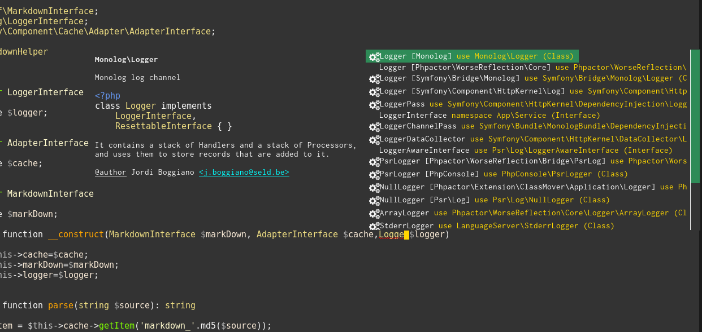

#+TITLE: Emacs configuration
#+AUTHOR: Richard G. Riley
#+EMAIL: rileyrg at g mx dot de
#+DESCRIPTION: emacs configuration orientated around lsp-mode,dap and company-mode
#+LANGUAGE: en
#+STARTUP: overview

#+OPTIONS: toc:nil
#+OPTIONS: ^:nil

#+EXPORT_FILE_NAME: README.md

# don't export trees tagged with:
#+EXCLUDE_TAGS: tasklist noexport broken
# do not export any sections marked as tasks unless TODO or DONE
#+OPTIONS: tasks:("TODO" "DONE")
# do not include task keywords in export
#+OPTIONS: todo:nil
# auto generate custom_ids
#+OPTIONS: auto-id:t

#+PROPERTY: header-args    :results silent
#+PROPERTY: header-args:bash :tangle-mode (identity #o555)
#+PROPERTY: header-args:conf :tangle-mode (identity #o444)
#+PROPERTY: header-args:emacs-lisp :tangle ~/.config/emacs/init.el :tangle-mode (identity #o444)
#+PROPERTY: header-args:gpg :cache no :tangle-mode (identity #o600)

Using org-babel to write out the config

* [[https://github.com/raxod502/straight.el#bootstrapping-straightel][straight.el]] package management
  :PROPERTIES:
  :CUSTOM_ID: straight_package_management
  :END:
  #+begin_src emacs-lisp
    (defvar bootstrap-version)
    (setq straight-base-dir (expand-file-name "etc" user-emacs-directory))
    (let ((bootstrap-file
           (expand-file-name "straight/repos/straight.el/bootstrap.el" straight-base-dir))
          (bootstrap-version 5))
      (unless (file-exists-p bootstrap-file)
        (with-current-buffer
            (url-retrieve-synchronously
             "https://raw.githubusercontent.com/raxod502/straight.el/develop/install.el"
             'silent 'inhibit-cookies)
          (goto-char (point-max))
          (eval-print-last-sexp)))
      (load bootstrap-file nil 'nomessage))

    (setq straight-use-package-by-default t)
    (straight-use-package 'use-package)

    (use-package straight
      :custom
      (straight-vc-git-default-protocol 'ssh))

    (use-package el-patch)
  #+end_src
* config
  :PROPERTIES:
  :CUSTOM_ID: b477a755
  :END:
  :LOGBOOK:
  CLOCK: [2021-02-24 Wed 22:42]
  :END:
** Paths, clutter
   :PROPERTIES:
   :CUSTOM_ID: Paths_and_clutter
   :END:
*** [[https://github.com/emacscollective/no-littering][no-littering]] aims to keep our undies folded.
    :PROPERTIES:
    :CUSTOM_ID: no_littering
    :END:
    #+begin_src emacs-lisp
      (use-package no-littering
        :config
        (setq auto-save-file-name-transforms
              `((".*" ,(no-littering-expand-var-file-name "auto-save/") t))))
    #+end_src
*** Path to our own elisp
    :PROPERTIES:
    :CUSTOM_ID: user_elisp_path
    :END:
    #+begin_src emacs-lisp
      (defvar elisp-dir (expand-file-name "elisp" no-littering-etc-directory) "my elisp directory. directories are recursively added to path.")
      (add-to-list 'load-path elisp-dir)
      (let ((default-directory elisp-dir))
        (normal-top-level-add-subdirs-to-load-path))
    #+end_src
** Customization
   :PROPERTIES:
   :CUSTOM_ID: Paths,_clutter_and_customisation-Customization-5078dd0a
   :END:
*** Standard Emacs customisation
    :PROPERTIES:
    :CUSTOM_ID: Paths_and_customisation-Standard_Emacs_customisation-33d6ef99
    :END:
    #+begin_src emacs-lisp
      (setq custom-file (no-littering-expand-etc-file-name "custom.el"))
      (load custom-file 'noerror)
    #+end_src
*** Load user customisations and gpg
    :PROPERTIES:
    :CUSTOM_ID: customisations
    :END:
    Load all files in certain directories.
    #+begin_src emacs-lisp
      (defun load-el-gpg (load-dir)
        (message "attempting mass load from %s." load-dir)
        (when (file-exists-p load-dir)
          (dolist (f (directory-files-recursively load-dir "\.[el|gpg]$"))
            (condition-case nil
                (load f 'no-error)
              (error nil)))))
    #+end_src
**** early load
     :PROPERTIES:
     :CUSTOM_ID: early_load
     :END:
     #+begin_src emacs-lisp
       (load-el-gpg (no-littering-expand-etc-file-name "early-load"))
     #+end_src
**** host specific
     :PROPERTIES:
     :CUSTOM_ID: host_specific_load
     :END:
     Stick a custom in here. eg my thinkpad [[./etc/hosts/thinkpadx270/custom.el][custom file]].
     #+begin_src emacs-lisp
       (load-el-gpg (expand-file-name (system-name)  (no-littering-expand-etc-file-name "hosts")))
     #+end_src
** [[https://www.gnu.org/software/emacs/manual/auth.html][Auth-Sources]]
   :PROPERTIES:
   :CUSTOM_ID: Authinfo-f08a2ff0
   :END:
   Let emacs take care of security things automagically
   #+begin_src emacs-lisp
     (use-package auth-source
       :demand
       :custom
       (auth-sources '("~/.gnupg/auth/authinfo.gpg" "~/.gnupg/auth/authirc.gpp"))
       :no-require t
       )
   #+end_src
** Macros & Utilities
   :PROPERTIES:
   :CUSTOM_ID: macros-and-utilities
   :END:
*** General utility functions
    :PROPERTIES:
    :CUSTOM_ID: general-utility-functions
    :END:
    Raw: [[file+sys:etc/elisp/rgr-utils.el][rgr-utils]].
    #+begin_src emacs-lisp
      (require 'rgr/utils "rgr-utils" 'NOERROR)
    #+end_src
**** rgr-utils library
     :PROPERTIES:
     :header-args:emacs-lisp: :tangle (expand-file-name "rgr-utils.el" elisp-dir)
     :CUSTOM_ID: rgr-utils-elisp
     :END:
***** line
      :PROPERTIES:
      :CUSTOM_ID: code-line-funcs
      :END:
      #+begin_src emacs-lisp
        (defun c-complete-line()
          (interactive)
          (end-of-line)
          (unless (eql ?\; (char-after (- (point-at-eol) 1)))
            (progn (insert ";")))
          (newline-and-indent))
        (defun c-insert-previous-line()
          (interactive)
          (previous-line)
          (end-of-line)
          (newline-and-indent)
          (insert (string-trim (current-kill 0))))
        (defun c-newline-below()
          (interactive)
          (end-of-line)
          (newline-and-indent))
      #+end_src
***** scratch
      :PROPERTIES:
      :CUSTOM_ID: config-Macros_&_Utilities-General_utility_functions-rgr-utils_library-scratch-145b8bfe
      :END:
      #+begin_src emacs-lisp
        (use-package scratch)
      #+end_src
***** provide
      :PROPERTIES:
      :CUSTOM_ID: Macros_&_Utilities-rgr-utils_code-provide-9ccde5c5
      :END:
      #+begin_src emacs-lisp
        (provide 'rgr/utils)
      #+end_src
*** Emacs Lisp, ELisp Utils
    :PROPERTIES:
    :CUSTOM_ID: elisp-utils
    :END:
    Load this relatively early in order to have utils available if there's a faied load
    Raw: [[file+sys:etc/elisp/rgr-elisp-utils.el][rgr/elisp-utils]]

    #+begin_src emacs-lisp
      (require 'rgr/elisp-utils (expand-file-name "rgr-elisp-utils" elisp-dir))
      (global-set-key (kbd "C-M-S-e") 'rgr/elisp-helpers-popup-help-enabled-toggle)
    #+end_src

**** rgr/elisp-utils library
     :PROPERTIES:
     :CUSTOM_ID: elisp-utils-library
     :header-args:emacs-lisp: :tangle (expand-file-name "rgr-elisp-utils.el" elisp-dir)
     :END:
***** emacs source
      :PROPERTIES:
      :CUSTOM_ID: Programming_Language_related-Emacs_Lisp,_ELisp-elisp_utils-rgrelisp-utils_library-emacs_source-c588f74e
      :END:
      #+begin_src emacs-lisp
        (defcustom rgr/emacs-source (no-littering-expand-var-file-name "emacs-source/current") "where the source is for the current emacs")
        (setq source-directory rgr/emacs-source)
      #+end_src
***** elisp checks
      :PROPERTIES:
      :CUSTOM_ID: ReferenceLookupMedia-Reference_and_dictionary-Elisp_reference-elisp_checks-62f0b274
      :END:
      #+begin_src emacs-lisp
        (defun rgr/elisp-edit-mode()
          "return non nil if this buffer edits elisp"
          (member major-mode '(emacs-lisp-mode lisp-interaction-mode)))
      #+end_src
***** helpful, enriched elisp help
      :PROPERTIES:
      :CUSTOM_ID: elisp-helpful
      :END:
      #+begin_src emacs-lisp
        (use-package helpful
          :config
          ;; Note that the built-in `describe-function' includes both functions
          ;; and macros. `helpful-function' is functions only, so we provide
          ;; `helpful-callable' as a drop-in replacement.
          (global-set-key (kbd "C-h f") #'helpful-callable)

          (global-set-key (kbd "C-h v") #'helpful-variable)
          (global-set-key (kbd "C-h k") #'helpful-key)
          ;;I also recommend the following keybindings to get the most out of helpful:
          ;; Lookup the current symbol at point. C-c C-d is a common keybinding
          ;; for this in lisp modes.
          (global-set-key (kbd "C-h SPC") #'helpful-at-point)
          ;; Look up *F*unctions (excludes macros).
          ;;
          ;; By default, C-h F is bound to `Info-goto-emacs-command-node'. Helpful
          ;; already links to the manual, if a function is referenced there.
          (global-set-key (kbd "C-h F") #'helpful-function)

          ;; Look up *C*ommands.
          ;;
          ;; By default, C-h C is bound to describe `describe-coding-system'. I
          ;; don't find this very useful, but it's frequently useful to only
          ;; look at interactive functions.
          (global-set-key (kbd "C-h C") #'helpful-command))
      #+end_src
***** read and write elisp vars to file
      :PROPERTIES:
      :CUSTOM_ID: read-write-vars
      :END:
      #+begin_src emacs-lisp

        (defun rgr/elisp-write-var (f v)
          (with-temp-file f
            (prin1 v (current-buffer))))

        (defun rgr/elisp-read-var (f)
          (with-temp-buffer
            (insert-file-contents f)
            (cl-assert (eq (point) (point-min)))
            (read (current-buffer))))
      #+end_src

***** delayed idle help popup
      :PROPERTIES:
      :CUSTOM_ID: elisp-delay-idle-popup
      :END:
      #+begin_src emacs-lisp
        (defcustom rgr/elisp-helpers-popup-help-delay 1.5 "How long to delay for auto popup of symbol at point" :type 'float)
        (defcustom rgr/elisp-helpers-popup-help-enabled t "If popup elisp help is timer enabled" :type 'boolean)

        (defun rgr/elisp-helpers-popup-help-enabled-toggle()
          (interactive)
          (setq-local rgr/elisp-helpers-popup-help-enabled (not rgr/elisp-helpers-popup-help-enabled)))

        (defun rgr/elisp-helpers-popup-help-enable()
          "buffer local rgr/elisp-helpers-popup-help-enabled on"
          (setq-local rgr/elisp-helpers-popup-help-enabled rgr/elisp-helpers-popup-help-enabled))

        (add-hook 'emacs-lisp-mode-hook #'rgr/elisp-helpers-popup-help-enable)
        (add-hook 'lisp-interaction-mode-hook #'rgr/elisp-helpers-popup-help-enable)
        (add-hook 'org-mode-hook #'rgr/elisp-helpers-popup-help-enable)
        (add-hook 'help-mode-hook #'rgr/elisp-helpers-popup-help-enable)

        (defun chunyang-elisp-function-or-variable-quickhelp (&optional symbol)
          "Display summary of function or variable at point.

          Adapted from `describe-function-or-variable'."
          (interactive)
          (when rgr/elisp-helpers-popup-help-enabled
            (let* ((v-or-f (variable-at-point))
                   (found (symbolp v-or-f))
                   (v-or-f (if found v-or-f (function-called-at-point))))
              (if (and v-or-f (symbolp v-or-f))
                  (let* ((fdoc (when (fboundp v-or-f )
                                 (or (documentation v-or-f  t) "Not documented.")))
                         (fdoc-short (and (stringp fdoc)
                                          (substring fdoc 0 (string-match "\n" fdoc))))
                         (vdoc (when  (boundp v-or-f )
                                 (or (documentation-property v-or-f  'variable-documentation t)
                                     "Not documented as a variable.")))
                         (vdoc-short (and (stringp vdoc)
                                          (substring vdoc 0 (string-match "\n" vdoc)))))
                    (and (require 'popup nil 'no-error)
                         (popup-tip
                          (or
                           (and fdoc-short vdoc-short
                                (concat fdoc-short "\n\n"
                                        (make-string 30 ?-) "\n" (symbol-name
                                                                  v-or-f )
                                        " is also a " "variable." "\n\n"
                                        vdoc-short))
                           fdoc-short
                           vdoc-short)
                          :margin t)))))))

        (run-with-idle-timer rgr/elisp-helpers-popup-help-delay t '(lambda()(when (rgr/elisp-edit-mode) (chunyang-elisp-function-or-variable-quickhelp nil))))

      #+end_src
***** Elisp debugging
      :PROPERTIES:
      :CUSTOM_ID: elisp-completion-debugging
      :END:
      #+begin_src emacs-lisp
        (use-package
          edebug-x
          :demand t
          :init
          (global-set-key (kbd "C-S-<f9>") 'toggle-debug-on-error)
          ;;:custom
          ;;(edebug-trace nil)
          :config
          (require 'edebug)
          (defun instrumentForDebugging()
            "use the universal prefix arg (C-u) to remove instrumentation"
            (interactive)
            (if current-prefix-arg (eval-defun nil) (eval-defun 0)))
          )
      #+end_src

      #+RESULTS:
      | myELisp | edebug-x-mode |
***** Auto-compile
      :PROPERTIES:
      :CUSTOM_ID: elisp-auto-compile
      :END:
      #+begin_src emacs-lisp
        (use-package
          auto-compile
          :demand
          :config
          (auto-compile-on-load-mode 1)
          (auto-compile-on-save-mode 1))

        ;; (when (memq window-system '(mac ns x))
        ;;   (exec-path-from-shell-initialize))
      #+end_src
***** Formatting
      :PROPERTIES:
      :CUSTOM_ID: elisp-formatting
      :END:
      #+begin_src emacs-lisp
        (use-package
          elisp-format
          :bind
          (:map emacs-lisp-mode-map
                ("C-c f" . elisp-format-region)))
      #+end_src
***** popup query symbol
      :PROPERTIES:
      :CUSTOM_ID: Programming_related-Emacs_Lisp,_ELisp-query_symbol-977f62e1
      :END:
      #+begin_src emacs-lisp
        (use-package popup
          :config
          (defun rgr/show-symbol-details ()
            (interactive)
            (popup-tip (format "intern-soft thing-at-point: %s, symbolp: %s, symbol-name:%s"
                               (setq-local sym (intern-soft (thing-at-point 'symbol)))
                               (symbolp sym)
                               (symbol-name sym))))
          :bind
          (:map emacs-lisp-mode-map (("M-6" . #'rgr/show-symbol-details))))
      #+end_src
***** provide
      :PROPERTIES:
      :CUSTOM_ID: Programming_Language_related-Emacs_Lisp,_ELisp-elisp_utils-rgrelisp-utils_library-provide-445b6239
      :END:
      #+begin_src emacs-lisp
        (provide 'rgr/elisp-utils)
      #+end_src
** Emacs daemon & startup
   :PROPERTIES:
   :CUSTOM_ID: emacs-daemon
   :END:
   Load up the daemon if not loaded, amongst other things.

   Raw: [[file+sys:etc/elisp/rgr-daemon.el][rgr/daemon]]

   #+begin_src emacs-lisp
     (require 'rgr/daemon "rgr-daemon" 'NOERROR)
   #+end_src
*** rgr-daemon libarary
    :PROPERTIES:
    :CUSTOM_ID: emacs-daemon-library
    :header-args:emacs-lisp: :tangle (expand-file-name "rgr-daemon.el" elisp-dir)
    :END:
    #+begin_src emacs-lisp

      ;; start emacs-server if not running
      (unless(daemonp)
        (add-hook 'after-init-hook (lambda ()
                                     (require 'server)
                                     (unless (server-running-p)
                                       (message "Starting EmacsServer from init as not already running.")
                                       (server-start))
                                     ))
        )

      (defun startHook()
        (message "In emacs-startup-hook"))

      (add-hook 'emacs-startup-hook 'startHook)

      (defun quit-or-close-emacs(&optional kill)
        (interactive)
        (if (or current-prefix-arg kill)
            (server-shutdown)
          (delete-frame)))

      (defun server-shutdown ()
        "Save buffers, Quit, and Shutdown (kill) server"
        (interactive)
        (save-some-buffers)
        (kill-emacs))

      (global-set-key (kbd "C-c x") 'quit-or-close-emacs)
      (global-set-key (kbd "C-x C-c") 'nil)

      (provide 'rgr/daemon)
    #+end_src

*** System
    :PROPERTIES:
    :CUSTOM_ID: config-System-55131d57
    :END:
**** TODO date format
     :PROPERTIES:
     :CUSTOM_ID: config-System-date_format
     :END:
     :LOGBOOK:
     - State "TODO"       from              [2021-03-03 Wed 10:48]
     :END:
     org-journal uses format-timestring which picks up sys locale. various elisp func
     calls didnt work ended up using [[#config-Emacs_daemon_&_startup-System-date_format-simply_redefine_org_journal_date_function][own format]]
***** CANCELLED using elisp                                       :CANCELLED:
      SCHEDULED: <2021-03-13 Sat>
      :PROPERTIES:
      :CUSTOM_ID: config-Emacs_daemon_&_startup-System-date_format-using_elisp
      :END:
      :LOGBOOK:
      - State "CANCELLED"  from              [2021-03-03 Wed 17:23] \\
        doesnt work for daemon frames. maybe revisit.
      :END:
      https://stackoverflow.com/questions/28913294/emacs-org-mode-language-of-time-stamps
      #+begin_src emacs-lisp
        ;; (setq system-time-locale "C") ;; doesnt work with daemon
        ;; (format-time-string "%A")
        ;;(setq system-time-locale "de.UTF8")
        ;; (setq system-time-locale nil)
        ;;(format-time-string "%A")
        ;; (set-locale-environment "en_GB.UTF8")
        ;;(add-hook 'server-switch-hook (lambda()(set-locale-environment "en_GB.UTF8")))
      #+end_src
***** CANCELLED use locales                                       :CANCELLED:
      CLOSED: [2021-03-03 Wed 17:48]
      :PROPERTIES:
      :CUSTOM_ID: config-Emacs_daemon_&_startup-System-date_format-use_locales
      :END:
      :LOGBOOK:
      - State "CANCELLED"  from              [2021-03-03 Wed 17:48] \\
        in the end did a

        (setq system-time-locale "C") in emacs-startup-hook
      :END:
      #+begin_src bash
        sudo localectl set-locale LC_TIME=en_GB.UTF8
      #+end_src
***** CANCELLED [#A] system-time-locale                           :CANCELLED:
      SCHEDULED: <2021-03-03 Wed>
      :PROPERTIES:
      :CUSTOM_ID: System-date_format-system-time-locale
      :END:
      :LOGBOOK:
      - State "CANCELLED"  from "DONE"       [2021-03-04 Do 09:47] \\
        ok, this doesnt work either if you close emacs frames and recreate. gah.
      - State "DONE"       from              [2021-03-03 Wed 17:50]
      :END:
      #+begin_src emacs-lisp
        (add-hook 'emacs-startup-hook (lambda()(setq system-time-locale "C")))
      #+end_src
***** simply redefine org journal date function
      :PROPERTIES:
      :CUSTOM_ID: config-Emacs_daemon_&_startup-System-date_format-simply_redefine_org_journal_date_function
      :END:
      #+begin_quote
      '(org-journal-date-format "%d/%m/%Y")
      #+end_quote

** Minibuffer Enrichment (search, sudo edit...)
   :PROPERTIES:
   :CUSTOM_ID: Completion_Frameworks_And_Enrichment
   :END:
   Various plugins for minibuffer enrichment

   Raw: [[file+sys:etc/elisp/rgr-minibuffer.el][rgr/minibuffer]]

   #+begin_src emacs-lisp
     (require 'rgr/minibuffer "rgr-minibuffer" 'NOERROR)
   #+end_src

*** library
    :PROPERTIES:
    :CUSTOM_ID: rgr-minibuffer-library
    :header-args:emacs-lisp: :tangle (expand-file-name "rgr-minibuffer.el" elisp-dir)
    :END:
**** [[https://www.emacswiki.org/emacs/TrampMode][TRAMP]] (Transparent Remote Access, Multiple Protocols)
     :PROPERTIES:
     :CUSTOM_ID: Tramp-fd162f34
     :END:
     is a package for editing remote files, similar to AngeFtp or efs. Whereas the others use FTP to connect to the remote host and to transfer the files, TRAMP uses a remote shell connection (rlogin, telnet, ssh). It can transfer the files using rcp or a similar program, or it can encode the file contents (using uuencode or base64) and transfer them right through the shell connection.
     #+begin_src emacs-lisp
       ;;(require 'tramp)
       (use-package tramp
         :custom
         (tramp-default-method "ssh")
         )
     #+end_src
**** fzf
     :PROPERTIES:
     :CUSTOM_ID: Completion_Frameworks_And_Enrichment-fzf-2437fe78
     :END:
     #+begin_src emacs-lisp
       (use-package fzf)
     #+end_src
**** file opening
     :PROPERTIES:
     :CUSTOM_ID: Completion_Frameworks_And_Enrichment-file_opening-15870f4a
     :END:
***** read only by default
      :PROPERTIES:
      :CUSTOM_ID: read_only_default
      :END:
      Increasingly editing by mistake. Can use [[help:read-only-mode][read-only-mode]] to edit it.
      #+begin_src emacs-lisp
        (defun maybe-read-only-mode()
          (when (cond ((eq major-mode 'org-mode) t))
            (message "Setting readonly mode for %s buffer" major-mode)
            (read-only-mode +1)))
                                                ;(add-hook 'find-file-hook 'maybe-read-only-mode)
      #+end_src
***** Priviliged file editing
      :PROPERTIES:
      :CUSTOM_ID: Completion_Frameworks_And_Enrichment-Priviliged_file_editing-45fddb0b
      :END:
      #+begin_src emacs-lisp
        (use-package sudo-edit)
      #+end_src
***** find file at point - documented in the [[https://github.com/raxod502/selectrum/wiki/Additional-Configuration#complete-file-names-at-point][selectrum wiki]]
      :PROPERTIES:
      :CUSTOM_ID: Completion_Frameworks_And_Enrichment-find_file_at_point_-_documented_in_the_https:github.comraxod502selectrumwikiAdditional-Configuration#complete-file-names-at-pointselectrum_wiki-ad02d20e
      :END:
      #+begin_src emacs-lisp
        (use-package ffap
          :custom
          (ffap-require-prefix nil)
          :config
          (add-hook 'completion-at-point-functions
                    (defun complete-path-at-point+ ()
                      (let ((fn (ffap-file-at-point))
                            (fap (thing-at-point 'filename)))
                        (when (and (or fn
                                       (equal "/" fap))
                                   (save-excursion
                                     (search-backward fap (line-beginning-position) t)))
                          (list (match-beginning 0)
                                (match-end 0)
                                #'completion-file-name-table)))) 'append)
          (ffap-bindings))
      #+end_src
**** [[https://github.com/raxod502/ctrlf][ctrlf]] - back to basics search
     :PROPERTIES:
     :CUSTOM_ID: ctrlf
     :END:
     #+begin_src emacs-lisp
       (use-package ctrlf
         :custom-face
         (ctrlf-highlight-active ((t (:inherit nil :background "gold" :foreground "dim gray"))))
         (ctrlf-highlight-passive ((t (:inherit nil :background "red4" :foreground "white"))))
         :custom
         (ctrlf-auto-recenter t nil nil "Customized with use-package ctrlf")
         (ctrlf-highlight-current-line t)
         (ctrlf-auto-recenter t)
         ;; (ctrlf-mode-bindings
         ;;  '(("C-s" . ctrlf-forward-fuzzy-regexp)
         ;;    ("C-r" . ctrlf-backward-fuzzy-regexp)
         ;;    ("C-M-s" . ctrlf-forward-literal)
         ;;    ("C-M-r" . ctrlf-backward-literal)
         ;;    ("M-s _" . ctrlf-forward-regexp)
         ;;    ))
         (ctrlf-mode-bindings
          '(("C-s" . ctrlf-forward-fuzzy-regexp)
            ("C-r" . ctrlf-backward-fuzzy-regexp)
            ))
         :config
         (ctrlf-mode +1))
     #+end_src
**** [[https://github.com/raxod502/selectrum][Selectrum]] provides UI for selection from candidate list
     :PROPERTIES:
     :CUSTOM_ID: selectrum
     :END:
     #+begin_src emacs-lisp
       (use-package selectrum
         :config
         (selectrum-mode +1)
         :bind ("C-x C-z" . #'selectrum-repeat))
     #+end_src
**** [[https://github.com/raxod502/prescient.el][Prescient]] provides sorting and filtering.
     :PROPERTIES:
     :CUSTOM_ID: prescient
     :END:
     #+begin_src emacs-lisp
       (use-package prescient
         :config
         (prescient-persist-mode +1)
         (if (featurep 'selectrum)
             (use-package selectrum-prescient
               :config
               (selectrum-prescient-mode +1))))
     #+end_src
**** [[https://github.com/minad/consult][Consult]] provides various commands based on the Emacs completion function completing-read
     :PROPERTIES:
     :CUSTOM_ID: consult
     :END:
     #+begin_src emacs-lisp
       (use-package consult
         ;; Replace bindings. Lazily loaded due by `use-package'.
         :bind (("C-x M-:" . consult-complex-command)
                ("C-c h" . consult-history)
                ;;               ("C-c m" . consult-mode-command)
                ("C-x b" . consult-buffer)
                ("C-x 4 b" . consult-buffer-other-window)
                ("C-x 5 b" . consult-buffer-other-frame)
                ("C-x r x" . consult-register)
                ("C-x r b" . consult-bookmark)
                ("M-g a" . consult-apropos)
                ("M-g g" . consult-goto-line)
                ("M-g M-g" . consult-goto-line)
                ("M-g o" . consult-outline)       ;; "M-s o" is a good alternative.
                ("M-g l" . consult-line)          ;; "M-s l" is a good alternative.
                ("M-g m" . consult-mark)          ;; I recommend to bind Consult navigation
                ("M-g k" . consult-global-mark)   ;; commands under the "M-g" prefix.
                ("M-g r" . consult-ripgrep)      ;; or consult-grep, consult-ripgrep
                ("M-g f" . consult-find)          ;; or consult-fdfind, consult-locate
                ("M-g i" . consult-project-imenu) ;; or consult-imenu
                ("M-g e" . consult-error)
                ("M-g s" . consult-grep)
                ("M-s m" . consult-multi-occur)
                ("M-y" . consult-yank-pop)
                ("<f3>" . consult-ripgrep)

                ("<help> a" . consult-apropos)
                ;;("C-s" . consult-line)
                )

         ;; The :init configuration is always executed (Not lazy!)

         :init

         ;; Replace `multi-occur' with `consult-multi-occur', which is a drop-in replacement.
         (fset 'multi-occur #'consult-multi-occur)
         ;;(fset 'projectile-ripgrep 'consult-ripgrep)

         ;; Configure other variables and modes in the :config section, after lazily loading the package
         :config

         ;; Optionally configure a function which returns the project root directory
         (autoload 'projectile-project-root "projectile")
         (setq consult-project-root-function #'projectile-project-root)

         ;; Optionally configure narrowing key.
         ;; Both < and C-+ work reasonably well.
         (setq consult-narrow-key "<") ;; (kbd "C-+")
         ;; Optionally make narrowing help available in the minibuffer.
         ;; Probably not needed if you are using which-key.
         ;; (define-key consult-narrow-map (vconcat consult-narrow-key "?") #'consult-narrow-help)

         ;; Optional configure a view library to be used by `consult-buffer'.
         ;; The view library must provide two functions, one to open the view by name,
         ;; and one function which must return a list of views as strings.
         ;; Example: https://github.com/minad/bookmark-view/
         ;; (setq consult-view-open-function #'bookmark-jump
         ;;       consult-view-list-function #'bookmark-view-names)

         ;; Optionally enable previews. Note that individual previews can be disabled
         ;; via customization variables.
         ;; (consult-preview-mode)

         (defun mode-buffer-exists-p (mode)
           (seq-some (lambda (buf)
                       (provided-mode-derived-p
                        (buffer-local-value 'major-mode buf)
                        mode))
                     (buffer-list)))

         (defvar eshell-source
           `(:category 'consult-new
                       :name "EShell"
                       :narrow ?e
                       :face     'font-lock-constant-face
                       :open
                       ,(lambda (&rest _) (eshell))
                       :items
                       ,(lambda ()
                          (unless (mode-buffer-exists-p 'eshell-mode)
                            '("*eshell* (new)")))))

         (defvar term-source
           `(:category 'consult-new
                       :name "Term"
                       :narrow ?t
                       :face     'font-lock-constant-face
                       :open
                       ,(lambda (&rest _)
                          (ansi-term (or (getenv "SHELL") "/bin/sh")))
                       :items
                       ,(lambda ()
                          (unless (mode-buffer-exists-p 'term-mode)
                            '("*ansi-term* (new)")))))

         (add-to-list 'consult-buffer-sources 'eshell-source 'append)
         (add-to-list 'consult-buffer-sources 'term-source 'append)
         )

       ;; Enable Consult-Selectrum integration.
       ;; This package should be installed if Selectrum is used.
       (use-package consult-selectrum
         :disabled t
         :after selectrum
         :demand t)

       ;; Optionally add the `consult-flycheck' command.
       (use-package consult-flycheck
         :bind (:map flycheck-command-map
                     ("!" . consult-flycheck)))
     #+end_src
**** [[https://github.com/oantolin/embark][Embark]] Emacs Mini-Buffer Actions Rooted in Keymaps
     :PROPERTIES:
     :CUSTOM_ID: Embark
     :END:
     #+begin_src emacs-lisp
       (use-package embark
         :demand t
         :config
         (add-hook 'embark-target-finders
                   (defun current-candidate+category ()
                     (when selectrum-active-p
                       (cons (selectrum--get-meta 'category)
                             (selectrum-get-current-candidate)))))

         (add-hook 'embark-candidate-collectors
                   (defun current-candidates+category ()
                     (when selectrum-active-p
                       (cons (selectrum--get-meta 'category)
                             (selectrum-get-current-candidates
                              ;; Pass relative file names for dired.
                              minibuffer-completing-file-name)))))

         ;; No unnecessary computation delay after injection.
         (add-hook 'embark-setup-hook 'selectrum-set-selected-candidate)

         ;; The following is not selectrum specific but included here for convenience.
         ;; If you don't want to use which-key as a key prompter skip the following code.

         (setq embark-action-indicator
               (lambda (map) (which-key--show-keymap "Embark" map nil nil 'no-paging)
                 #'which-key--hide-popup-ignore-command)
               embark-become-indicator embark-action-indicator)
         :bind
         ("C-S-a" . embark-act)) ; pick some comfortable binding
     #+end_src
**** [[https://en.wikipedia.org/wiki/Marginalia][Marginalia]] are marks or annotations placed at the margin of the page of a book or in this case helpful colorful annotations placed at the margin of the minibuffer for your completion candidates
     :PROPERTIES:
     :CUSTOM_ID: Marginalia
     :END:

     The [[https://github.com/minad/marginalia][marginalia]] pckage in emacs is very helpful.

     #+begin_src emacs-lisp
       (use-package marginalia
         :custom
         (marginalia-annotators '(marginalia-annotators-heavy marginalia-annotators-light nil))
         :config
         (marginalia-mode)
         (advice-add #'marginalia-cycle :after
                     (lambda () (when (bound-and-true-p selectrum-mode) (selectrum-exhibit)))))
     #+end_src
**** provide
     :PROPERTIES:
     :CUSTOM_ID: Completion_Frameworks_And_Enrichment-rgr-minibuffer_library-provide-7692bb98
     :END:
     #+begin_src emacs-lisp
       (provide 'rgr/minibuffer)
     #+end_src

** Completion
   :PROPERTIES:
   :CUSTOM_ID: completion
   :END:
   Let emacs suggest completions

   Raw:[[file+sys:etc/elisp/rgr-completion.el][rgr/completion]]

   #+begin_src emacs-lisp
     (require 'rgr/completion "rgr-completion" 'NOERROR)
   #+end_src

*** library
    :PROPERTIES:
    :CUSTOM_ID: completion-library
    :header-args:emacs-lisp: :tangle (expand-file-name "rgr-completion.el" elisp-dir)
    :END:
**** Abbrev Mode
     :PROPERTIES:
     :CUSTOM_ID: Text_tools-Abbrev_Mode-b7116ab5
     :END:
     [[https://www.emacswiki.org/emacs/AbbrevMode#toc4][Abbrev Mode]] is very useful for expanding small text snippets
     #+begin_src emacs-lisp
       (setq-default abbrev-mode 1)
     #+end_src
**** Snippets with yasnippet
     :PROPERTIES:
     :CUSTOM_ID: yasnippet
     :END:
     #+begin_src emacs-lisp
       (use-package
         yasnippet
         :init (yas-global-mode 1)
         :config
         (use-package
           php-auto-yasnippets)
         (use-package
           el-autoyas)
         (use-package
           yasnippet-snippets)
         (use-package
           yasnippet-classic-snippets))
     #+end_src
**** Company Mode
     :PROPERTIES:
     :CUSTOM_ID: company-mode
     :END:
     [[https://github.com/sebastiencs/company-box][company-box]] provides nice linked help on the highlighted completions when available.

     #+CAPTION: company-box in action for php/lsp mode.
     
     #+begin_src emacs-lisp
       (use-package
         company
         :init
         (add-hook 'after-init-hook 'global-company-mode)
         :custom
         (company-backends
          '((company-capf :with company-dabbrev company-files company-ispell)))
         :config
         (use-package
           company-box
           :hook (company-mode . company-box-mode))
         (require 'company-ispell)
         (use-package company-prescient
           :after company
           :config
           (company-prescient-mode +1))
         ) ;; :bind ("C-<tab>" . company-complete))
     #+end_src
**** Which Key
     :PROPERTIES:
     :CUSTOM_ID: Text_tools-Completion-Which_Key-f475ea36
     :END:
     [[https://github.com/justbur/emacs-which-key][which-key]] shows you what further key options you have if you pause on a multi key command.
     #+begin_src emacs-lisp
       (use-package
         which-key
         :demand t
         :config (which-key-mode))
     #+end_src
**** Tying it all together
     :PROPERTIES:
     :CUSTOM_ID: Text_tools-Completion-Tying_it_call_together-5260aafa
     :END:
     #+begin_src emacs-lisp
       (defun check-expansion ()
         (save-excursion (if (looking-at "\\_>") t (backward-char 1)
                             (if (looking-at "\\.") t (backward-char 1)
                                 (if (looking-at "->") t nil)))))

       (defun do-yas-expand ()
         (let ((yas-fallback-behavior 'return-nil))
           (yas-expand)))

       (defun tab-indent-or-complete ()
         (interactive)
         (if (minibufferp)
             (minibuffer-complete)
           (if (or (not yas-minor-mode)
                   (null (do-yas-expand)))
               (if (check-expansion)
                   (company-complete-common)
                 (yas/create-php-snippet)))))
       ;;              (indent-for-tab-command)))))
     #+end_src
**** provide
     :PROPERTIES:
     :CUSTOM_ID: Completion_Frameworks_And_Enrichment-rgr-minibuffer_library-provide-7692bb98
     :END:
     #+begin_src emacs-lisp
       (provide 'rgr/completion)
     #+end_src
** Alert and Alert Learn
   :PROPERTIES:
   :CUSTOM_ID: alert-learn
   :END:
   Added in a utility which pops up fortunes when idle and a hot key (see google-translate section to call up google-translate for the last fortune shown.. Handy for learning a language.

   Raw: [[file+sys:etc/elisp/rgr-alert-learn.el][rgr/alert-learn]].
   #+begin_src emacs-lisp
     (require  'rgr/alert-learn "rgr-alert-learn" 'NOERROR)
     (alert "Emacs is starting!")
   #+end_src

*** library
    :PROPERTIES:
    :CUSTOM_ID: alert-learn-elisp
    :END:

    Raw: [[file+sys:etc/elisp/rgr-alert-learn.el][rgr-alert-learn.el]].
    #+begin_src emacs-lisp :tangle (expand-file-name "rgr-alert-learn.el" elisp-dir)

      (use-package
        alert
        :demand
        :init
        (defvar rgr/alert-learn-history  nil "list of learns in rgr/alert-learn")
        (defgroup rgr/alert-learn nil "Options to control the Alert based popup learning" :group 'rgr)
        (defcustom rgr/alert-learn-on t "Whether pop up learning is on" :type 'boolean :group 'rgr/alert-learn)
        (defcustom rgr/alert-learn-command "fortune de" "Shell command to run to generate a learn" :type 'boolean :group 'rgr/alert-learn)
        (defcustom rgr/alert-learn-period 120 "How many seconds before another learn is displayed when idle" :type 'integer :group 'rgr/alert-learn)
        (defcustom rgr/alert-learn-fade-time 30 "How many seconds before the learn fades out" :type 'integer :group 'rgr/alert-learn)
        (defcustom rgr/alert-learn-history-auto-save  t "Auto save learn history?" :type 'boolean :group 'rgr/alert-learn)
        (defcustom rgr/alert-learn-history-file  (if (featurep 'no-littering) (no-littering-expand-var-file-name "alert-learn/alert-learn.txt" ) (expand-file-name "alert-learn.alist" user-emacs-directory)) "filename in which to save learns" :type '() :group 'rgr/alert-learn)
        (defcustom rgr/alert-learn-history-length 200 "How many learns to store in history" :type 'integer :group 'rgr/alert-learn)
        :config

        (defvar rgr/alert-learn-timer nil "timer object for alert-learn prompt")

        (let ((dir (file-name-directory rgr/alert-learn-history-file)))
          (unless (file-exists-p dir)
            (make-directory dir)))

        (defun rgr/alert-learn-history-save()
          (when rgr/alert-learn-history-auto-save
            (rgr/elisp-write-var rgr/alert-learn-history-file (butlast rgr/alert-learn-history (- (length rgr/alert-learn-history) rgr/alert-learn-history-length)))))

        (defun rgr/alert-learn-history-load()
          (when rgr/alert-learn-history-auto-save
            (setq rgr/alert-learn-history (rgr/elisp-read-var rgr/alert-learn-history-file))))

        (defun rgr/alert-learn-select-from-history()
          (interactive)
          (if rgr/alert-learn-history ;; select from old ones by bubbling one to top
              (let ((learn (completing-read "Select learn:" rgr/alert-learn-history)))
                (when learn
                  (setq rgr/alert-learn-history (remove learn rgr/alert-learn-history))
                  (add-to-list 'rgr/alert-learn-history learn)
                  (rgr/alert-learn-history-save)))
            (message "No previous learns."))
          (car rgr/alert-learn-history))

        (defun rgr/alert-fortune(&optional title id)
          ;; alert a fortune and return it. (rgr/alert-fortune)
          (let ((f (shell-command-to-string rgr/alert-learn-command)))
            (alert  f :title (or title "Fortune favours the brave...") :id (or id 'emacs))
            f))

        (defun rgr/alert-learn()
          ;; alert a learn and store it. (rgr/alert-learn)
          (interactive)
          (let ((alert-fade-time rgr/alert-learn-fade-time)
                (learn (rgr/alert-fortune "Learn Now..." "learn")))
            (add-to-list 'rgr/alert-learn-history learn)
            (rgr/alert-learn-history-save)
            ;;
            )
          nil)

        (defun rgr/alert-learn-timer()
          "start or remove learn timer as appropriate."
          (if rgr/alert-learn-on
              (unless rgr/alert-learn-timer
                (setq rgr/alert-learn-timer
                      (run-with-idle-timer rgr/alert-learn-period t 'rgr/alert-learn)))
            (when rgr/alert-learn-timer
              (cancel-timer rgr/alert-learn-timer)
              (setq rgr/alert-learn-timer nil))))

        (defun rgr/google-translate-learn(&optional prefix)
          "prefix 1 to toggle on/off, 2 to create a new learn, anything else to swap languages"
          (interactive "P")
          (when prefix
            (if (eq prefix 0) ;; C-u 0 to toggle on/off
                (progn
                  (setq rgr/alert-learn-on (if rgr/alert-learn-on nil t))
                  (rgr/alert-learn-timer))
              (if (eq prefix 1) ;; C-u 1 to create new learn
                  (rgr/alert-learn)
                (if (eq prefix 2) ;; C-u 2 to select an old learn and relearn it
                    (rgr/alert-learn-select-from-history)
                  (google-translate-swap-default-languages)))))
          (when rgr/alert-learn-on
            (let ((learn (car rgr/alert-learn-history)))
              (when learn
                (google-translate-translate google-translate-default-source-language google-translate-default-target-language (car rgr/alert-learn-history))
                (if google-translate-pop-up-buffer-set-focus
                    (select-window (display-buffer "*Google Translate*")))))))

        (rgr/alert-learn-history-load)

        (rgr/alert-learn-timer)

        :bind
        ("C-c L" . rgr/google-translate-learn))

      (provide 'rgr/alert-learn)

    #+end_src
** General configuration
   :PROPERTIES:
   :CUSTOM_ID: general-config
   :END:
   Raw: [[file+sys:etc/elisp/rgr-general-config.el][rgr/general-config]].
   #+begin_src emacs-lisp
     (require  'rgr/general-config "rgr-general-config" 'NOERROR)
   #+end_src

*** library
    :PROPERTIES:
    :CUSTOM_ID: -4be109d6
    :header-args:emacs-lisp: :tangle (expand-file-name "rgr-general-config.el" elisp-dir)
    :END:
**** General
     :PROPERTIES:
     :CUSTOM_ID: Configure_main_look_and_feel-General-d3da3739
     :END:

     #+begin_src emacs-lisp
       (require 'iso-transl) ;; supposed to cure deadkeys when my external kbd is plugged into my thinkpad T44460.  It doesnt.
                                               ; t60
       (scroll-bar-mode -1)
       (tool-bar-mode -1)
       (menu-bar-mode -1)
       (show-paren-mode 1)
       (winner-mode 1)
       (tooltip-mode 1)
       (global-auto-revert-mode)

       (global-visual-line-mode 1)

       (setq column-number-mode t)

       (delete-selection-mode 1)

       (global-set-key (kbd "S-<f1>") 'describe-face)

       (global-set-key (kbd "S-<f10>") #'menu-bar-open)
                                               ;          (global-set-key (kbd "<f10>") #'imenu)

       (setq frame-title-format (if (member "-chat" command-line-args)  "Chat: %b" "Emacs: %b")) ;; used to select the window again (frame-list)

       (defalias 'yes-or-no-p 'y-or-n-p)

       ;; Auto refresh buffers
       (global-auto-revert-mode 1)

       ;; Also auto refresh dired, but be quiet about it
       (setq global-auto-revert-non-file-buffers t)
       (setq auto-revert-verbose nil)

       ;; ;; restore desktop
       (setq desktop-dirname (expand-file-name "desktop" user-emacs-directory))
       ;; (desktop-save-mode 1)

       (setq disabled-command-function nil)

       (global-hl-line-mode t)

       (use-package boxquote
         :straight (:branch "main")
         :bind
         ("C-S-r" . boxquote-region))

       (use-package
         browse-url-dwim)

       (use-package
         all-the-icons)

       (use-package beacon
         :custom
         (beacon-blink-delay 1)
         (beacon-size 10)
         (beacon-color "orange" nil nil "Customized with use-package beacon")
         (beacon-blink-when-point-moves-horizontally 32)
         (beacon-blink-when-point-moves-vertically 8)
         :config
         (beacon-mode 1))

       (use-package
         webpaste
         :bind ("C-c y" . (lambda()(interactive)(call-interactively 'webpaste-paste-region)(deactivate-mark)))
         ("C-c Y" . webpaste-paste-buffer))

       ;; brings visual feedback to some operations by highlighting portions relating to the operations.
       (use-package
         volatile-highlights
         :init (volatile-highlights-mode 1))
       ;; display dir name when core name clashes
       (require 'uniquify)

       (add-to-list 'Info-directory-list (expand-file-name "info" user-emacs-directory)) ;; https://www.emacswiki.org/emacs/ExternalDocumentation

       (global-set-key (kbd "C-c r") 'query-replace-regexp)

     #+end_src
**** Accessibility
     :PROPERTIES:
     :CUSTOM_ID: accessibility
     :END:
***** fonts
      :PROPERTIES:
      :CUSTOM_ID: General_configuration-general_config_library-Accessibility-fonts-44f51541
      :END:
      JetBrains fonts are nice. See [[https://github.com/ryanoasis/nerd-fonts][nerd-fonts]]
      :PROPERTIES:
      :CUSTOM_ID: General_configuration-general_config_library-Accessibility-fonts-93efb5b8
      :END:
      #+begin_src emacs-lisp
        ;; (set-face-attribute 'default nil :height 60 :family "JetBrainsMono Nerd Font" :foundry "JB")
      #+end_src
***** Darkroom
      :PROPERTIES:
      :CUSTOM_ID: darkroom
      :END:
      Zoom in and center using [[https://github.com/joaotavora/darkroom][darkroom]].
      #+begin_src emacs-lisp
        (use-package
          darkroom
          :bind
          ( "<f7>" . 'darkroom-mode))
      #+end_src

**** Transparency
     :PROPERTIES:
     :CUSTOM_ID: Configure_main_look_and_feel-Transparency-d2ecc29e
     :END:
     #+begin_src emacs-lisp
       (set-frame-parameter (selected-frame) 'alpha '(95 . 50))
       (add-to-list 'default-frame-alist '(alpha . (95 . 50)))
     #+end_src
**** Clipboard
     :PROPERTIES:
     :CUSTOM_ID: Configure_main_look_and_feel-Clipboard-e000a1c3
     :END:
     Allow terminal emacs to interact with the x clipboard.
     #+begin_src emacs-lisp
       (use-package xclip
         :demand t
         :config
         (xclip-mode))
     #+end_src
**** Ansi colour
     :PROPERTIES:
     :CUSTOM_ID: Configure_main_look_and_feel-Ansi_colour-99a94f80
     :END:
     [[https://www.emacswiki.org/emacs/AnsiColor][Ansi colour hooks]] to enable emacs buffers to handle ansi.
     #+begin_src emacs-lisp :tangle no
       (require 'ansi-color)
       (add-hook 'shell-mode-hook 'ansi-color-for-comint-mode-on)
       (add-to-list 'comint-output-filter-functions 'ansi-color-process-output)
     #+end_src
**** Tab Bar Mode
     :PROPERTIES:
     :CUSTOM_ID: tab-bar-mode
     :END:
     #+begin_src emacs-lisp

       (defun consult-buffer-other-tab ()
         "Variant of `consult-buffer' which opens in other tab."
         (interactive)
         (let ((consult--buffer-display #'switch-to-buffer-other-tab))
           (consult-buffer)))

       (use-package tab-bar
         :defer t
         :custom
         (tab-bar-show t)
         (tab-bar-close-button-show nil)
         (tab-bar-new-button-show nil)
         (tab-bar-tab-hints t)
         (tab-bar-new-tab-choice "*scratch*")
         (tab-bar-select-tab-modifiers '(control))
         :custom-face
         (tab-bar ((t (:background "gray24" :foreground "#ffffff"))))
         (tab-bar-tab-inactive ((t (:background "gray24" :foreground "#ffffff"))))
         (tab-bar-tab ((t (:background "black" :foreground "#ffffff"))))
         :bind (:map tab-prefix-map
                     (("x" . tab-close)
                      ("b" . consult-buffer-other-tab)
                      ("p" . tab-previous)
                      ("n" . tab-next)
                      ("c" . tab-bar-new-tab)
                      ("s" . tab-bar-switch-to-tab))))
     #+end_src
**** Memory
     :PROPERTIES:
     :CUSTOM_ID: Memory,_Completion_Frameworks_And_Enrichment-Memory-fac9f622
     :END:
***** save-place-mode, remember position in files
      :PROPERTIES:
      :CUSTOM_ID: save_place_mode
      :END:
      #+begin_src emacs-lisp
        (save-place-mode +1)
      #+end_src
***** DONE save-hist-mode, save history
      CLOSED: [2021-01-14 Thu 18:28] SCHEDULED: <2021-01-11 Mo>
      :PROPERTIES:
      :CUSTOM_ID: save_hist_mode
      :END:
      :LOGBOOK:
      - State "DONE"       from              [2021-01-14 Thu 18:28]
      - State "CANCELLED"  from "TODO"       [2021-01-11 Mo 19:11] \\
      no need with precient
      - Note taken on [2021-01-11 Mo 19:04] \\
      do I need this using prescient?
      - State "TODO"       from              [2021-01-11 Mo 19:03]
      :END:
      #+begin_src emacs-lisp
        (savehist-mode 1)
        (add-to-list 'savehist-additional-variables 'kill-ring)
        (add-to-list 'savehist-additional-variables 'global-mark-ring)
        ;; (add-hook 'kill-emacs-hook 'rgr/unpropertize-kill-ring)
        ;; (defun rgr/unpropertize-kill-ring ()
        ;; (setq kill-ring (mapcar 'substring-no-properties kill-ring)))

      #+end_src
***** recentf-mode, remember recent files
      :PROPERTIES:
      :CUSTOM_ID: recentf_mode
      :END:
      #+begin_src emacs-lisp
        (use-package recentf-ext
          :config
          (recentf-mode 1)
          ;;(setq savehist-minibuffer-history-variables (remove 'file-name-history savehist-minibuffer-history-variables))
          (if (featurep 'savehist)
              (add-to-list 'savehist-ignored-variables 'file-name-history))
          (if (featurep 'no-littering)
              (add-to-list 'recentf-exclude no-littering-var-directory)
            (add-to-list 'recentf-exclude no-littering-etc-directory)))
      #+end_src
**** provide
     :PROPERTIES:
     :CUSTOM_ID: ReferenceLookupMedia-Google_related-provide-0a0bd237
     :END:
     #+begin_src emacs-lisp
       (provide 'rgr/general-config)
     #+end_src
** Org functionality
   :PROPERTIES:
   :CUSTOM_ID: org_mode
   :END:
   General org-mode config

   Raw: [[file+sys:etc/elisp/rgr-org.el][rgr/org]]

   #+begin_src emacs-lisp
     (require 'rgr/org "rgr-org" 'NOERROR)
   #+end_src

*** org library
    :PROPERTIES:
    :CUSTOM_ID: org-library
    :header-args:emacs-lisp: :tangle (expand-file-name "rgr-org.el" elisp-dir)
    :END:
**** Org Mode, org-mode
     :PROPERTIES:
     :CUSTOM_ID: org_mode_config
     :END:
     :LOGBOOK:
     - State "TODO"       from              [2021-01-09 Sat 14:32]
     :END:
     #+begin_src emacs-lisp
       (use-package org
         :demand t
         :custom
         (org-M-RET-may-split-line nil)
         (org-agenda-files (no-littering-expand-etc-file-name "org/agenda-files.txt" ))
         (org-agenda-include-diary t)

         (org-agenda-remove-tags nil)
         (org-agenda-restore-windows-after-quit t)
         (org-agenda-show-inherited-tags t)
         (org-agenda-skip-deadline-if-done t)
         (org-agenda-skip-scheduled-if-done t)
         (org-agenda-skip-scheduled-if-deadline-is-shown t)
         (org-agenda-skip-scheduled-delay-if-deadline t)
         (org-agenda-start-on-weekday 0)
         (org-agenda-window-setup 'current-window)
         (org-babel-load-languages '((emacs-lisp . t)(python . t) (shell . t)))
         ;;         (org-babel-python-command "python3")
         (org-catch-invisible-edits 'smart)
         (org-clock-into-drawer t)
         (org-clock-persist 'history)
         (org-confirm-babel-evaluate nil)
         (org-contacts-files (no-littering-expand-etc-file-name  "org/orgfiles/contacts.org"))
         (org-crypt-disable-auto-save t)
         (org-ctrl-k-protect-subtree t)
         (org-default-notes-file "refile.org")
         (org-directory (no-littering-expand-var-file-name "org/orgfiles" ))
         (org-enforce-todo-dependencies t)
         (org-export-backends '(ascii html icalendar latex md odt))
         (org-google-weather-location "Hamburg,Germany" t)
         (org-goto-interface 'outline-path-completion)
         (org-link-search-must-match-exact-headline nil)
         (org-log-done 'time)
         (org-log-into-drawer t)
         (org-log-note-clock-out t)
         (org-outline-path-complete-in-steps nil)
         (org-refile-allow-creating-parent-nodes 'confirm)
         (org-refile-use-outline-path 'file)
         (org-refile-targets         '((org-agenda-files :tag . "refile")           (org-agenda-files :maxlevel . 16)))
         (org-remember-clock-out-on-exit nil t)
         (org-return-follows-link t)
         (org-reverse-note-order t)
         (org-tag-persistent-alist '(("noexport" . 110) ("trash" . 116)))
         (org-tags-exclude-from-inheritance '("PROJECT" "DEFAULTCLOCKTASK" "crypt"))
         (org-use-property-inheritance t)
         :init
         (defun rgr/org-refile-targets()
           (directory-files-recursively org-directory "^[[:alnum:]].*\\.\\(org\\|gpg\\)\\'"))
         :config
         (setq org-babel-default-header-args:python
               '((:results  . "output")))

         (progn
           ;;  stuff for setting fixed ref links - https://blog.phundrak.com/better-custom-ids-orgmode/
           (require 'org-id)
           (defun eos/org-id-new (&optional prefix)
             "Create a new globally unique ID.

              An ID consists of two parts separated by a colon:
              - a prefix
              - a   unique   part   that   will   be   created   according   to
                `org-id-method'.

              PREFIX  can specify  the  prefix,  the default  is  given by  the
              variable  `org-id-prefix'.  However,  if  PREFIX  is  the  symbol
              `none', don't  use any  prefix even if  `org-id-prefix' specifies
              one.

              So a typical ID could look like \"Org-4nd91V40HI\"."
             (let* ((prefix (if (eq prefix 'none)
                                ""
                              (concat (or prefix org-id-prefix)
                                      "-"))) unique)
               (if (equal prefix "-")
                   (setq prefix ""))
               (cond
                ((memq org-id-method
                       '(uuidgen uuid))
                 (setq unique (org-trim (shell-command-to-string org-id-uuid-program)))
                 (unless (org-uuidgen-p unique)
                   (setq unique (org-id-uuid))))
                ((eq org-id-method 'org)
                 (let* ((etime (org-reverse-string (org-id-time-to-b36)))
                        (postfix (if org-id-include-domain
                                     (progn
                                       (require 'message)
                                       (concat "@"
                                               (message-make-fqdn))))))
                   (setq unique (concat etime postfix))))
                (t (error "Invalid `org-id-method'")))
               (concat prefix (car (split-string unique "-")))))
           (setq org-id-link-to-org-use-id 'create-if-interactive-and-no-custom-id)
           (defun eos/org-custom-id-get (&optional pom create prefix)
             "Get the CUSTOM_ID property of the entry at point-or-marker POM.

              If POM is nil, refer to the entry at point. If the entry does not
              have an CUSTOM_ID, the function returns nil. However, when CREATE
              is non nil, create a CUSTOM_ID if none is present already. PREFIX
              will  be passed  through to  `eos/org-id-new'. In  any case,  the
              CUSTOM_ID of the entry is returned."
             (interactive)
             (org-with-point-at pom
               (let* ((orgpath (mapconcat #'identity (org-get-outline-path) "-"))
                      (heading (replace-regexp-in-string
                                "/\\|~\\|\\[\\|\\]" ""
                                (replace-regexp-in-string
                                 "[[:space:]]+" "_" (if (string= orgpath "")
                                                        (org-get-heading t t t t)
                                                      (concat orgpath "-" (org-get-heading t t t t))))))
                      (id (org-entry-get nil "CUSTOM_ID")))
                 (cond
                  ((and id
                        (stringp id)
                        (string-match "\\S-" id)) id)
                  (create (setq id (eos/org-id-new (concat prefix heading)))
                          (org-entry-put pom "CUSTOM_ID" id)
                          (org-id-add-location id
                                               (buffer-file-name (buffer-base-buffer)))
                          id)))))

           (defun eos/org-add-ids-to-headlines-in-file ()
             "Add CUSTOM_ID properties to all headlines in the current file
              which do not already have one.

              Only adds ids if the `auto-id' option is set to `t' in the file
              somewhere. ie, #+OPTIONS: auto-id:t"
             (interactive)
             (save-excursion
               (widen)
               (goto-char (point-min))
               (when (re-search-forward "^#\\+OPTIONS:.*auto-id:t"
                                        (point-max)
                                        t)
                 (org-map-entries (lambda ()
                                    (eos/org-custom-id-get (point)
                                                           'create))))))

           (add-hook 'org-mode-hook
                     (lambda ()
                       (add-hook 'before-save-hook
                                 (lambda ()
                                   (when (and (eq major-mode 'org-mode)
                                              (eq buffer-read-only nil))
                                     (eos/org-add-ids-to-headlines-in-file)))))))

         (defun rgr/org-agenda (&optional arg)
           (interactive "P")
           (let ((org-agenda-tag-filter-preset '("-trash")))
             (org-agenda arg "a")))
         :bind
         ("C-c a" . org-agenda)
         ("C-c A" . rgr/org-agenda)
         ("C-c c" . org-capture)
         ("C-c l" . org-store-link)
         ("C-c C-l" . org-insert-link)
         ("C-c C-s" . org-schedule)
         ("C-c C-t" . org-todo))

       (use-package ob-async)

       (use-package
         org-bullets
         :demand
         :config (add-hook 'org-mode-hook (lambda ()
                                            (org-bullets-mode 1)
                                            ;; (org-num-mode 1)
                                            )))

       (org-clock-persistence-insinuate)
       (add-hook 'auto-save-hook 'org-save-all-org-buffers)

       ;; The following lines are always needed.  Choose your own keys.

       (defface org-canceled
         ;; originally copied from font-lock-type-face
         (org-compatible-face nil '((((class color)
                                      (min-colors 16)
                                      (background light))
                                     (:foreground "darkgrey"
                                                  :bold t))
                                    (((class color)
                                      (min-colors 16)
                                      (background dark))
                                     (:foreground "grey"
                                                  :bold t))
                                    (((class color)
                                      (min-colors 8))
                                     (:foreground "grey"))
                                    (t
                                     (:bold t))))
         "Face used for todo keywords that indicate DONE items."
         :group 'org-faces)

       (defface org-wait
         ;; originally copied from font-lock-type-face
         (org-compatible-face nil '((((class color)
                                      (min-colors 16)
                                      (background light))
                                     (:foreground "darkgrey"
                                                  :bold t))
                                    (((class color)
                                      (min-colors 16)
                                      (background dark))
                                     (:foreground "grey"
                                                  :bold t))
                                    (((class color)
                                      (min-colors 8))
                                     (:foreground "grey"))
                                    (t
                                     (:bold t))))
         "Face used for todo keywords that indicate DONE items."
         :group 'org-faces)
     #+end_src

     :LOGBOOK:
     CLOCK: [2020-02-10 Mon 00:22]--[2020-02-10 Mon 00:23] =>  0:01
     - just a little bit
     :END:
***** org-id
      :PROPERTIES:
      :CUSTOM_ID: Org_functionality-Org_Mode,_org-mode-org-id-1494464b
      :END:
      #+begin_src emacs-lisp
        (require 'org-id)
        (setq org-id-link-to-org-use-id 'create-if-interactive-and-no-custom-id)
      #+end_src
***** org-appear
      :PROPERTIES:
      :CUSTOM_ID: org-appear
      :END:
      provides a way to toggle visibility of emphasis markers, links, subscripts, and superscripts by customising variables such as org-hide-emphasis-markers
      #+begin_src emacs-lisp
        (use-package org-appear
          :disabled ;; PITA
          :straight(:type git :host github :repo "awth13/org-appear")
          :custom
          (org-appear-autoemphasis  t)
          (org-appear-autolinks t)
          (org-appear-autosubmarkers t)
          :config
          (add-hook 'org-mode-hook 'org-appear-mode))
      #+end_src
***** org-tempo
      :PROPERTIES:
      :CUSTOM_ID: Org_functionality-Org_Mode,_org-mode-org-id-1494464b
      :END:
      #+begin_src emacs-lisp
        (require 'org-tempo)
        (add-to-list 'org-structure-template-alist '("ba" . "src bash"))
        (add-to-list 'org-structure-template-alist '("sh" . "src shell"))
        (add-to-list 'org-structure-template-alist '("el" . "src emacs-lisp"))
        (add-to-list 'org-structure-template-alist '("py" . "src python"))
      #+end_src
***** CANCELLED org-popup                                         :CANCELLED:
      CLOSED: [2021-03-11 Thu 20:47] SCHEDULED: <2021-03-08 Mon>
      :PROPERTIES:
      :CUSTOM_ID: org-popup
      :header-args:emacs-lisp: :tangle no
      :END:
      :LOGBOOK:
      - State "CANCELLED"  from "TODO"       [2021-03-11 Thu 20:47]
      - State "TODO"       from              [2021-02-27 Sa 21:46]
      :END:
      templates not working
      #+begin_src emacs-lisp
        (setq org-capture-templates (append org-capture-templates '(("s" "Simple" entry (file+headline "~/test" "Simple Notes")
                                                                     "%[~/.emacs.d/.org-popup]" :immediate-finish t :prepend t)
                                                                    ("a" "Titled" entry (file+headline "~/test" "Titled Notes")
                                                                     "%[~/.emacs.d/.org-popup]" :immediate-finish t :prepend t))))
      #+end_src

***** org crypt
      :PROPERTIES:
      :CUSTOM_ID: org-crypt
      :END:
****** config
       :PROPERTIES:
       :CUSTOM_ID: org-crapt-config
       :END:
       #+begin_src emacs-lisp
         (require 'org-crypt)
         (setq  org-crypt-key "rileyrg")
         (org-crypt-use-before-save-magic)
       #+end_src
***** org agenda
      :PROPERTIES:
      :CUSTOM_ID: org-agenda-files
      :END:
      maintain a file pointing to agenda sources
      #+begin_src conf :tangle (no-littering-expand-etc-file-name "org/agenda-files.txt")
        ~/.emacs.d/var/org/orgfiles/
        ~/.emacs.d/var/org/orgfiles/journals/
        ~/.emacs.d/var/lessons/
        ~/.emacs.d/var/org/orgfiles/projects/
        ~/development/projects/Python/python-lernen.de
      #+end_src
***** Journal, org-journal
      :PROPERTIES:
      :CUSTOM_ID: Org_functionality-Org_Mode,_org-mode-Journal,_org-journal-0c1d005b
      :END:
      More advanced journalling courtesy of [[https://github.com/bastibe/org-journal][org-journal]].
      A great habit it to get into is use org journal to todo your day and refile at a later date.
      Obviously add your journal files to your agenda files!
      #+begin_src emacs-lisp
        (use-package org-journal
          :demand t
          :custom
          (org-journal-dir (expand-file-name "journals" org-directory))
          (org-journal-file-format "%Y%m%d.org")
          (org-journal-date-format "%d/%m/%Y")
          :config
          ;;(add-to-list 'org-agenda-files org-journal-dir)

          :hook (org-journal-mode  . (lambda ()
                                       (local-unset-key (kbd "C-c C-s"))))
          :bind (
                 ("C-c S" . org-journal-search)
                 ("C-c J" . org-journal-new-entry)
                 ))
      #+end_src
***** OPEN scratchpad
      :PROPERTIES:
      :TEST:     HELLO WORLD
      :CUSTOM_ID: Org_functionality-Org_Mode,_org-mode-scratchpad-7f99fe7f
      :END:
      :LOGBOOK:
      - State "OPEN"       from              [2020-12-30 Wed 13:48] \\
      scratch pad
      :END:
      #+begin_src emacs-lisp
        (defun insert-property(&optional p)
          "insert PROPERTY value of pdftools link"
          (unless p (setq p "TEST"))
          (message "property passed is: %s" p)
          (let ((pvalue
                 (save-window-excursion
                   (message "%s" (org-capture-get :original-buffer))
                   (switch-to-buffer (org-capture-get :original-buffer))
                   (org-entry-get (point) p)
                   )))
            pva))
      #+end_src

      #+RESULTS:
      : insert-property
**** Self documenting config file, tangling
     :PROPERTIES:
     :CUSTOM_ID: Org_functionality-Self_documenting_config_file-7dfe1f94
     :END:

     Create a filename.export to auto export markdown

     #+begin_src emacs-lisp

       (use-package f);; f-touch

       (use-package ox-gfm);; github compliant markdown

       (defun rgr/org-tangle-and-export(&optional filename)
         (when (buffer-file-name)
           (let* ((filename (if filename filename (buffer-file-name)))
                  (f-org (concat (file-name-sans-extension filename) ".org"))
                  (f-export (concat (file-name-sans-extension f-org) ".export"))
                  (f-tangle (concat (file-name-sans-extension f-org) ".tangle"))
                  (alert-fade-time 3))
             (when (and (file-exists-p f-export) (file-newer-than-file-p f-org f-export))
               (when (featurep 'alert)
                 (alert (format "%s is older than %s,exporting." f-export f-org)))
               (org-gfm-export-to-markdown)
               (f-touch f-export))
             (when (and (file-exists-p f-tangle) (file-newer-than-file-p f-org f-tangle))
               (when(featurep 'alert)
                 (alert (format "%s is older than %s,tangling." f-tangle f-org)))
               (org-babel-tangle)
               (f-touch f-tangle)))))

       (advice-add #'magit-status :before (lambda()"look to see if we need to export and tangle"(interactive)(rgr/org-tangle-and-export)))

       ;;             (add-hook 'after-save-hook (lambda(tangle)(interactive "P")(when tangle (call-interactive #'rgr/org-tangle-and-export))))
       (add-hook 'after-save-hook (lambda()(when current-prefix-arg (rgr/org-tangle-and-export))))

     #+end_src
**** provide
     :PROPERTIES:
     :CUSTOM_ID: ReferenceLookupMedia-Google_related-provide-0a0bd237
     :END:
     #+begin_src emacs-lisp
       (provide 'rgr/org)
     #+end_src
** Text tools
   :PROPERTIES:
   :CUSTOM_ID: Text_tools-c95056f4
   :END:
*** Cursor/Region related
    :PROPERTIES:
    :CUSTOM_ID: Text_tools-CursorRegion_related-2167fa26
    :END:
**** General
     :PROPERTIES:
     :CUSTOM_ID: Text_tools-CursorRegion_related-General-6bb1459d
     :END:
     #+begin_src emacs-lisp
       (defun centreCursorLineOn()
         "set properties to keep current line approx at centre of screen height. Useful for debugging."
         ;; a faster more concise alternative to MELPA's centered-cursor-mode
         (interactive)
         (setq  scroll-preserve-screen-position_t scroll-preserve-screen-position scroll-conservatively_t
                scroll-conservatively maximum-scroll-margin_t maximum-scroll-margin scroll-margin_t
                scroll-margin)
         (setq scroll-preserve-screen-position t scroll-conservatively 0 maximum-scroll-margin 0.5
               scroll-margin 99999))

       (defun centreCursorLineOff()
         (interactive)
         (setq  scroll-preserve-screen-position scroll-preserve-screen-position_t scroll-conservatively
                scroll-conservatively_t maximum-scroll-margin maximum-scroll-margin_t scroll-margin
                scroll-margin_t))

     #+end_src
**** expand-region
     :PROPERTIES:
     :CUSTOM_ID: Text_tools-CursorRegion_related-expand-region-397b2744
     :END:
     [[https://github.com/magnars/expand-region.el][expand-region]] is an Emacs extension to increase selected region by semantic units.

     #+begin_src emacs-lisp
       (use-package
         expand-region
         :disabled
         :config (defun er/select-call-f(arg)
                   (setq current-prefix-arg arg)
                   (call-interactively 'er/expand-region)
                   (exchange-point-and-mark))
         (defun selectFunctionCall()
           (interactive)
           (er/select-call-f 3))
         :bind ("<C-return>" . selectFunctionCall)
         ("C-c e" . er/expand-region)
         ("C-c c" . er/contract-region))
     #+end_src
**** easy-kill
     :PROPERTIES:
     :CUSTOM_ID: Text_tools-CursorRegion_related-easy-kill-b77182e7
     :END:
     [[https://github.com/leoliu/easy-kill][easy-kill]] enables you to kill & Mark Things Easily in Emacs
     #+begin_src emacs-lisp
       (use-package easy-kill
         :config
         (global-set-key [remap kill-ring-save] 'easy-kill))
     #+end_src
*** Folding/Hide Show
    :PROPERTIES:
    :CUSTOM_ID: Text_tools-FoldingHide_Show-7a85642e
    :END:
    [[https://www.gnu.org/software/emacs/manual/html_node/emacs/Hideshow.html][hs-minor-mode]] allows hiding and showing different blocks of text/code (folding).
    #+begin_src emacs-lisp
      (add-hook 'prog-mode-hook (lambda()(hs-minor-mode t)))
      (use-package hideshow
        :config
        (defun toggle-selective-display (column)
          (interactive "P")
          (set-selective-display
           (or column
               (unless selective-display
                 (1+ (current-column))))))
        (defun toggle-hiding (column)
          (interactive "P")
          (if hs-minor-mode
              (if (condition-case nil
                      (hs-toggle-hiding)
                    (error t))
                  (hs-show-all))
            (toggle-selective-display column)))
        (add-hook 'prog-mode-hook (lambda()(hs-minor-mode t)))
        :bind ( "C-+" . toggle-hiding)
        ("C-\\" . toggle-selective-display))

    #+end_src

    #+end_src
*** flyspell
    :PROPERTIES:
    :CUSTOM_ID: Text_tools-flyspell-c6d5ddd4
    :END:
    #+begin_src emacs-lisp
      (use-package flyspell
        :config
        (defun flyspell-check-next-highlighted-word ()
          "Custom function to spell check next highlighted word"
          (interactive)
          (flyspell-goto-next-error)
          (ispell-word)
          )
        (defun force-complete-ispell()
          (interactive)
          (let ((company-backends '(company-ispell)))
            (company-complete)))

        :bind (("C-<f8>" . flyspell-mode)
               ("C-S-<f8>" . flyspell-buffer)
               ("M-<f8>" . force-complete-ispell)
               ("<f8>" . flyspell-check-next-highlighted-word)
               ("S-<f8>" . flyspell-check-previous-highlighted-word)
               ))
    #+end_src
*** rg, ripgrep
    :PROPERTIES:
    :CUSTOM_ID: ripgrep
    :END:
    rg is pretty quick
    #+begin_src emacs-lisp
      (use-package
        ripgrep)
    #+end_src
**** ~/bin/helm-rg-wrapper
     :PROPERTIES:
     :CUSTOM_ID: Projectile-binhelm-rg-wrapper-8cfa9a92
     :END:

     NB : left despite removing helm from config

     [[https://gist.github.com/pesterhazy/fabd629fbb89a6cd3d3b92246ff29779#gistcomment-2352523][The issue is that helm-projectile automatically adds options like --ignore *.o to ag. When it tries to send the same options to rg (which doesn't have an --ignore option), you get  errors. This behavior currently is not configurable.]]

     A workaround is to create a wrapper script that removes these options, named rg-wrapper

     #+begin_src bash :tangle bin/helm-rg-wrapper
       #!/usr/bin/bash
       #Maintained in linux-scripts-and-configs.org
       # correcting applied ignores in helm/projectile emacs
       set -euo pipefail
       newargs="$(echo "$@" | sed 's/\-\-ignore .* //')"
       rg $newargs
     #+end_src
***** .ignore for the emacs root sample
      :PROPERTIES:
      :CUSTOM_ID: Text_tools-rg,_ripgrep-.ignore_for-3547e8b9
      :END:
      #+begin_src conf :tangle ~/.config/emacs/.ignore
        # Maintained in emacs-config.org
        !*
        .git
        .cache
        auto-save
        history
        undohist
        var/*.el
      #+end_src
*** ag, silver searcher
    :PROPERTIES:
    :CUSTOM_ID: silver_searcher
    :END:
    #+begin_src emacs-lisp
      (use-package
        ag)
    #+end_src
*** Deft - text searching
    :PROPERTIES:
    :CUSTOM_ID: Text_tools-Deft_-_text_searching-f85ce6a5
    :END:
    [[https://jblevins.org/projects/deft/][Deft]] is an Emacs mode for quickly browsing, filtering, and editing directories of plain text notes, inspired by Notational Velocity. It was designed for increased productivity when writing and taking notes by making it fast and simple to find the right file at the right time and by automating many of the usual tasks such as creating new files and saving files.
    #+begin_src emacs-lisp
      (use-package deft
        :config
        (setq deft-directory (expand-file-name "orgfiles" user-emacs-directory))
        (setq deft-recursive t)
        :bind(("M-<f3>" . #'deft)))

    #+end_src
** Reference/Lookup/Media
   :PROPERTIES:
   :CUSTOM_ID: reference-lookup
   :END:
   lookup and reference uilities and config

   Raw: [[file+sys:etc/elisp/rgr-reference.el][rgr/reference]]

   #+begin_src emacs-lisp
     (require 'rgr/reference "rgr-reference" 'NOERROR)
   #+end_src

*** reference library
    :PROPERTIES:
    :CUSTOM_ID: reference-library
    :header-args:emacs-lisp: :tangle (expand-file-name "rgr-reference.el" elisp-dir)
    :END:

**** Google related
     :PROPERTIES:
     :CUSTOM_ID: google-utils
     :END:
     Raw:[[file+sys:etc/elisp/rgr-google.el][rgr/google]]
     #+begin_src emacs-lisp
       (require 'rgr/google "rgr-google")
     #+end_src
***** google utils code
      :PROPERTIES:
      :CUSTOM_ID: google-utils-code
      :header-args:emacs-lisp: :tangle (expand-file-name "rgr-google.el" elisp-dir)
      :END:
****** Google This
       :PROPERTIES:
       :CUSTOM_ID: google-this
       :END:
       [[https://melpa.org/#/google-this][google-this]] includes an interface to [[https://translate.google.com/][google translate]].
       #+begin_src emacs-lisp
         (use-package
           google-this
           :after org
           :custom
           (google-this-keybind "g")
           :config
           (google-this-mode 1))
       #+end_src
****** Google translate
       :PROPERTIES:
       :CUSTOM_ID: google-translate
       :END:
       #+begin_src emacs-lisp
         (use-package google-translate

           :init
           (require 'google-translate)

           :custom
           (google-translate-backend-method 'curl)
           (google-translate-pop-up-buffer-set-focus t)
           :config

           (defun google-translate--search-tkk () "Search TKK." (list 430675 2721866130))

           (defun google-translate-swap-default-languages()
             "swap google-translate default languages"
             (setq google-translate-default-source-language  (prog1 google-translate-default-target-language (setq google-translate-default-target-language  google-translate-default-source-language))))

           (defun rgr/google-translate-in-history-buffer(&optional phrase)
             (interactive)
             (when current-prefix-arg
               ;;swap source and dest languages
               (google-translate-swap-default-languages))
             (let  ((phrase (if phrase phrase (symbol-or-region-at-point-as-string-or-prompt))))
               (switch-to-buffer "*Google Translations*")
               ;; need to make aminor mode and do this properly based on file - org-mode?
               (local-set-key (kbd "<return>") (lambda() (interactive)
                                                 (goto-char(point-max))
                                                 (newline)))
               (unless (= (current-column) 0)
                 (end-of-line)
                 (newline))
               (insert  (format "<%s>: %s" (format-time-string "%Y-%m-%d %T") phrase))
               (rgr/google-translate-at-point)))

           (defun rgr/google-translate-at-point()
             "reverse translate word/region if prefix"
             (interactive)
             (when current-prefix-arg
               ;;swap source and dest languages
               (google-translate-swap-default-languages))
             (google-translate-at-point)
             (if google-translate-pop-up-buffer-set-focus
                 (select-window (display-buffer "*Google Translate*"))))

           (defun rgr/google-translate-query-translate()
             "reverse translate input if prefix"
             (interactive)
             (when current-prefix-arg
               ;;swap source and dest languages
               (google-translate-swap-default-languages))
             (google-translate-query-translate)
             (if google-translate-pop-up-buffer-set-focus
                 (select-window (display-buffer "*Google Translate*"))))

           :bind
           ("C-c t" . rgr/google-translate-at-point)
           ("C-c T" . rgr/google-translate-query-translate)
           ("C-c b" . rgr/google-translate-in-history-buffer))

       #+end_src
****** provide
       :PROPERTIES:
       :CUSTOM_ID: ReferenceLookupMedia-Google_related-provide-0a0bd237
       :END:
       #+begin_src emacs-lisp
         (provide 'rgr/google)
       #+end_src
**** Reference and dictionary
     :PROPERTIES:
     :CUSTOM_ID: Text_tools-Reference_and_dictionary-d498cf0b
     :END:

     The aim here is to link to different reference sources and have a sensible default for different modes. eg elisp mode would use internal doc sources, whereas javascript uses Dash/Zeal or even a straight URL search  to lookup help. On top of that provide a list of other sources you can call by prefixing the core lookup-reference-dwim call. But if you lookup internal docs and it doesnt exist then why not farm it out to something like Goldendict which you can configure to look wherever you want? Examples here show Goldendict plugged into google translate amonst other things. The world's your oyster.

***** utility funcs
      :PROPERTIES:
      :CUSTOM_ID: Text_tools-Reference_and_dictionary-utility_funcs-b5391631
      :END:
      #+begin_src emacs-lisp

        (defgroup rgr/lookup-reference nil
          "Define functions to be used for lookup"
          :group 'rgr)

        (defcustom mode-lookup-reference-functions-alist '(
                                                           (nil (goldendict-dwim goldendict-dwim))
                                                           (c++-mode  (rgr/lsp-ui-doc-glance rgr/dash))
                                                           (gdscript-mode  (rgr/lsp-ui-doc-glance rgr/dash))
                                                           ;;                                                         (gdscript-mode  (rgr/gdscript-docs-browse-symbol-at-point rgr/dash))
                                                           (php-mode  (rgr/lsp-ui-doc-glance rgr/dash))
                                                           (web-mode  (rgr/lsp-ui-doc-glance rgr/devdocs))
                                                           (org-mode (rgr/elisp-lookup-reference-dwim))
                                                           (Info-mode (rgr/elisp-lookup-reference-dwim))
                                                           (js2-mode (rgr/dash rgr/devdocs))
                                                           (js-mode (rgr/dash rgr/devdocs))
                                                           (rjsx-mode (rgr/dash rgr/devdocs))
                                                           (typescript-mode (rgr/dash rgr/devdocs))
                                                           (lisp-interaction-mode (rgr/elisp-lookup-reference-dwim rgr/dash))
                                                           (emacs-lisp-mode (rgr/elisp-lookup-reference-dwim rgr/dash)))
          "mode lookup functions"
          :group 'rgr/lookup-reference)

        (defun get-mode-lookup-reference-functions(&optional m)
          (let* ((m (if m m major-mode))
                 (default-funcs (copy-tree(cadr (assoc nil mode-lookup-reference-functions-alist))))
                 (mode-funcs (cadr (assoc m mode-lookup-reference-functions-alist))))
            (if mode-funcs (progn
                             (setcar default-funcs (car mode-funcs))
                             (if (cadr mode-funcs)
                                 (setcdr default-funcs (cdr mode-funcs)))))
            default-funcs)) ;; (get-mode-lookup-reference-functions 'org-mode)

        (defcustom linguee-url-template "https://www.linguee.com/english-german/search?source=auto&query=%S%"
          "linguee url search template"
          :type 'string
          :group 'rgr/lookup-reference)

        (defcustom php-api-url-template "https://www.google.com/search?q=php[%S%]"
          "php api url search template"
          :type 'string
          :group 'rgr/lookup-reference)

        (defcustom jquery-url-template "https://api.jquery.com/?s=%S%"
          "jquery url search template"
          :type 'string
          :group 'rgr/lookup-reference)

        (defcustom  lookup-reference-functions '(rgr/describe-symbol goldendict-dwim rgr/linguee-lookup rgr/dictionary-search rgr/jquery-lookup google-this-search)
          "list of functions to be called via C-n prefix call to lookup-reference-dwim"
          :type 'hook
          :group 'rgr/lookup-reference)

        (defun sys-browser-lookup(w template)
          (interactive)
          (browse-url-xdg-open (replace-regexp-in-string "%S%" (if w w (symbol-or-region-at-point-as-string-or-prompt)) template)))

        (defun symbol-or-region-at-point-as-string-or-prompt()
          "if a prefix argument (4)(C-u) read from input, else if we have a region select then return that and deselect the region, else try symbol-at-point and finally fallback to input"
          (let* ((w (if (or  (not current-prefix-arg) (not (listp current-prefix-arg)))
                        (if(use-region-p)
                            (let ((sel-text
                                   (buffer-substring-no-properties
                                    (mark)
                                    (point))))
                              sel-text)
                          (thing-at-point 'symbol)) nil))
                 (result (if w w (read-string "lookup:"))))
            result))

        (defun rgr/describe-symbol(w)
          (interactive (cons (symbol-or-region-at-point-as-string-or-prompt) nil))
          (let ((s (if (symbolp w) w (intern-soft w))))
            (if s (describe-symbol s)
              (message "No such symbol: %s" w))))

        (defun rgr/linguee-lookup(w)
          (interactive (cons (symbol-or-region-at-point-as-string-or-prompt) nil))
          (sys-browser-lookup w linguee-url-template))

        (defun rgr/php-api-lookup(w)
          (interactive (cons (symbol-or-region-at-point-as-string-or-prompt) nil))
          (let ((dash-docs-docsets '("PHP")))
            (dash-docs-search w)))
        ;; (sys-browser-lookup w php-api-url-template))

        (defun rgr/jquery-lookup(&optional w)
          (interactive(cons (symbol-or-region-at-point-as-string-or-prompt) nil))
          (let (;;(zeal-at-point-docset "jQuery")
                (dash-docs-docsets '("jQuery")))
            (dash-docs-search w)))
        ;; (interactive (cons (symbol-or-region-at-point-as-string-or-prompt) nil))
        ;; (sys-browser-lookup w jquery-url-template))

        (defun rgr/gdscript-docs-browse-symbol-at-point(&optional w)
          (gdscript-docs-browse-symbol-at-point))

        (defun lookup-reference-dwim(&optional secondary)
          "if we have a numeric prefix then index into lookup-reference functions"
          (interactive)
          (let((w (symbol-or-region-at-point-as-string-or-prompt))
               ;; PREFIX integer including 4... eg C-2 lookup-reference-dwim
               (idx (if (and  current-prefix-arg (not (listp current-prefix-arg)))
                        (- current-prefix-arg 1)
                      nil)))
            (if idx (let((f (nth idx lookup-reference-functions)))
                      (funcall (if f f (car lookup-reference-functions)) w))
              (let* ((funcs (get-mode-lookup-reference-functions))
                     (p (car funcs))
                     (s (cadr funcs)))
                (if (not secondary)
                    (unless (funcall p w)
                      (if s (funcall s w)))
                  (if s (funcall s w)))))))

        (defun lookup-reference-dwim-secondary()
          (interactive)
          (lookup-reference-dwim t))

        (bind-key* "C-q" 'lookup-reference-dwim) ;; overrides major mode bindings
        (bind-key* "C-S-q" 'lookup-reference-dwim-secondary)

      #+end_src
***** Dictionary
      :PROPERTIES:
      :CUSTOM_ID: Text_tools-Reference_and_dictionary-Dictionary-a5cedaa6
      :END:
      The more emacsy [[https://melpa.org/#/dictionary][Dictionary]] .
      #+begin_src emacs-lisp
        (use-package
          dictionary
          :commands (rgr/dictionary-search)
          :config
          (use-package mw-thesaurus)
          (defun rgr/dictionary-search(&optional w)
            (interactive)
            (dictionary-search (if w w (symbol-or-region-at-point-as-string-or-prompt))))
          :bind
          ("<f6>" . rgr/dictionary-search)
          ("S-<f6>" . mw-thesaurus-lookup-at-point))
      #+end_src
****** Requires dictd.
       :PROPERTIES:
       :CUSTOM_ID: Text_tools-Reference_and_dictionary-Dictionary-Requires_dictd.-8c3bc808
       :END:
       #+begin_src bash
         sudo apt install dictd
         sudo apt install dict-de-en
       #+end_src

***** Elisp reference
      :PROPERTIES:
      :CUSTOM_ID: Text_tools-Reference_and_dictionary-Elisp_reference-42e06246
      :END:
****** quick help for function etc at point
       :PROPERTIES:
       :CUSTOM_ID: Text_tools-Reference_and_dictionary-Elisp_reference-quick_help_for_function_etc_at_point-772dc477
       :END:
       If an elisp object is there it brings up the internal docs:

       #+CAPTION: lookup using internal docs
       [[./images/lookup-internal-doc.png]]

       else it palms it off to goldendict.

       #+CAPTION: lookup using goldendict
       [[./images/lookup-goldendict.png]]

       #+begin_src emacs-lisp
         (defun rgr/elisp-lookup-reference-dwim (&optional sym)
           "Checks to see if the 'thing' is known to elisp and, if so, use internal docs and return symbol else return nil to signal maybe fallback"
           (interactive)
           (let* ((sym (if sym sym (symbol-or-region-at-point-as-string-or-prompt)))
                  (sym (if (symbolp sym) sym (intern-soft sym))))
             (when sym
               (if (fboundp sym)
                   (if (featurep 'helpful)
                       (helpful-function sym)
                     (describe-function sym))
                 (if (boundp sym)
                     (if (featurep 'helpful)
                         (helpful-variable sym)
                       (describe-variable sym))
                   (progn
                     (let ((msg (format "No elisp help for '%s" sym)))
                       (if (featurep 'alert)
                           (alert msg)
                         (message msg)))
                     (setq sym nil)))))
             sym))
       #+end_src
***** GoldenDict - external lookup and reference
      :PROPERTIES:
      :CUSTOM_ID: Text_tools-Reference_and_dictionary-GoldenDict_-_external_lookup_and_reference-aa3e7ae1
      :END:

      When using goldendict-dwim why not add your program to the wonderful [[http://goldendict.org/][GoldenDict]]? A call to [[https://github.com/soimort/translate-shell][trans-shell]] in the dictionary programs tab gives us google translate:-

      #+begin_src bash
        trans -e google -s de -t en -show-original y -show-original-phonetics n -show-translation y -no-ansi -show-translation-phonetics n -show-prompt-message n -show-languages y -show-original-dictionary n -show-dictionary n -show-alternatives n "%GDWORD%"
      #+end_src

      #+begin_src emacs-lisp
        (use-package
          goldendict
          :commands (goldendict-dwim)
          :config
          (defun goldendict-dwim
              (&optional
               w)
            "lookup word at region, thing at point or prompt for something, in goldendict. Use a prefix to force prompting."
            (interactive)
            (let ((w (if w w (symbol-or-region-at-point-as-string-or-prompt))))
              (call-process-shell-command (format  "goldendict \"%s\"" w ) nil 0)))
          :bind (("C-c g" . goldendict-dwim)))
      #+end_src
***** DevDocs
      :PROPERTIES:
      :CUSTOM_ID: Text_tools-Reference_and_dictionary-DevDocs-47be8419
      :END:
      #+begin_src emacs-lisp
        (use-package devdocs
          :commands (rgr/devdocs)
          :config
          (defun rgr/devdocs (&optional w)
            (interactive)
            (devdocs-search)t)
          :bind* ("C-c v" . 'rgr/devdocs))
      #+end_src
***** Zeal - Linux Dash
      :PROPERTIES:
      :CUSTOM_ID: Text_tools-Reference_and_dictionary-Zeal_-_Linux_Dash-c5f5e38b
      :END:
      #+begin_src emacs-lisp
        (use-package zeal-at-point
          :disabled t ;;way too buggy
          :commands (rgr/zeal)
          :config
          (defun rgr/zeal (&optional w)
            (interactive)
            (zeal-at-point)t)
          :bind* ("C-c z" . 'rgr/zeal))
      #+end_src
***** DASH - API documentation for most languages
      :PROPERTIES:
      :CUSTOM_ID: dash_docsets
      :END:
      Dash packages docs for many languages.
      #+begin_src emacs-lisp
        (use-package
          dash-docs
          ;;:custom
          ;;(dash-docs-browser-func 'eww-readable-url)
          :config
          (setq dash-docs-common-docsets '("C++" "Emacs Lisp" "Docker"))
          (setq dash-docs-docsets '("C++" "Emacs Lisp" "Docker"))
          (defun rgr/dash (w)
            (interactive (cons (symbol-or-region-at-point-as-string-or-prompt) nil))
            (message "docsets are: %s" dash-docs-docsets)
            (message "%s" (dash-docs-search w)))
          :bind ("C-c d" . 'rgr/dash))
      #+end_src
**** Man Pages
     :PROPERTIES:
     :CUSTOM_ID: Text_tools-Man_Pages-45b2e304
     :END:
     Use emacsclient if it's running. Might consider an alias
     #+begin_src conf
       alias man="eman"
     #+end_src
     #+begin_src bash :tangle bin/eman
       #!/usr/bin/bash
       # Maintained in emacs-config.org
       mp=${1:-"man"}
       pgrep -x emacs > /dev/null && emacsclient -c -e "(manual-entry \"-a ${mp}\"))" &> /dev/null || man "$@"
     #+end_src
**** Elfeed
     :PROPERTIES:
     :CUSTOM_ID: Referencelookup-Elfeed-2f3a25c8
     :END:
     [[https://github.com/skeeto/elfeed][Elfeed]] is an extensible web feed reader for Emacs, supporting both Atom and RSS.
     #+begin_src emacs-lisp
       (use-package elfeed
         :config
         (use-package elfeed-org
           :ensure t
           :custom
           (rmh-elfeed-org-files (list (no-littering-expand-etc-file-name "elfeed/elfeed.org")))
           :config
           (elfeed-org))
         (use-package elfeed-goodies
           :disabled
           :config
           (elfeed-goodies/setup))
         (run-at-time nil (* 8 60 60) #'elfeed-update)
         :bind ( "C-x w" . elfeed))

     #+end_src
***** elfeed-org
      :PROPERTIES:
      :CUSTOM_ID: ReferenceLookupMedia-Elfeed-elfeed-org-25be5f4f
      :END:
      #+begin_src emacs-lisp
      #+end_src
**** provide
     :PROPERTIES:
     :CUSTOM_ID: ReferenceLookupMedia-Google_related-provide-0a0bd237
     :END:
     #+begin_src emacs-lisp
       (provide 'rgr/reference)
     #+end_src
** EMMS
   :PROPERTIES:
   :CUSTOM_ID: emms
   :END:
   [[https://github.com/skeeto/elfeed][Emms]] is the Emacs Multimedia System. Emms displays and plays multimedia from within GNU/Emacs using a variety of external players and from different sources.

   Raw:[[./etc/elisp/rgr-emms.el][rgr/emms]]

   #+begin_src emacs-lisp
     (require 'rgr/emms "rgr-emms" 'NOERROR)
   #+end_src

*** rgr/emms library
    :PROPERTIES:
    :CUSTOM_ID: emms-library
    :header-args:emacs-lisp: :tangle (expand-file-name "rgr-emms.el" elisp-dir)
    :END:

    #+begin_src emacs-lisp
      (use-package
        emms
        :custom
        (emms-source-file-default-directory "~/Music" emms-info-asynchronously t emms-show-format "♪ %s")
        (emms-source-file-directory-tree-function 'emms-source-file-directory-tree-find)
        (emms-history-start-playing nil)
        :config
        (defun rgr/emms-play-url()
          (interactive)
          (let* ((url (thing-at-point-url-at-point))
                 (url (if (and (not current-prefix-arg)
                               url) url (read-string (format "URL to play %s: " (if url url "")) nil
                               nil url))))
            (message "Playing: %s" url)
            (kill-new url)
            (emms-play-url url)))
        (defun rgr/emms-play-playlist()
          (interactive)
          (let(( emms-source-file-default-directory (expand-file-name "Playlists/" emms-source-file-default-directory)))
            (call-interactively 'emms-play-playlist)))
        (require 'emms-setup)
        (emms-all)
        (emms-default-players)
        (require 'emms-history)
        (emms-history-load)
        :bind ("C-c e e" . #'emms-smart-browse)
        ("C-c e j" . #'emms-seek-backward)
        ("C-c e l" . #'emms-seek-forward)
        ("C-c e p" . #'rgr/emms-play-playlist)
        ;;        ("C-c e p" . #'emms-play-playlist)
        ("C-c e <SPC>" . #'emms-pause)
        ("C-c e o" . #'rgr/emms-play-url)
        (:map emms-playlist-mode-map
              ("<SPC>" . #'emms-pause)
              ("j" . #'emms-seek-backward)
              ("l" . #'emms-seek-forward)
              ("k" . #'emms-pause)))
      (provide 'rgr/emms)
    #+end_src
** Shells and Terminals
   :PROPERTIES:
   :CUSTOM_ID: shells
   :END:
*** open terminal in current/project  dir
    :PROPERTIES:
    :CUSTOM_ID: Shells-open_https:github.comdavidshepherd7terminal-heredefault_terminal_in_currentproject_dir-ecd75d89
    :END:
    #+begin_src emacs-lisp
      (use-package terminal-here
        :custom
        (terminal-here-terminal-command (list "oneterminal"))
        :bind
        ("C-<f5>" . #'terminal-here-project-launch)
        ("C-S-<f5>" . #'terminal-here-launch))
    #+end_src
*** Shell Switcher
    :PROPERTIES:
    :CUSTOM_ID: Shells-Shell_Switcher-5832ad74
    :END:
    [[https://github.com/DamienCassou/shell-switcher][shell-switcher]] allows easier shell switching.

    #+begin_src emacs-lisp
      (use-package
        shell-switcher
        :config (setq shell-switcher-mode t)
        ;;(add-hook 'eshell-mode-hook 'shell-switcher-manually-register-shell)
        :bind
        ("M-<f12>" . shell-switcher-switch-buffer)
        ("C-<f12>" . shell-switcher-new-shell))
    #+end_src

*** Eshell
    :PROPERTIES:
    :CUSTOM_ID: eshell
    :END:
    [[https://www.masteringemacs.org/article/complete-guide-mastering-eshell][EShell]] is, amongst other things,  convenient for cat/console debugging in Symfony etc to have all output in easily browsed Emacs buffers via [[https://www.emacswiki.org/emacs/EshellRedirection][EShell redirection]].
**** Eshell functions
     :PROPERTIES:
     :CUSTOM_ID: eshell_functions
     :END:
***** Bootstrap  clean emacs
      :PROPERTIES:
      :CUSTOM_ID: Shells-Eshell-Eshell_functions-Bootstrap_clean_emacs-abf81f9c
      :END:
      #+begin_src emacs-lisp
        (defun eshell/emacs-clean (&rest args)
          "run a clean emacs"
          (interactive)
          (message "args are %s" args)
          (save-window-excursion
            (shell-command "emacs -Q -l ~/.config/emacs/straight/repos/straight.el/bootstrap.el &")))
      #+end_src
****** ftrace - debugging the kernel utility funtions
       :PROPERTIES:
       :CUSTOM_ID: Shells-Eshell-Eshell_functions-Bootstrap_clean_emacs-ftrace_-_debugging_the_kernel_utility_funtions-60c8ca40
       :END:
******* run a function trace
        :PROPERTIES:
        :CUSTOM_ID: Shells-Eshell-Eshell_functions-Bootstrap_clean_emacs-ftrace_-_debugging_the_kernel_utility_funtions-run_a_function_trace-f7b406e3
        :END:
        #+begin_src emacs-lisp
          (defun eshell/_ftrace_fn (&rest args)
            "useage: _ftrace_fn &optional function-name(def:printf)  depth(def:1)
          creates a report in function-name.ftrace and opens it in a buffer"
            (interactive)
            (let ((fn (or (nth 2 args) "printf"))
                  (depth (or (nth 3 args) 1)))
              (shell-command (format "sudo trace-cmd record -p function_graph --max-graph-depth %s -e syscalls -F %s && trace-cmd report | tee %s.ftrace" depth fn fn))
              (switch-to-buffer (find-file-noselect (format "%s.ftrace" fn) ))))
        #+end_src
**** EShell Aliases
     :PROPERTIES:
     :CUSTOM_ID: eshel_aliases
     :END:
     Be sure to check out [[http://www.howardism.org/Technical/Emacs/eshell.html][Aliases]]. Aliases are very powerful allowing you to mix up shell script, elisp raw and elisp library function. My current [[file+sys:eshell/alias][alias file]] (subject to change...) is currently, at this time of discovery:-

     #+include: "~/.config/emacs/etc/eshell/alias" src bash

**** EShell Config
     :PROPERTIES:
     :CUSTOM_ID: eshell_config
     :END:
****** TODO Tasks                                                  :tasklist:
       :PROPERTIES:
       :CUSTOM_ID: eshell_tasks
       :END:
       :LOGBOOK:
       - State "TODO"       from              [2020-02-13 Thu 01:10]
       :END:
****** This setup uses the so called "plan 9" pattern documented [[https://www.masteringemacs.org/article/complete-guide-mastering-eshell][here]].
       :PROPERTIES:
       :CUSTOM_ID: eshell_config
       :END:

       #+begin_quote
       If smart display is enabled it will also let you review the output of long-running commands by using SPC to move down a page and BACKSPACE to move up a page. If any other key is pressed it will jump the end of the buffer, essentially acting in the same way as if smart display wasn’t enabled.

       Essentially, if Eshell detects that you want to review the last executed command, it will help you do so; if, on the other hand, you do not then Eshell will jump to the end of the buffer instead. It’s pretty clever about it, and there are switches you can toggle to fine-tune the behavior.
       #+end_quote

       Added in some pcomplete extensions for git from [[https://www.masteringemacs.org/article/pcomplete-context-sensitive-completion-emacs][Mastering Emacs]].

       #+begin_src emacs-lisp
         (use-package
           eshell
           :init
           (require 'em-hist)
           (require 'em-tramp)
           (require 'em-smart)
           :config
           (defun eshell-mode-hook-func ()
             (setq eshell-path-env (concat "/home/rgr/bin:" eshell-path-env))
             (setenv "PATH" (concat "/home/rgr/bin:" (getenv "PATH")))
             (setq pcomplete-cycle-completions nil))
           (add-to-list 'eshell-modules-list 'eshell-tramp)
           (add-hook 'eshell-mode-hook 'eshell-mode-hook-func)
           (setq eshell-review-quick-commands nil)
           (setq eshell-smart-space-goes-to-end t)
           (use-package pcomplete-extension
             :config
             (defconst pcmpl-git-commands
               '("add" "bisect" "branch" "checkout" "clone"
                 "commit" "diff" "fetch" "grep"
                 "./init" "log" "merge" "mv" "pull" "push" "rebase"
                 "reset" "rm" "show" "status" "tag" )
               "List of `git' commands")

             (defvar pcmpl-git-ref-list-cmd "git for-each-ref refs/ --format='%(refname)'"
               "The `git' command to run to get a list of refs")

             (defun pcmpl-git-get-refs (type)
               "Return a list of `git' refs filtered by TYPE"
               (with-temp-buffer
                 (insert (shell-command-to-string pcmpl-git-ref-list-cmd))
                 (goto-char (point-min))
                 (let ((ref-list))
                   (while (re-search-forward (concat "^refs/" type "/\\(.+\\)$") nil t)
                     (add-to-list 'ref-list (match-string 1)))
                   ref-list)))

             (defun pcomplete/git ()
               "Completion for `git'"
               ;; Completion for the command argument.
               (pcomplete-here* pcmpl-git-commands)
               ;; complete files/dirs forever if the command is `add' or `rm'
               (cond
                ((pcomplete-match (regexp-opt '("add" "rm")) 1)
                 (while (pcomplete-here (pcomplete-entries))))
                ;; provide branch completion for the command `checkout'.
                ((pcomplete-match "checkout" 1)
                 (pcomplete-here* (pcmpl-git-get-refs "heads")))))    )
           (use-package
             eshell-git-prompt
             :config
             (eshell-git-prompt-use-theme 'powerline)
             (define-advice
                 eshell-git-prompt-powerline-dir
                 (:override ()
                            short)
               "Show only last directory."
               (file-name-nondirectory (directory-file-name default-directory))))
           )
       #+end_src
*** Docker
    :PROPERTIES:
    :CUSTOM_ID: Shells-Docker-54aebfdb
    :END:
**** tasks                                                         :tasklist:
     :PROPERTIES:
     :CUSTOM_ID: Shells-Docker-tasks-39ccb43b
     :END:
***** DONE docker-tramp: work out how the hell to do this
      CLOSED: [2020-03-22 So 01:34] SCHEDULED: <2020-03-24 Di>
      :PROPERTIES:
      :CUSTOM_ID: Shells-Docker-tasks-docker-tramp:_work_out_how_the_hell_to_do_this-845073dd
      :END:
      :LOGBOOK:
      - State "DONE"       from "TODO"       [2020-03-22 So 01:34]
      - State "TODO"       from              [2020-03-22 So 01:30]
      :END:
**** docker
     :PROPERTIES:
     :CUSTOM_ID: Shells-Docker-docker-eca19628
     :END:
     A general interface to [[https://github.com/Silex/docker.el/tree/a2092b3b170214587127b6c05f386504cae6981b][docker]].
     #+begin_src emacs-lisp
       (use-package docker
         :after projectile
         :bind (:map projectile-mode-map ("C-c k" . docker)))
     #+end_src
** Buffers and Windows
   :PROPERTIES:
   :CUSTOM_ID: buffers-and-windows
   :END:
*** toggle buffer
    :PROPERTIES:
    :CUSTOM_ID: Emacs_daemon_&_startup-toggle_buffer-37113f61
    :END:
    #+begin_src emacs-lisp
      (defun rgr/toggle-buffer(n)
        "jump to or from buffer named n else default to *Messages*"
        (interactive "bbuffer:")
        (let ((n (or n
                     "*Messages*")))
          (switch-to-buffer (if (string= (buffer-name) n)
                                (other-buffer) n))))
    #+end_src
*** General
    :PROPERTIES:
    :CUSTOM_ID: Buffers_and_Windows-General-3deb8148
    :END:
    #+begin_src emacs-lisp
      (global-set-key (kbd "C-<f2>") 'rgr/toggle-buffer)
      (global-set-key (kbd "C-h d") (lambda()(interactive)(apropos-documentation (symbol-or-region-at-point-as-string-or-prompt))))
      (defun kill-next-window ()
        "If there are multiple windows, then close the other pane and kill the buffer in it also."
        (interactive)
        (if (not (one-window-p))(progn
                                  (other-window 1)
                                  (kill-this-buffer))
          (message "no next window to kill!")))
      (global-set-key (kbd "C-x k") 'kill-current-buffer)
      (global-set-key (kbd "C-x K") 'kill-next-window)
      (defun rgr/switch-to-buffer-list (buffer alist)
        (message "in rgr/switch-to-buffer-list")
        (select-window  (display-buffer-use-some-window buffer alist)))
      (add-hook 'before-save-hook 'delete-trailing-whitespace)
    #+end_src
*** Buffer selection
    :PROPERTIES:
    :CUSTOM_ID: buffer-selection
    :END:
**** Bufler
     :PROPERTIES:
     :CUSTOM_ID: bufler
     :END:
     [[https://github.com/alphapapa/bufler.el][Bufler]]  is like a butler for your buffers, presenting them to you in an organized way based on your instructions.

     #+begin_src emacs-lisp :tangle no
       (use-package bufler
         :config
         (bufler-tabs-mode t)
         :bind
         ("C-x C-b" . 'bufler))
     #+end_src

*** dired - emacs file management                                     :dired:
    :PROPERTIES:
    :CUSTOM_ID: dired
    :END:
**** Dired Git Info
     :PROPERTIES:
     :CUSTOM_ID: Buffers_and_Windows-dired_-_emacs_file_management-Dired_Git_Info-62b306a6
     :END:
     #+begin_src emacs-lisp
       (use-package dired-git
         :config
         :hook ((dired-mode-hook . dired-git-mode)))
     #+end_src
**** dired hacks
     :PROPERTIES:
     :CUSTOM_ID: Buffers_and_Windows-dired_-_emacs_file_management-dired_hacks-20e1508f
     :END:
     Collection of useful dired additions found on github [[https://github.com/Fuco1/dired-hacks][here]]. Found out about
     it at the useful emacs resource [[http://pragmaticemacs.com/category/dired/][*Pragmatic Emacs*]].
***** dired subtree
      :PROPERTIES:
      :CUSTOM_ID: Buffers_and_Windows-dired_-_emacs_file_management-dired_hacks-dired_subtree-428f87ba
      :END:
      #+begin_src emacs-lisp
        (use-package dired-subtree
          :config
          (use-package dash)
          :bind (:map dired-mode-map
                      ("i" . dired-subtree-insert)
                      (";" . dired-subtree-remove)))
      #+end_src
***** dired filter
      :PROPERTIES:
      :CUSTOM_ID: Buffers_and_Windows-dired_-_emacs_file_management-dired_hacks-dired_filter-e04f3929
      :END:
      More dired based filtering see [[help:dired-filter-prefix][dired-filter-prefix]]
      #+begin_src emacs-lisp
        (use-package dired-filter
          :config
          (use-package dash)
          )
      #+end_src
***** dired quicksort
      :PROPERTIES:
      :CUSTOM_ID: Buffers_and_Windows-dired_-_emacs_file_management-dired_hacks-dired_quicksort-b960d79f
      :END:
      Dired sorting popup options from [[http://pragmaticemacs.com/emacs/speedy-sorting-in-dired-with-dired-quick-sort/][Pragmatic Emacs]].
      EDIT: cant clone from gitlab
      #+begin_src emacs-lisp
        (use-package dired-quick-sort
          :disabled t
          :config
          (dired-quick-sort-setup))
      #+end_src

*** PopUp Utilities
    :PROPERTIES:
    :CUSTOM_ID: config-Buffers_and_Windows-PopUp_Utilities-7a565021
    :END:
**** CANCELLED popwin                                      :popwin:CANCELLED:
     CLOSED: [2021-03-18 Thu 21:36]
     :PROPERTIES:
     :CUSTOM_ID: popwin
     :header-args:emacs-lisp: :tangle no
     :END:
     :LOGBOOK:
     - State "CANCELLED"  from              [2021-03-18 Thu 21:36] \\
       using popper for now
     :END:
     Free from the hell of annoying buffers such like *Help*, *Completions*, *compilation*, and etc.
     #+begin_src emacs-lisp
       (use-package popwin
         :init (popwin-mode 1))
     #+end_src
**** posframe                                                      :posframe:
     :PROPERTIES:
     :CUSTOM_ID: config-Buffers_and_Windows-PopUp_Utilities-posframe-59c7e41c
     :END:
     [[https://github.com/tumashu/posframe][Posframe]]
     can pop up a frame at point, this posframe is a child-frame connected to its root window's buffer.
     #+begin_src emacs-lisp
       (use-package posframe)
     #+end_src
**** popper                                                          :popper:
     :PROPERTIES:
     :CUSTOM_ID: config-Buffers_and_Windows-PopUp_Utilities-popper-908bc8a3
     :END:
     [[https://github.com/karthink/popper][Popper]] is a minor-mode to tame the flood of ephemeral windows Emacs produces, while still keeping them within arm’s reach. Designate any buffer to “popup” status, and it will stay out of your way.
     :PROPERTIES:
     :CUSTOM_ID: config-Buffers_and_Windows-PopUp_Utilities-popper-d5aab8e6
     :END:
     #+begin_src emacs-lisp
       (use-package popper
         :ensure t
         :init
         (defvar pfb "*posframe buffer*")
         ;;(setq popper-display-function 'rgr/popper-display-posframe)
         ;; (setq popper-group-function #'popper-group-by-projectile)
         (setq popper-reference-buffers
               '(
                 "\\*Messages\\*"
                 help-mode
                 helpful-mode
                 dictionary-mode
                 compilation-mode))
         (popper-mode +1)
         (defun rgr/popper-display-posframe(buf &optional o)
           (save-excursion
             (let* ((db (generate-new-buffer pfb)))
               (with-current-buffer db
                 (insert-buffer buf)
                 )
               (posframe-show db
                              :internal-border-width 2
                              :internal-border-color "Orange"
                              :border-width 3
                              :border-color "IndianRed"
                              :width (/ (* (frame-width) 2) 3)
                              :height (/ (* (frame-height) 2) 3)
                              :poshandler 'posframe-poshandler-frame-center
                              :position t
                              ))))
         :bind (("C-`"   . popper-toggle-latest)
                ("M-`"   . popper-cycle)
                ("C-M-`" . popper-toggle-type)))
     #+end_src
*** Transpose windows, transpose-frame
    :PROPERTIES:
    :CUSTOM_ID: Buffers_and_Windows-Transpose_windows,_transpose-frame-a974850f
    :END:
    #+begin_src emacs-lisp
      (use-package transpose-frame
        :disabled t
        :config
        (defun window-split-toggle ()
          "Toggle between horizontal and vertical split with two windows."
          (interactive)
          (if (> (length (window-list)) 2)
              (error "Can't toggle with more than 2 windows!")
            (let ((func (if (window-full-height-p)
                            #'split-window-vertically
                          #'split-window-horizontally)))
              (delete-other-windows)
              (funcall func)
              (save-selected-window
                (other-window 1)
                (switch-to-buffer (other-buffer))))))
        :bind
        ("C-M-t" . transpose-frame)
        ("C-c T" . window-split-toggle)
        )
    #+end_src
*** Hyperbole
    :PROPERTIES:
    :CUSTOM_ID: Buffers_and_Windows-Hyperbole-49ca9fff
    :END:
    [[https://www.emacswiki.org/emacs/Hyperbole][Hyperbole]] is more a window management system from what I can see. Need to explore it.

    #+begin_src emacs-lisp
      (use-package
        hyperbole
        :disabled t)
    #+end_src

*** Undo utilities
    :PROPERTIES:
    :CUSTOM_ID: Buffers_and_Windows-Undo_utilities-2de236d5
    :END:
**** undohist
     :PROPERTIES:
     :CUSTOM_ID: Buffers_and_Windows-Undo_utilities-undohist-3a31cabd
     :END:
     [[https://melpa.org/#/undohist][undo-hist]] provides persistent undo across sessions.
     #+begin_src emacs-lisp
       (use-package undohist
         :disabled t
         :config
         (undohist-initialize))
     #+end_src
**** undo-tree
     :PROPERTIES:
     :CUSTOM_ID: Buffers_and_Windows-Undo_utilities-undo-tree-8c213117
     :END:
     [[https://github.com/apchamberlain/undo-tree.el][undo-tree]] visualises the sometimes complex undo ring and allow stepping along the timeline
     #+begin_src emacs-lisp
       (use-package undo-tree
         :disabled t
         :config
         (global-undo-tree-mode))
     #+end_src
**** undo-fu
     :PROPERTIES:
     :CUSTOM_ID: Buffers_and_Windows-Undo_utilities-undo-fu-02fe91b9
     :END:
     #+begin_src emacs-lisp
       (use-package undo-fu
         :disabled t
         :init
         (global-unset-key (kbd "C-z"))
         (global-set-key (kbd "C-z")   'undo-fu-only-undo)
         (global-set-key (kbd "C-S-z") 'undo-fu-only-redo))
     #+end_src
*** Navigation
    :PROPERTIES:
    :CUSTOM_ID: Buffers_and_Windows-Navigation-1688df0b
    :END:
**** Back Button
     :PROPERTIES:
     :CUSTOM_ID: Buffers_and_Windows-Navigation-Back_Button-86118baa
     :END:
     [[https://github.com/rolandwalker/back-button][Back-Button]] provides better navigation on the [[https://www.gnu.org/software/emacs/manual/html_node/emacs/Mark-Ring.html][local and global mark rings]]. The jury is still out on this one.
     #+begin_src emacs-lisp
       (use-package back-button
         :disabled t
         :config
         (back-button-mode 1)
         :bind
         ("M-<left>" . previous-buffer)
         ("M-<right>" . next-buffer))
     #+end_src
**** Window hopping
     :PROPERTIES:
     :CUSTOM_ID: Buffers_and_Windows-Navigation-Window_hopping-be363f69
     :END:
     [[https://github.com/abo-abo/ace-window][Ace-Window]] provides better window switching.
     #+begin_src emacs-lisp
       (use-package ace-window
         :bind*
         ("M-o" . ace-window)
         ("M-S o" . ace-delete-window))
     #+end_src
**** hopping around links
     :PROPERTIES:
     :CUSTOM_ID: Buffers_and_Windows-Navigation-hopping_around_links-5a4d3f22
     :END:
     Quickly follow [[https://github.com/abo-abo/ace-link][links]] in Emacs.
     #+begin_src emacs-lisp
       (use-package ace-link
         :demand t
         :config
         (ace-link-setup-default)
         :bind*
         (:map emacs-lisp-mode-map
               ("C-c o" . ace-link-addr))
         ("C-c o" . ace-link)
         )
     #+end_src
**** hopping around in the buffer
     :PROPERTIES:
     :CUSTOM_ID: Buffers_and_Windows-Navigation-hopping_around_in_the_buffer-d8ad687c
     :END:
     Allows word, char and line hopping. The [[https://github.com/winterTTr/ace-jump-mode/wiki][wiki]] is a food source of info.
     #+begin_src emacs-lisp
       (use-package ace-jump-mode
         :bind
         ("C-c j" . ace-jump-mode)
         )
     #+end_src
*** Elscreen
    :PROPERTIES:
    :CUSTOM_ID: Buffers_and_Windows-Elscreen-a39a72e4
    :END:
    [[https://github.com/knu/elscreen][Elscreen]] provides tabs in Emacs.
    #+begin_src emacs-lisp
      (use-package
        elscreen
        :disabled t
        :config (elscreen-start))
    #+end_src
** System
   :PROPERTIES:
   :CUSTOM_ID: config-System
   :END:
*** htop interface
    :PROPERTIES:
    :CUSTOM_ID: htop_interface
    :END:
    #+begin_src emacs-lisp
      (defun htop-regexp()
        (interactive)
        (let ((s (completing-read (format "HTtop filter (%s): " (symbol-at-point)) minibuffer-history nil nil (symbol-at-point))))
          (condition-case nil
              (shell-command (format "htop-regexp %s" s))
            (error nil))))
      (global-set-key (kbd "C-S-p") 'htop-regexp)
    #+end_src
** Treemacs
   :PROPERTIES:
   :CUSTOM_ID: treemacs
   :END:
   Excellent [[https://github.com/Alexander-Miller/treemacs][tree based navigation that works really well with projectile.]]
   #+begin_src emacs-lisp
     (use-package
       treemacs
                                             ;,:disabled t
       :config
       (treemacs-git-mode 'deferred)
       (use-package
         treemacs-projectile)

       (use-package
         treemacs-icons-dired
         :config (treemacs-icons-dired-mode))

       (use-package
         treemacs-magit
         :after treemacs
         magit)
       (defun rgr/treemacs-select-window (close)
         (interactive "P")
         (if close (treemacs)
           (treemacs-select-window)))
       :bind ("M-0"   . rgr/treemacs-select-window)
       (:map treemacs-mode-map
             ("<right>" . treemacs-peek)))

   #+end_src

** CANCELLED Web                                                  :CANCELLED:
   CLOSED: [2021-02-28 Sun 22:04] SCHEDULED: <2021-03-02 Di>
   :PROPERTIES:
   :CUSTOM_ID: web
   :END:
   :LOGBOOK:
   - State "CANCELLED"  from "TODO"       [2021-02-28 Sun 22:04]
   - State "TODO"       from              [2021-02-24 Mi 23:48]
   :END:
   erm, cant remember why I tagged this. come back to it
*** helper functions
    :PROPERTIES:
    :CUSTOM_ID: Web-helper_functions-3c31aed5
    :END:
    #+begin_src emacs-lisp
      (defun www-open-current-page-external ()
        "Open the current URL in desktop browser."
        (interactive)
        (let((url (or
                   (if(fboundp 'eww-current-url)
                       (eww-current-url)
                     (if(fboundp 'w3m-current-url)
                         (w3m-current-url)
                       nil)))))
          (if url
              (browse-url-xdg-open url)
            (message "No buffer url"))))

      (defun www-open-link-external ()
        "Open the current link or image in Firefox."
        (interactive)
        (let((anchor (url-get-url-at-point)))
          (if anchor
              (browse-url-xdg-open anchor)
            (message "No valid anchor found at cursor!"))))
    #+end_src
*** W3M - emacs text based web browser
    :PROPERTIES:
    :CUSTOM_ID: Web-W3M_-_emacs_text_based_web_browser-94b4c8ba
    :END:
    [[https://github.com/emacs-w3m/emacs-w3m][W3M]] is an in-editor text based web browser. Handy for text based resources, bookmarking etc. Bind a couple of keys to open in the system browser.
    #+begin_src emacs-lisp
      (use-package
        w3m
        :disabled t
        :custom (browse-url-browser-function 'w3m-browse-url)
        :bind
        ("C-c o" . 'browse-url)
        (:map w3m-mode-map
              ("O" . www-open-current-page-external)
              ("o" . www-open-link-external)))
    #+end_src
*** EWW - emacs text based web browser
    :PROPERTIES:
    :CUSTOM_ID: Web-EWW_-_emacs_text_based_web_browser-23e5981b
    :END:
    [[https://www.gnu.org/software/emacs/manual/html_mono/eww.html][Emacs-EWW]] is an in-editor text based web browser. Handy for text based resources, bookmarking etc. Bind a couple of keys to open in the system browser.
    Added some functions to [[https://emacs.stackexchange.com/questions/36284/how-to-open-eww-in-readable-mode/47757][open some URLs in 'eww-readable]] so that it skips headers and footers (normally bound to R in eww).
    #+begin_src emacs-lisp
      (use-package
        eww
        :demand t
        :commands (eww-readable-url)
        :config
        (defun make-eww-readable()
          ;; make current eww buffer eww-readable and then remove the hook that called this so normal buffers are not eww-readable.
          (message "in make-eww-reabable")
          (unwind-protect
              ;;(eww-readable)
              (remove-hook 'eww-after-render-hook #'make-eww-readable)))

        (defun eww-readable-url (url)
          ;; when the eww buffer has rendered call a hook function that implements eww-readable and then removes that hook.
          ;; primarily for 'dash-docs-browser-func
          (interactive "sURL:")
          (add-hook 'eww-after-render-hook #'make-eww-readable)
          (message "eww readable browsing: %s, hook is: %s " url eww-after-render-hook)
          (eww url))
        :bind
        ("C-c M-o" . 'browse-url)
        ("C-c M-O" . 'eww-readable-url)
        (:map eww-mode-map
              ("O" . www-open-current-page-external)
              ("o" . www-open-link-external)))
    #+end_src
    :LOGBOOK:
    - State "TODO"       from              [2020-08-18 Di 21:24]
    :END:
** Online Chats
   :PROPERTIES:
   :CUSTOM_ID: online-chats
   :END:
   Add a "-chat" [[https://www.gnu.org/software/emacs/manual/html_node/elisp/Command_002dLine-Arguments.html][command line switch]] to load the [[https://www.gnu.org/software/emacs/manual/html_mono/erc.html][Emacs IRC client]] and other such of choice.
   I created this as I tend to hop in and out of Emacs because of severe "[[https://alhassy.github.io/init/][configuration fever]]".
   You don't want to be hopping in and out of chat groups too.

   #+begin_src emacs-lisp
     (defun rgr/load-chats(switch)
       (require  'rgr-chat))
     (add-to-list 'command-switch-alist '("chat" . rgr/load-chats))
   #+end_src

   Small external script, [[./bin/oneemacs-chat][oneemacs-chat]], to create an erc instance if there isnt already one.

   #+include: "./bin/oneemacs-chat" src shell

   #+begin_src bash :tangle "./bin/oneemacs-chat"
     #!/bin/bash
     WID=`xdotool search --name "Chat:"|head -1`
     if [[ -z ${WID} ]]; then
         notify-send "Starting Chats in Emacs..."
         emacs -chat
     else
         notify-send "restoring Chat instance..."
         xdotool windowactivate $WID
     fi
   #+end_src

   and the eshell func to call it:

   #+begin_src emacs-lisp
     (defun eshell/chat-client
         (&rest
          args)
       "chat with emacs.."
       (interactive)
       (save-window-excursion (call-process "oneemacs-chat" nil 0)))

     (global-set-key (kbd "C-c i") 'eshell/chat-client)
   #+end_src

   The code in [[./elisp/rgr-chat.el][rgr-chat.el]]:
   #+include: "./etc/elisp/rgr-chat.el" src emacs-lisp

*** Slackware
    :PROPERTIES:
    :CUSTOM_ID: Online_Chats-Slackware-57955066
    :END:
**** Slack secrets                                           :noexport:crypt:
     :PROPERTIES:
     :CUSTOM_ID: Online_Chats-Slackware-Slack_secrets-2d4d4ea2
     :END:
     -----BEGIN PGP MESSAGE-----

     hQEMA7IjL5SkHG4iAQf+MDWXCbvyg4UURIAcZHb8obHJtnr0CGNglcNzeDJTmgO6
     cJ5AdDNYRgRv/Br9R0C/xxuzjFGr+kmVAyq3ukZrrUHS3Gle9JpzYPIqG4XaYlcR
     MCq1Zo0ASBXps57pbSFaHSBUlcwQwfJ2PA0qlSdSTbjQMJLfxGxleQ8UuoFWh0y0
     GyZ23JbJsOM7bnqTsWZzIVUaHqHsm3mKCrCvbrvypVKuPfQrDu67JYo2PnzxOcew
     XCVh7mupD8dBTxDogywbFfrGuzpQ+Jjuys5NvwAtG72kHd64nQkbglioK6iRfaw+
     tkNip9iB8yXxHGvePB84dxIY3BQkEN2Ex0nADC+xMdLALAEH8OPj2FswT3jV+7gX
     TUJ05F7K9lOYYk9MINYkuJyhtmDO6mDAX9Nnwip9//EdNa9s/9DTjE/8XJ37i6fW
     Y4W1/D08lzW0B0FE5JqjzMwlyajU5MWtlyU3Tfo35ks7dsEgFddNApea+8V8IVRF
     9Bdc9yQkiFsffoasw69I3gx59h8UpsCHpEKm6Z32u2/JKMXNRIetqFa9YmYogxwv
     9A9hQRkl+5I2shDZkefPK+8pkn2yhnWo5THtDTWRSiTBIgTDRKh9TWv1RYu+SnoK
     1lBiWniBb/Nzqga54c1YGs38vH/KWmWQlcVUhX3F
     =WGFw
     -----END PGP MESSAGE-----
**** Emacs Slack
     :PROPERTIES:
     :CUSTOM_ID: Online_Chats-Slackware-Emacs_Slack-d6bba110
     :END:
     [[https://slack.com/intl/en-de/][Slack]] interface for Emacs on [[https://github.com/yuya373/emacs-slack][github]]. See [[./lisp/rgr-chat.el][rgr-chat.el]].
**** Emacs Gitter
     :PROPERTIES:
     :CUSTOM_ID: Online_Chats-Slackware-Emacs_Gitter-43f52ee1
     :END:
     [[https://gitter.im/][Gitter]] interface for Emacs on [[https://github.com/xuchunyang/gitter.el][github]]. See [[./lisp/rgr-chat.el][rgr-chat.el]].
** Email, gmail, Gnus, mu4e
   :PROPERTIES:
   :CUSTOM_ID: email
   :END:
*** gnus
    :PROPERTIES:
    :CUSTOM_ID: gnus
    :END:
    #+begin_src emacs-lisp
      (use-package
        gnus

        :disabled t
        :config

        (setq smtpmail-smtp-server "smtp.gmail.com" smtpmail-smtp-service 587 gnus-ignored-newsgroups
              "^to\\.\\|^[0-9. ]+\\( \\|$\\)\\|^[\"]\"[#'()]")
        (require 'bbdb)
        (require 'bbdb-vcard)
        (bbdb-initialize 'gnus 'message)
        (add-hook 'message-setup-hook 'bbdb-mail-aliases)
        (defun rgr/gnus-themes()
          (load-theme-buffer-local 'alect-light (current-buffer)))
        (require 'gnus-desktop-notify)
        (gnus-desktop-notify-mode)
        (gnus-demon-add-scanmail)

        (define-key gnus-summary-mode-map (kbd "M-o") 'ace-link-gnus)
        (define-key gnus-article-mode-map (kbd "M-o") 'ace-link-gnus)
        (setq bbdb-use-pop-up nil)
        :bind	  ("C-c m".  'gnus))
    #+end_src
*** [[https://www.emacswiki.org/emacs/mu4e][mu4e]] email client
    :PROPERTIES:
    :CUSTOM_ID: mu4e_config
    :END:
**** tasks
     :PROPERTIES:
     :CUSTOM_ID: Email,_gmail,_Gnus,_mu4e-mu4e-tasks-0832309d
     :END:
***** SOMEDAY checkout mu4e query fragments to subset search and bookmakrs discussed [[https://www.reddit.com/r/emacs/comments/l5kdsy/mu4e_contexts_root_search_query_limiter/][here]] :WAITING:
      SCHEDULED: <2021-03-21 Sun>
      :PROPERTIES:
      :CUSTOM_ID: Email,_gmail,_Gnus,_mu4e-mu4e_email_client-tasks-checkout_mu4e_query_fragments_to_subset_search_and_bookmakrs_discussed_https:www.reddit.comremacscommentsl5kdsymu4e_contexts_root_search_query_limiterhere-5fa601d2
      :END:
      :LOGBOOK:
      - State "SOMEDAY"    from "TODO"       [2021-02-16 Di 11:45]
      - State "TODO"       from              [2021-01-26 Tue 20:00]
      :END:
      [[https://gitlab.com/wavexx/mu4e-query-fragments.el][mu4e query fragments]]
***** DONE check straight releases to get the pre-build command so we dont have to do it manually.
      CLOSED: [2021-01-31 Sun 21:02] SCHEDULED: <2021-02-01 Mon>
      :PROPERTIES:
      :CUSTOM_ID: Email,_gmail,_Gnus,_mu4e-mu4e-tasks-check_straight_releases_to_get_the_pre-build_command_so_we_dont_have_to_do_it_manually.-c726d816
      :END:
      :LOGBOOK:
      - State "DONE"       from "TODO"       [2021-01-31 Sun 21:02]
      - State "TODO"       from              [2021-01-14 Thu 18:27]
      :END:
**** config
     :PROPERTIES:
     :CUSTOM_ID: mu4e_basic_config
     :END:
     uses mu4e-contrib to provide mark all unread as read. Using [[https://www.reddit.com/r/emacs/comments/8q84dl/tip_how_to_easily_manage_your_emails_with_mu4e/e0hrbfg?utm_source=share&utm_medium=web2x&context=3][pandoc]] for htlm viewing.
     #+begin_src emacs-lisp
       (use-package mu4e

         :straight ( :host github :files ("mu4e/*") :repo "djcb/mu" :branch "master" :pre-build (("./autogen.sh") ("make")) )
         :commands (mu4e mu4e-update-index)
         :custom
         ( mail-user-agent 'mu4e-user-agent )
         ( mail-user-agent 'mu4e-user-agent )
         ( message-send-mail-function 'smtpmail-send-it )
         ( mu4e-attachment-dir "~/Downloads" )
         ( mu4e-change-filenames-when-moving t )
         ( mu4e-compose-context-policy 'ask )
         ( mu4e-confirm-quit nil )
         ( mu4e-context-policy 'pick-first )
         ( mu4e-compose-reply-recipients 'sender )
         ( mu4e-headers-include-related nil )
         ( mu4e-headers-show-threads nil ) ; Use "P" to toggle threading
         ( mu4e-decryption-policy 'ask )
         ( mu4e-hide-index-messages t )
         ( mu4e-mu-binary (expand-file-name "mu/mu" (straight--repos-dir "mu")) )
         ( mu4e-update-interval nil )
         ( mu4e-use-fancy-chars t )
         ( mu4e-view-prefer-html nil )
         ( mu4e-view-show-addresses t )
         ( smtpmail-smtp-service 587 )
         ( user-full-name "Richard G.Riley" )
         :config

         (use-package mu4e-maildirs-extension
           :custom
           (mu4e-maildirs-extension-hide-empty-maildirs t)
           :config
           (mu4e-maildirs-extension))

         (setq mu4e-contexts
               `( ,(make-mu4e-context
                    :name "aGmx"
                    :enter-func (lambda () (mu4e-message "gmx context")(rgr/mu4e-refresh))
                    :match-func (lambda (msg)
                                  (when msg
                                    (string-match-p "^/gmx" (mu4e-message-field msg :maildir))))
                    :vars '( ( user-mail-address . "rileyrg@gmx.de" )
                             ( user-full-name . "Richard G. Riley" )
                             ( smtpmail-smtp-server . "mail.gmx.net")
                             ( mu4e-get-mail-command . "getmails gmx gmx-special-interest")
                             ( mu4e-refile-folder . "/gmx/Archive" )
                             ( mu4e-sent-folder . "/gmx/Sent" )
                             ( mu4e-sent-messages-behavior . sent)
                             ( mu4e-trash-folder . "/gmx/Bin" )
                             ( mu4e-drafts-folder . "/gmx/Drafts" )
                             ;; (mu4e-maildir-shortcuts .
                             ;;  (("/gmx/INBOX"             . ?i)
                             ;;    ("/gmx/Sent" . ?s)
                             ;;    ("/gmx/Bin"     . ?b)
                             ;;    ("/gmx/Drafts"    . ?d)
                             ;;    ("/gmx/Spam"    . ?p)
                             ;;    ("/gmx/Archive"  . ?a)))
                             ( mu4e-bookmarks . ((:name "Inbox" :query "maildir:/gmx/INBOX and flag:unread" :key ?i)
                                                 (:name "Learning" :query "maildir:/gmx/Learning* and flag:unread" :key ?l)
                                                 (:name "All Today's messages" :query "maildir:/gmx/*  AND NOT (maildir:/gmx/Spam  OR  maildir:/gmx/Sent) AND date:today..now " :key ?t)
                                                 (:name "Last 7 days" :query "maildir:/gmx/* AND NOT (maildir:/gmx/Spam  OR  maildir:/gmx/Sent)  AND date:7d..now" :hide-unread t :key ?w)
                                                 (:name "All" :query "maildir:/gmx/* and not (maildir:/gmx/Spam or maildir:/gmx/Bin)" :key ?a)
                                                 (:name "Bin" :query "maildir:/gmx/Bin" :key ?b)
                                                 ;;                      (:name "Messages with images" :query "maildir:/gmx/* AND  NOT maildir:/gmx/Spam  AND  NOT maildir:/gmx/Sent" :key ?m)
                                                 (:name "Spam" :query "maildir:/gmx/Spam AND date:7d..now" :hide-unread t :key ?p)))
                             ( mu4e-compose-signature  .
                                                       (concat
                                                        "Richard G. Riley\n"
                                                        "Ein bier, ein Helbing.\n"))))
                  ,(make-mu4e-context
                    :name "bGmail"
                    :enter-func (lambda () (mu4e-message "gmail context") (rgr/mu4e-refresh))
                    ;; no leave-func
                    ;; we match based on the maildir of the message
                    ;; this matches maildir /Arkham and its sub-directories
                    :match-func (lambda (msg)
                                  (when msg
                                    (string-match-p "^/gmail" (mu4e-message-field msg :maildir))))
                    :vars '( ( user-mail-address . "rileyrg@gmail.com"  )
                             ( user-full-name . "Richie" )
                             ( smtpmail-smtp-server . "smtp.gmail.com")
                             ( mu4e-get-mail-command . "getmails gmail")
                             ( mu4e-refile-folder . "/gmail/Archive" )
                             ( mu4e-sent-folder . "/gmail/Sent" )
                             ( mu4e-sent-messages-behavior . delete)
                             ( mu4e-trash-folder . "/gmail/Bin" )
                             ( mu4e-drafts-folder . "/gmail/Drafts" )
                             ;; (mu4e-maildir-shortcuts .
                             ;;   (("/gmail/INBOX"             . ?i)
                             ;;    ("/gmail/Sent" . ?s)
                             ;;    ("/gmail/Bin"     . ?b)
                             ;;    ("/gmail/Drafts"    . ?d)
                             ;;    ("/gmail/Spam"    . ?p)
                             ;;    ("/gmail/Archive"  . ?a)))
                             ( mu4e-bookmarks . ((:name "Inbox" :query "maildir:/gmail/INBOX and flag:unread" :key ?i)
                                                 (:name "All Today's messages" :query "maildir:/gmail/* AND NOT (maildir:/gmail/Spam  OR  maildir:/gmail/Sent) AND date:today..now " :key ?t)
                                                 (:name "Last 7 days" :query "maildir:/gmail/* AND NOT (maildir:/gmail/Spam  OR  maildir:/gmail/Sent) AND date:7d..now" :hide-unread t :key ?w)
                                                 (:name "All" :query "maildir:/gmail/* and not (maildir:/gmail/Spam or maildir:/gmail/Bin)" :key ?a)
                                                 (:name "Bin" :query "maildir:/gmail/Bin" :key ?b)
                                                 ;;                    (:name "Messages with images" :query "maildir:/gmail/* AND  NOT maildir:/gmail/Spam  AND  NOT maildir:/gmail/Sent" :key ?m)
                                                 (:name "Spam" :query "maildir:/gmail/Spam AND date:7d..now" :hide-unread t :key ?p)))
                             ( mu4e-compose-signature . "Please change my email to 'rileyrg@gmx.de'.")))))

         (defun mu4e-smarter-compose ()
           "My settings for message composition."
           (set-fill-column 72)
           (flyspell-mode))

         (defun rgr/mu4e-refresh()
           (interactive)
           (when (featurep 'alert)
             (alert "refreshing mu4e indexes"))
           (call-interactively #'(lambda () (interactive)(mu4e-update-mail-and-index t))))

         (add-to-list 'mu4e-view-actions
                      '("ViewInBrowser" . mu4e-action-view-in-browser) t)
         (add-to-list 'mu4e-view-actions
                      '("XWidget View" . mu4e-action-view-with-xwidget) t)
         (add-to-list 'mu4e-view-actions
                      '("Markall as read" . mu4e-headers-mark-all-unread-read) t)
         (require 'mu4e-contrib)
         :hook ((mu4e-view-mode . visual-line-mode)
                (mu4e-compose-mode . mu4e-smarter-compose)
                (mu4e-view-mode-hook .
                                     (lambda()
                                       ;; try to emulate some of the eww key-bindings
                                       (local-set-key (kbd "<tab>") 'shr-next-link)
                                       (local-set-key (kbd "<backtab>") 'shr-previous-link))))
         :bind	  (("C-c m".  'mu4e)
                  (:map mu4e-main-mode-map
                        ("m" . mu4e-compose-new))
                  (:map mu4e-main-mode-map
                        ("g" . rgr/mu4e-refresh))
                  (:map mu4e-headers-mode-map
                        ("C-c u" . mu4e-headers-mark-all-unread-read))))
       ;;(
       ;;:map mu4e-view-mode-map
       ;;   ("V" . '(lambda()(message "%s" (mu4e-message-at-point))))))) ;; mu4e-action-view-in-browser))))
     #+end_src
**** CANCELLED [[https://github.com/iqbalansari/mu4e-alert][mu4e-alert]] to let us know of new emails :CANCELLED:
     CLOSED: [2021-02-24 Wed 20:43] SCHEDULED: <2021-03-01 Mon>
     :PROPERTIES:
     :CUSTOM_ID: mu4e_alert
     :header-args:emacs-lisp: :tangle no
     :END:
     :LOGBOOK:
     - State "CANCELLED"  from "SOMEDAY"    [2021-02-24 Wed 20:43] \\
       too annoying
     - State "SOMEDAY"    from "TODO"       [2021-02-01 Mon 13:12]
     - Note taken on [2021-01-31 Sun 21:10] \\
       vector error.
     - State "TODO"       from "STARTED"    [2021-01-31 Sun 21:10]
     - State "STARTED"    from "DONE"       [2021-01-31 Sun 21:02]
     - State "DONE"       from "TODO"       [2021-01-31 Sun 21:02]
     - Note taken on [2021-01-28 Do 23:32] \\
       not working - parse errors
     - State "TODO"       from "DONE"       [2021-01-28 Do 23:32]
     - State "DONE"       from              [2021-01-28 Do 23:32]
     :END:
     #+begin_src emacs-lisp
       (use-package mu4e-alert
         ;;:disabled t
         :config
         (add-hook 'after-init-hook #'mu4e-alert-enable-mode-line-display)
         (add-hook 'after-init-hook #'mu4e-alert-enable-notifications))
     #+end_src
*** isync/mbsync
    :PROPERTIES:
    :CUSTOM_ID: isync_mbsync
    :END:
    The [[https://wiki.archlinux.org/index.php/Isync][isync]] package provides the imap - maildir sync app mbsync.
**** ~/.mbsyncrc
     :PROPERTIES:
     :CUSTOM_ID: mbsync_config_rc
     :END:
     mbsync gmail config file (maintained in linux-init-files repo)
     #+include: "~/Dropbox/homefiles/DotFiles/.mbsyncrc" src conf
**** sync and index
     :PROPERTIES:
     :CUSTOM_ID: mbsync_sync_and_index
     :END:
     and now we fetch our imap stuff into maildir and index it. The [[https://wiki.debian.org/systemd/Services][Debian Wiki]] documents
     how to use [[https://wiki.debian.org/systemd/Services][systemd services]] to and the [[https://wiki.archlinux.org/][arch wiki]] gives some concrete examples of how
     to use [[https://wiki.archlinux.org/index.php/Isync#With_a_timer][mbsync user services]] to keep you maildir upto date.
     #+begin_src bash
       cd ~
       mkdir -p ~/Maildir/gmail
       mbsync personal
       mu init --maildir=~/Maildir/gmail --rgr/address="$USEREMAIL"
       mu index
     #+end_src
***** mu4e considerations using mbsync service
      :PROPERTIES:
      :CUSTOM_ID: Email,_gmail,_Gnus,_mu4e-isyncmbsync-sync_and_index-mu4e_considerations_using_mbsync_service-798d4cd6
      :END:
      Note that if using mu4e (which we are here ;)) then
      #+begin_src emacs-lisp :tangle no
        (setq mu4e-get-mail-command "true")
      #+end_src
      so that mu4e simply re-reads pre-indexed maildir as opposed fetching itself. (getsync got the mail).
** Screen recording
   :PROPERTIES:
   :CUSTOM_ID: screen_recording
   :END:
*** camcorder
    :PROPERTIES:
    :CUSTOM_ID: Screen_recording-camcorder-9e3cfe17
    :END:
    do screen recording directly from emacs
    #+begin_src emacs-lisp
      (use-package camcorder
        :custom
        (camcorder-output-directory  "~/tmp"))
    #+end_src
*** Emacs screencasts
    :PROPERTIES:
    :CUSTOM_ID: emacs_screencasts_keycasts
    :END:
    Package [[https://github.com/tarsius/keycast][keycast]] shows the keys pressed
    #+begin_src emacs-lisp
      (use-package keycast
        )

    #+end_src

** Pomodoro
   :PROPERTIES:
   :CUSTOM_ID: pomodoro
   :END:
   [[https://github.com/TatriX/pomidor][Pomidor]] is a simple and cool pomodoro technique timer.
   #+begin_src emacs-lisp
     (use-package
       pomidor
       :bind (("S-<f7>" . pomidor))
       :custom (pomidor-sound-tick nil)
       (pomidor-sound-tack nil)
       (pomidor-seconds (* 25 60))
       (pomidor-break-seconds (* 5 60))
       :hook (pomidor-mode . (lambda ()
                               (display-line-numbers-mode -1) ; Emacs 26.1+
                               (setq left-fringe-width 0 right-fringe-width 0)
                               (setq left-margin-width 2 right-margin-width 0)
                               ;; force fringe update
                               (set-window-buffer nil (current-buffer)))))
   #+end_src
** Programming Language related
   :PROPERTIES:
   :CUSTOM_ID: programming
   :END:
*** prog-mode hack
    :PROPERTIES:
    :CUSTOM_ID: Programming_related-prog-mode_hack-08004990
    :END:
    #+begin_src emacs-lisp
      (unless (fboundp 'prog-mode)
        (defalias 'prog-mode 'fundamental-mode))
    #+end_src
*** linum-mode Show Line numbers
    :PROPERTIES:
    :CUSTOM_ID: Programming_related-linum-mode_Show_Line_numbers-ac3a310e
    :END:

    :PROPERTIES:
    :CUSTOM_ID: Programming_related-General-ac9e6746
    :END:
    #+begin_src emacs-lisp
      (global-set-key (kbd "S-<f2>") 'linum-mode)
      (add-hook 'prog-mode-hook (lambda() (linum-mode t)))
    #+end_src
*** smartparens
    :PROPERTIES:
    :CUSTOM_ID: Programming_related-smartparens-b14ac32f
    :END:
    #+begin_src emacs-lisp
      (use-package
        smartparens
        :disabled t
        :commands (smartparens-mode)
        :config (setq sp-show-pair-from-inside nil)
        (require 'smartparens-config)
        (sp-local-tag '(mhtml-mode html-mode) "b" "" "")
        (smartparens-global-mode t))
    #+end_src
*** rainbow delimiters
    :PROPERTIES:
    :CUSTOM_ID: Programming_related-rainbow_delimiters-3c5e8cb9
    :END:
    #+begin_src emacs-lisp
      (use-package rainbow-delimiters
        :config
        (add-hook 'prog-mode-hook #'rainbow-delimiters-mode))

      (use-package rainbow-identifiers
        :config
        (add-hook 'prog-mode-hook #'rainbow-identifiers-mode))

    #+end_src
*** Projectile
    :PROPERTIES:
    :CUSTOM_ID: projectile-project-management
    :END:
    :LOGBOOK:
    - State "TODO"       from              [2020-02-25 Tue 19:51]
    :END:
    [[https://github.com/bbatsov/projectile][Projectile]] is all about being "project aware". Find files, grep and similar are aware of your [[https://projectile.readthedocs.io/en/latest/configuration/][project root]] making such tasks project local. Can't do without it.
    #+begin_src emacs-lisp
      (use-package projectile
        :custom
        (projectile-completion-system 'default)
        :config
        (projectile-mode +1)
        :bind ("<f2>" . 'projectile-dired)
        ("<f12>" . projectile-run-eshell)
        ("M-<RET>" . projectile-run-eshell)
        (:map projectile-mode-map ( "C-c p" . projectile-command-map)))
    #+end_src
*** BASH                                                               :bash:
    :PROPERTIES:
    :CUSTOM_ID: Programming_related-BASH-15618618
    :END:
**** Navigating Bash set -x output
     :PROPERTIES:
     :CUSTOM_ID: Programming_related-BASH-Navigating_Bash_set_-x_output-cc0831b0
     :END:
     #+begin_src emacs-lisp
       ;; try to work with next-error for bash's "set -x" output
       (use-package compile
         :config
         (add-to-list 'compilation-error-regexp-alist
                      'bash-set-x)
         (add-to-list 'compilation-error-regexp-alist-alist
                      '(pascal
                        "\\(.+?\\)\\(\\([0-9]+\\),\\([0-9]+\\)\\).*" 1 2 3)))
     #+end_src
*** JSON, YAML Configuration files
    :PROPERTIES:
    :CUSTOM_ID: Programming_related-JSON,_YAML_Configuration_files-0e8a0dac
    :END:
**** JSON Editing
     :PROPERTIES:
     :CUSTOM_ID: Programming_related-JSON,_YAML_Configuration_files-JSON_Editing-7c365c4b
     :END:
     JSON editing using [[https://github.com/joshwnj/json-mode][json-mode]]
     #+begin_src emacs-lisp
       (use-package json-mode)
     #+end_src
**** YAML
     :PROPERTIES:
     :CUSTOM_ID: Programming_related-JSON,_YAML_Configuration_files-YAML-0a3fb035
     :END:
***** Modes
      :PROPERTIES:
      :CUSTOM_ID: Programming_related-JSON,_YAML_Configuration_files-YAML-Modes-fb3b4ea1
      :END:
      #+begin_src emacs-lisp
        (use-package
          yaml-mode
          :config
          (add-to-list 'auto-mode-alist '("\\.yml\\.yaml\\'" . yaml-mode))
          )
      #+end_src
*** Flycheck
    :PROPERTIES:
    :CUSTOM_ID: Programming_related-Flycheck-a6fd25c7
    :END:
    On the fly [[https://github.com/flycheck/flycheck][syntax checking]] for GNU Emacs
    #+begin_src emacs-lisp
      (use-package
        flycheck
        :config (use-package
                  flycheck-pos-tip)
        (flycheck-pos-tip-mode)
        (global-flycheck-mode))
    #+end_src
*** Version Control
    :PROPERTIES:
    :CUSTOM_ID: Programming_related-Version_Control-2f7da057
    :END:
**** It's [[https://github.com/magit/magit][Magit]]! A Git porcelain inside Emacs
     :PROPERTIES:
     :CUSTOM_ID: config-Programming_Language_related-Version_Control-It's_https:github.commagitmagitMagit!_A_Git_porcelain_inside_Emacs-7a0ccd46
     :END:
     :PROPERTIES:
     :CUSTOM_ID:
     magit
     :END:
     #+begin_src emacs-lisp
       ;; (use-package
       ;;   diff-hl
       ;;   :init (global-diff-hl-mode 1))

       (use-package
         magit
         :config
         (add-hook 'magit-post-commit-hook 'magit-mode-bury-buffer)
         :bind* ("C-x g" . magit-status))
     #+end_src
***** Task                                                         :tasklist:
      :PROPERTIES:
      :CUSTOM_ID: Programming_related-Version_Control-It's_Magit!_A_Git_porcelain_inside_Emacs-Task-121a38b7
      :END:
**** EDiff - comparing files in Emacs
     :PROPERTIES:
     :CUSTOM_ID: Programming_related-EDiff_-_comparing_files_in_Emacs-aefdea8d
     :END:
     #+begin_src emacs-lisp
       (use-package ediff+
         :custom
         (ediff-window-setup-function 'ediff-setup-windows-plain)
         (ediff-split-window-function 'split-window-horizontally)
         :config
         (when (fboundp 'winnder-undo)
           (add-hook 'ediff-after-quit-hook-internal 'winner-undo))
         :bind (:map prog-mode-map ("C-c C-d" . 'ediff-files)))
     #+end_src

**** [[https://github.com/magit/forge][Forge]] ahead with Pull Requests
     :PROPERTIES:
     :CUSTOM_ID: Programming_related-Version_Control-https:github.commagitforgeForge_ahead_with_Pull_Requests-92c48a4b
     :END:
     #+begin_src emacs-lisp
       (use-package forge
         :after magit)
     #+end_src
**** [[https://github.com/magit/orgit][Orgit]] allows us to link to Magit buffers from Org documents
     :PROPERTIES:
     :CUSTOM_ID: orgit
     :END:
     #+begin_src emacs-lisp
       (use-package orgit
         :after magit
         :demand t)
     #+end_src
**** Git Gutter Mode
     :PROPERTIES:
     :CUSTOM_ID: git-gutter
     :END:
     [[https://github.com/emacsorphanage/git-gutter][git-gutter.el]] is an Emacs port of the Sublime Text plugin GitGutter.
     #+begin_src emacs-lisp
       (use-package git-gutter
         :demand t
         :config
         (global-git-gutter-mode +1)
         :bind
         ("C-x v ="  . git-gutter:popup-hunk))
     #+end_src
*** Javascript                                                           :js:
    :PROPERTIES:
    :CUSTOM_ID: Programming_related-Javascript-27ca755b
    :END:
    #+begin_src emacs-lisp

      (use-package rjsx-mode
        :config
        (use-package npm-mode)
        (defun rgr/js2-mode-hook ()
          ;;         (setq-local zeal-at-point-docset '("JavaScript" "jQuery"))
          (npm-mode t)
          (setq-local dash-docs-docsets '("React" "JavaScript" "jQuery")))
        (add-hook 'js2-mode-hook 'rgr/js2-mode-hook)
        :init
        ;; (add-to-list 'auto-mode-alist '("\\.js?\\'" . js2-mode))
        ;; (add-to-list 'auto-mode-alist '("\\.ts\\'" . js2-mode))
        (add-to-list 'auto-mode-alist '("\\.js?\\'" . rjsx-mode))
        (add-to-list 'auto-mode-alist '("\\.ts\\'" . rjsx-mode))
        )

      (use-package prettier-js
        :custom
        (prettier-js-args '(
                            "--trailing-comma" "all"
                            "--bracket-spacing" "false"
                            "--print-width" "80"
                            )))

      (defun rgr/js-mode-hook ()
        (setq-local js-indent-level 2)
        (prettier-js-mode t)
        (setq-local dash-docs-docsets '("React" "JavaScript" "jQuery")))

      (add-hook 'js-mode-hook 'rgr/js-mode-hook)

      ;;(add-to-list 'auto-mode-alist '("\\.ts\\'" . js-mode))
    #+end_src
*** RJSX
    :PROPERTIES:
    :CUSTOM_ID: Programming_related-RJSX-ce97f109
    :END:
    [[https://github.com/felipeochoa/rjsx-mode][rjsx-mode]] extends js2-mode to include jsx parsing.
    #+begin_src emacs-lisp
      (use-package rjsx-mode
        :disabled t
        :init
        (add-to-list 'auto-mode-alist '("\\.js\\'" . rjsx-mode))
        (add-to-list 'auto-mode-alist '("\\.ts\\'" . rjsx-mode))
        )
    #+end_src
*** Typescript
    :PROPERTIES:
    :CUSTOM_ID: Programming_related-Typescript-e881ec58
    :END:
    #+begin_src emacs-lisp
      (use-package typescript-mode
        :init
        (add-to-list 'auto-mode-alist '("\\.ts?\\'" . typescript-mode))
        (defun rgr/ts-mode-hook ()
          (setq-local dash-docs-docsets '("React" "JavaScript")))
        (add-hook 'typescript-mode-hook 'rgr/ts-mode-hook))
    #+end_src
*** Tide Mode
    :PROPERTIES:
    :CUSTOM_ID: Programming_related-Tide_Mode-61fba37a
    :END:
    #+begin_src emacs-lisp
      (use-package tide
        :disabled t
        :config
        (defun setup-tide-mode ()
          "Setup function for tide."
          (interactive)
          (tide-setup)
          (flycheck-mode +1)
          (setq flycheck-check-syntax-automatically '(save mode-enabled))
          (eldoc-mode +1)
          (tide-hl-identifier-mode +1)
          (company-mode +1))

        (setq company-tooltip-align-annotations t)
        :init
        (add-hook 'js2-mode-hook #'setup-tide-mode)
        )
    #+end_src
*** Language Server Protocol (LSP)                                      :lsp:
    :PROPERTIES:
    :CUSTOM_ID: language-server-protocol
    :END:
    [[https://github.com/emacs-lsp][Emacs-lsp]] : Language Server Protocol client for Emacs

    Raw: [[file+sys:etc/elisp/rgr-lsp.el][rgr/lsp]]

    #+begin_src emacs-lisp
      (require 'rgr/lsp "rgr-lsp" 'NOERROR)
    #+end_src

**** library
     :PROPERTIES:
     :CUSTOM_ID: language-server-protocol-library
     :header-args:emacs-lisp: :tangle (expand-file-name "rgr-lsp.el" elisp-dir)
     :END:

     #+begin_src emacs-lisp
       ;; if you want to change prefix for lsp-mode keybindings.
       (use-package lsp-mode
         :custom
         (lsp-enable-file-watchers . nil)
         :config
         (use-package
           lsp-ui
           :custom
           (lsp-ui-sideline-show-hover t)
           (lsp-ui-sideline-delay 3)
           (lsp-ui-doc-delay 1.7)
           :config
           ;; (use-package lsp-treemacs
           ;;   :config
           ;;   (lsp-treemacs-sync-mode 1))
           (define-key lsp-ui-mode-map [(meta ?.)]  #'lsp-ui-peek-find-definitions)
           (define-key lsp-ui-mode-map [(meta ??)] #'lsp-ui-peek-find-references)
           (defun toggle-lsp-ui-sideline ()
             (interactive)
             (if lsp-ui-sideline-mode (progn (message "Disable LSP UI Sideline Mode")
                                             (lsp-ui-sideline-mode -1))
               (progn (message "Enable LSP UI Sideline Mode")
                      (lsp-ui-sideline-mode 1))))
           (defun toggle-lsp-ui-doc ()
             (interactive)
             (if lsp-ui-doc-mode (progn (message "Disable LSP UI Doc Mode")
                                        (lsp-ui-doc-mode -1)
                                        (lsp-ui-doc--hide-frame))
               (progn (lsp-ui-doc-mode 1)
                      (message "Enable LSP UI Doc mode"))))

           (defun rgr/lsp-ui-doc-glance (&optional w)
             "Trigger display hover information popup and hide it on next typing."
             (interactive)
             (lsp-describe-thing-at-point)
             ;; (message "lsp-ui-doc--displayed:%s" lsp-ui-doc--displayed)
             )
           (defun rgr/lsp-ui-mode-hook()
             (lsp-ui-sideline-mode -1)
             (lsp-ui-doc-mode -1)
             )

           (defun rgr/lsp-ui-imenu-view()
             (interactive)
             (lsp-ui-imenu--view)
             )

           :bind ((:map lsp-ui-mode-map
                        ;;("C-q"   . lsp-ui-doc-show)
                        ("C-S-<f10>" . lsp-ui-imenu)
                        ("C-<f8>" . rgr/dap-debug)
                        ("C-c S"   . toggle-lsp-ui-sideline)
                        ("C-c D"   . toggle-lsp-ui-doc))
                  (:map lsp-ui-imenu-mode-map
                        ("<RET>" . rgr/lsp-ui-imenu-view)
                        ))

           :hook ((lsp-ui-mode . rgr/lsp-ui-mode-hook)))

         (use-package dap-mode
           :demand t
           :commands (rgr/dap-debug )
           :config
           (setq dap-ui-buffer-configurations
                 `((,"*dap-ui-locals*"  . ((side . right) (slot . 1) (window-width . 0.50))) ;; changed this to 0.50
                   (,"*dap-ui-expressions*" . ((side . right) (slot . 2) (window-width . 0.50)))
                   (,"*dap-ui-sessions*" . ((side . right) (slot . 3) (window-width . 0.50)))
                   (,"*dap-ui-breakpoints*" . ((side . left) (slot . 2) (window-width . , 0.20)))
                   (,"*debug-window*" . ((side . bottom) (slot . 3) (window-width . 0.20)))))

           (setq dap-auto-configure-features '(locals  tooltip))
           (require 'dap-gdb-lldb)
           (dap-gdb-lldb-setup)
           ;; (require 'dap-codelldb)
           ;;      (dap-codelldb-setup)
           (require 'dap-cpptools)
           (dap-cpptools-setup)
           ;; (add-hook 'dap-stopped-hook (lambda (arg)
           ;;                               (call-interactively #'dap-hydra)))

           (require 'dap-chrome)

           ;; (dap-register-debug-template "Chrome Browse rgr/project"
           ;;   (list :type "chrome"
           ;;         :cwd nil
           ;;         :mode "url"
           ;;         :request "launch"
           ;;         :webRoot "/home/rgr/Dropbox/homefiles/development/projects/react/rgr/app/"
           ;;         :url "http://localhost:3000"
           ;;         :sourceMap "true"
           ;;         :name "Chrome Browse rgr/project"))

           (defun rgr/dap-debug()
             (interactive)
             (if current-prefix-arg
                 (call-interactively 'dap-debug)
               (dap-debug-last)))
           ;;    (dap-hydra))

           (defun rgr/lsp-mode-hook()
             (lsp-enable-which-key-integration))

           :bind (:map dap-mode-map
                       ("<f8>" . dap-continue)
                       ("C-S-<f8>" . dap-delete-session)
                       ("<f9>" . dap-hydra)
                       ("<f10>" . dap-next)
                       ("<f11>" . dap-step-in)
                       ("S-<f11>" . dap-step-out)
                       ))
         :hook (;; replace XXX-mode with concrete major-mode(e. g. python-mode)
                ((c-mode c++-mode js-mode php-mode gdscript-mode). lsp)
                ;; if you want which-key integration
                (lsp-mode . rgr/lsp-mode-hook)))

       (provide 'rgr/lsp)
     #+end_src
***** [[file:~/development/thirdparty/godot/bin][.dir-local.el]] config for a debug template
      :PROPERTIES:
      :CUSTOM_ID: dir-local-godot
      :END:
      #+begin_src emacs-lisp  :tangle no
        ((c++-mode . ((dap-debug-template-configurations . (("Godot LLDB"
                                                             :type "lldb"
                                                             :request "launch"
                                                             :target "/home/rgr/bin/godot")
                                                            ("Godot GDB"
                                                             :type "gdb"
                                                             :request "launch"
                                                             :target "/home/rgr/bin/godot"))))))
      #+end_src

*** Serial Port
    :PROPERTIES:
    :CUSTOM_ID: Programming_related-Serial_Port-d66d6c67
    :END:
    #+begin_src emacs-lisp
      (defgroup rgr/serial-ports nil
        "serial port customization"
        :group 'rgr)

      (defcustom rgr/serialIOPort "/dev/ttyACM0"
        "Serial device for emacs to display"
        :type 'string
        :group 'rgr/serial-ports)

      (defcustom rgr/serialIOPortBaud 9600
        "Default serial baud rate"
        :type 'integer
        :group 'rgr/serial-ports)

      (defun selectSerialPortBuffer()
        (setq ser (get-buffer rgr/serialIOPort))
        (if ser (switch-to-buffer ser)
          (serial-term rgr/serialIOPort rgr/serialIOPortBaud)))

      (global-set-key (kbd "C-c s")
                      (lambda()
                        (interactive)
                        (selectSerialPortBuffer)))
    #+end_src
*** PlatformIO
    :PROPERTIES:
    :CUSTOM_ID: Programming_related-PlatformIO-c00368f6
    :END:
    [[https://github.com/emacsmirror/platformio-mode][platformio-mode]] is an Emacs minor mode which allows quick building and uploading of PlatformIO projects with a few short key sequences.
    The build and install process id documented [[https://docs.platformio.org/en/latest/ide/emacs.html][here]].
    #+begin_src emacs-lisp
      (straight-use-package 'platformio-mode)
    #+end_src
*** Python                                                           :python:
    :PROPERTIES:
    :CUSTOM_ID: config-Programming_Language_related-Python
    :END:
**** General
     :PROPERTIES:
     :CUSTOM_ID: config-Programming_Language_related-Python-General-2e40beff
     :END:
     #+begin_src emacs-lisp
       (use-package python-mode
         :init
         (setq python-shell-interpreter "ipython"
               python-shell-interpreter-args "-i --simple-prompt --InteractiveShell.display_page=True")
         )
     #+end_src
**** CANCELLED lsp                                            :lsp:CANCELLED:
     CLOSED: [2021-03-16 Tue 01:10] SCHEDULED: <2021-03-18 Thu>
     :PROPERTIES:
     :CUSTOM_ID: python-lsp
     :header-args:emacs-lisp: :tangle no
     :END:
     :LOGBOOK:
     - State "CANCELLED"  from "STARTED"    [2021-03-16 Tue 01:10] \\
       using elpy for now
     - Note taken on [2021-03-16 Tue 00:52] \\
       elpy vs lsp or both together?
     - State "STARTED"    from "TODO"       [2021-03-16 Tue 00:52]
     - State "TODO"       from              [2021-03-16 Tue 00:51]
     :END:
     #+begin_src emacs-lisp
       ;; (use-package lsp-python-ms
       ;;   :ensure t
       ;;   :init (setq lsp-python-ms-auto-install-server t)
       ;;   :hook (python-mode . (lambda ()
       ;;                          ;; (require 'lsp-python-ms)
       ;;                          (lsp-deferred))))
       (add-hook 'python-mode-hook  (lambda ()
                                      ;; (require 'lsp-python-ms)
                                      (lsp)))
     #+end_src
**** Anaconda
     :PROPERTIES:
     :CUSTOM_ID: config-Programming_Language_related-Python-Anaconda-d30e2860
     :END:
     https://github.com/pythonic-emacs/anaconda-mode
     #+begin_src emacs-lisp
              (use-package anaconda-mode
                :config
                (add-hook 'python-mode-hook 'anaconda-mode)
                (add-hook 'python-mode-hook 'anaconda-eldoc-mode))
     #+end_src
**** CANCELLED Elpy, the Emacs Python IDE                    :elpy:CANCELLED:
     CLOSED: [2021-03-22 Mon 09:36]
     :PROPERTIES:
     :CUSTOM_ID: python-elpy
     :header-args:emacs-lisp: :tangle no
     :END:
     :LOGBOOK:
     - State "CANCELLED"  from              [2021-03-22 Mon 09:36] \\
       paused while try anaconda
     :END:
     #+begin_src emacs-lisp
       (use-package elpy
         :ensure t
         :defer t
         :custom
         (elpy-rpc-virtualenv-path 'current)
         :init
         (advice-add 'python-mode :before 'elpy-enable))
     #+end_src
**** virtualenvs
     :PROPERTIES:
     :CUSTOM_ID: config-Programming_Language_related-Python-virtualenvs-3d14ccbf
     :END:
***** TODO auto-virtualenv
      SCHEDULED: <2021-03-23 Tue>
      :PROPERTIES:
      :CUSTOM_ID: config-Programming_Language_related-Python-virtualenvs-auto-virtualenvwrapper-bd500e27
      :header-args:emacs-lisp: :tangle no
      :END:
      :LOGBOOK:
      - State "TODO"       from              [2021-03-23 Tue 21:44]
      :END:
      #+begin_src emacs-lisp
        (use-package  auto-virtualenv
          :init
          (add-hook 'python-mode-hook #'auto-virtualenv-set-virtualenv))
      #+end_src
***** pyenv in a python project
      :PROPERTIES:
      :header-args:emacs-lisp: :tangle no
      :CUSTOM_ID: config-Late_load-pyenv_in_a_python_project-245e2d3a
      :END:
****** creating the env in a project directory
       :PROPERTIES:
       :CUSTOM_ID: config-Late_load-pyenv_in_a_python_project-creating_the_env_in_a_project_directory-49006d11
       :END:
       note standard is to call project local .venv and that can be
       detected by the likes of [[#config-Programming_Language_related-Python-virtualenvs-auto-virtualenvwrapper-bd500e27][auto-virtualenvwrapper]]
       #+begin_src bash
         python3 -m venv .venv
       #+end_src
*** C                                                                     :c:
    :PROPERTIES:
    :CUSTOM_ID: Programming_related-C
    :END:
**** asm
     :PROPERTIES:
     :CUSTOM_ID: Programming_related-C-asm-75e6438f
     :END:
     #+begin_src emacs-lisp
       (defun rgr/asm-mode-hook ()
         ;; you can use `comment-dwim' (M-;) for this kind of behaviour anyway
         (local-unset-key (vector asm-comment-char))
         ;; (local-unset-key "<return>") ; doesn't work. "RET" in a terminal.  http://emacs.stackexchange.com/questions/13286/how-can-i-stop-the-enter-key-from-triggering-a-completion-in-company-mode
         (electric-indent-local-mode)  ; toggle off
                                               ;  (setq tab-width 4)
         (setq indent-tabs-mode nil)
         ;; asm-mode sets it locally to nil, to "stay closer to the old TAB behaviour".
         ;; (setq tab-always-indent (default-value 'tab-always-indent))

         (defun asm-calculate-indentation ()
           (or
            ;; Flush labels to the left margin.
                                               ;   (and (looking-at "\\(\\.\\|\\sw\\|\\s_\\)+:") 0)
            (and (looking-at "[.@_[:word:]]+:") 0)
            ;; Same thing for `;;;' comments.
            (and (looking-at "\\s<\\s<\\s<") 0)
            ;; %if nasm macro stuff goes to the left margin
            (and (looking-at "%") 0)
            (and (looking-at "c?global\\|section\\|default\\|align\\|INIT_..X") 0)
            ;; Simple `;' comments go to the comment-column
                                               ;(and (looking-at "\\s<\\(\\S<\\|\\'\\)") comment-column)
            ;; The rest goes at column 4
            (or 4)))
         )

       (add-hook 'asm-mode-hook #'rgr/asm-mode-hook)
     #+end_src
**** Clang provides us with some industry standard code prettiers     :clang:
     :PROPERTIES:
     :CUSTOM_ID: Programming_related-C-Clang_provides_us_with_some_industry_standard_code_prettiers-846d04c8
     :END:
     #+begin_src emacs-lisp
       (straight-use-package 'clang-format)
       (setq clang-format-style-option "llvm")
       (fset 'c-indent-region 'clang-format-region)
       (fset 'c-indent-buffer 'clang-format-buffer)
     #+end_src
**** C  modes hooks
     :PROPERTIES:
     :CUSTOM_ID: Programming_related-C-C_modes_hooks-04a1a897
     :END:
     #+begin_src emacs-lisp
       (add-to-list 'auto-mode-alist '("\\.h\\'" . c++-mode))
       (use-package
         ccls
         :hook ((c++-mode c-mode objc-mode) . (lambda ()
                                                (require 'ccls)
                                                (ccls-use-default-rainbow-sem-highlight)
                                                ;;                 (ccls-code-lens-mode)
                                                )))
       (defun rgr/c-setup ()
         "Set up my C mode."
         (platformio-mode))
       ;;        (define-key c-mode-map (kbd "C-c s") #'selectSerialPort
       (add-hook 'c-mode-hook #'rgr/c-setup)
       (add-hook 'objc-mode-hook #'rgr/c-setup)

     #+end_src
***** TODO look into rgr/c-setup and platformio code :tangle no
      :PROPERTIES:
      :CUSTOM_ID: Programming_related-C-C_modes_hooks-look_into_rgr/c-setup_and_platformio_code_:tangle_no-05d88c45
      :END:
      :LOGBOOK:
      - State "TODO"       from              [2020-08-18 Di 20:48]
      :END:
*** Linux tools
    :PROPERTIES:
    :CUSTOM_ID: Programming_related-Linux_tools-799298c0
    :END:
**** strace - highlight strace output
     :PROPERTIES:
     :CUSTOM_ID: Programming_related-Linux_tools-strace_-_highlight_strace_output-5163d851
     :END:
     #+begin_src emacs-lisp
       (use-package x86-lookup
         :custom
         ( x86-lookup-pdf  (expand-file-name "pdf/intel-x86.pdf" user-emacs-directory))
         )
     #+end_src
**** [[https://github.com/doublep/logview][logview]] - view system logfiles
     :PROPERTIES:
     :CUSTOM_ID: Programming_related-Linux_tools-https:github.comdoubleplogviewlogview_-_view_system_logfiles-25631170
     :END:
     #+begin_src emacs-lisp
       (use-package logview
         :demand t
         :init
         (add-to-list 'auto-mode-alist '("\\.log\\'" . logview-mode))
         (add-to-list 'auto-mode-alist '("log\\'" . logview-mode)))
     #+end_src
*** Assembler
    :PROPERTIES:
    :CUSTOM_ID: Programming_related-Assembler-e2673169
    :END:
**** [[https://nullprogram.com/blog/2015/11/21/][x86Lookup]]
     :PROPERTIES:
     :CUSTOM_ID: Programming_related-Assembler-https:nullprogram.comblog20151121x86Lookup-c9ea32b1
     :END:
     #+begin_src emacs-lisp
       (use-package strace-mode)
     #+end_src
*** C++                                                                 :cpp:
    :PROPERTIES:
    :CUSTOM_ID: Programming_related-C++-ca997834
    :END:
    #+begin_src emacs-lisp
      (defun rgr/c++-mode-hook ()
        (setq-local dash-docs-docsets '("C++")))
      (add-hook 'c++-mode-hook 'rgr/c++-mode-hook)
    #+end_src
*** C#                                                                   :c#:
    :PROPERTIES:
    :CUSTOM_ID: Programming_related-C#-a59bcf7f
    :END:
***** Loading CSharp support
      :PROPERTIES:
      :CUSTOM_ID: Programming_related-C#-Loading_CSharp_support-63d07660
      :END:
****** config
       :PROPERTIES:
       :CUSTOM_ID: Programming_related-C#-config-c98eb7f1
       :END:
       #+begin_src emacs-lisp
         (use-package csharp-mode)
         (use-package omnisharp)
       #+end_src

*** Godot GDScript                                                    :godot:
    :PROPERTIES:
    :CUSTOM_ID: Programming_related-Godot_GDScript-bfd74946
    :END:
    This [[https://github.com/GDQuest/emacs-gdscript-mode][package]] adds support for the GDScript programming language from the Godot game engine in Emacs. It gives syntax highlighting and indentations
    #+begin_src emacs-lisp
      (use-package gdscript-mode
        ;;       :disabled t
        :straight (gdscript-mode
                   :type git
                   :host github
                   :repo "rileyrg/emacs-gdscript-mode")
        :init
        (defun franco/godot-gdscript-lsp-ignore-error (original-function &rest args)
          "Ignore the error message resulting from Godot not replying to the `JSONRPC' request."
          (if (string-equal major-mode "gdscript-mode")
              (let ((json-data (nth 0 args)))
                (if (and (string= (gethash "jsonrpc" json-data "") "2.0")
                         (not (gethash "id" json-data nil))
                         (not (gethash "method" json-data nil)))
                    nil ; (message "Method not found")
                  (apply original-function args)))
            (apply original-function args)))
        (advice-add #'lsp--get-message-type :around #'franco/godot-gdscript-lsp-ignore-error)
        )
    #+end_src

***** TODO 19:03 godot scripts                                        :godot:
      :PROPERTIES:
      :CUSTOM_ID: Programming_related-Godot_GDScript-19:03_godot_scripts-84990f50
      :END:
      :LOGBOOK:
      - State "TODO"       from              [2020-09-03 Do 19:13]
      :END:

      <rgr_> terminaolgy (and tools) : you run/play a scene which can be associated with scripts. Do you ever in the IDE run a script directly?
      <GodotDiscord> <Calinou> you can, using an option in the script editor menu
      <GodotDiscord> <Calinou> it's not very common though
      <GodotDiscord> <Calinou> https://docs.godotengine.org/en/latest/tutorials/misc/running_code_in_the_editor.html
      <GodotDiscord> <Calinou> see also the EditorScript class, which you need to extend from to use that feature: https://docs.godotengine.org/en/latest/classes/class_editorscript.html
      <rgr_> thank you
      <rgr_> now a niave Q as I dont have mono install installed. is the C# stuff also "script" and the files are "scripts"?
      <GodotDiscord> <Calinou> yes, "script" is a generic term
      <rgr_> and can be run the same way during development?
*** Web,Symfony and Twig
    :PROPERTIES:
    :CUSTOM_ID: Programming_related-Web,Symfony_and_Twig-07661086
    :END:
**** Tasks                                                         :tasklist:
     :PROPERTIES:
     :CUSTOM_ID: Programming_related-Web,Symfony_and_Twig-Tasks-3233cc5a
     :END:
***** DONE put dash docset in here!
      CLOSED: [2020-03-08 So 23:36] DEADLINE: <2020-03-07 Sa> SCHEDULED: <2020-03-06 Fr>
      :PROPERTIES:
      :CUSTOM_ID: Programming_related-Web,Symfony_and_Twig-Tasks-put_dash_docset_in_here!-d4d48059
      :END:
      :LOGBOOK:
      - State "DONE"       from "TODO"       [2020-03-08 So 23:36]
      - State "TODO"       from              [2020-03-06 Fr 03:55]
      :END:

**** Symfony
     :PROPERTIES:
     :CUSTOM_ID: Programming_related-Symfony-40bb2b75
     :END:
***** custom
      :PROPERTIES:
      :CUSTOM_ID: Programming_related-Symfony-custom-98e62551
      :END:

      #+begin_src emacs-lisp
        (defgroup rgr/symfony nil
          "Symfony Development"
          :group 'rgr)

        (defcustom symfony-server-command "~/.symfony/bin/symfony server:start"
          "Start the symfony web server"
          :type 'string
          :group 'rgr/symfony)
      #+end_src

***** Start a symfony web server when applicable
      :PROPERTIES:
      :CUSTOM_ID: Programming_related-Symfony-Start_a_symfony_web_server_when_applicable-66add881
      :END:
      #+begin_src emacs-lisp
        (use-package php-mode
          :config
          (add-to-list 'display-buffer-alist
                       (cons "\\*Symfony Web Server\\*.*" (cons #'display-buffer-no-window nil)))
          (defun start-symfony-web-server()
            (interactive)
            (let ((default-directory (projectile-project-root)))
              (if (and default-directory (file-exists-p "bin/console") (eq (length (shell-command-to-string "pgrep symfony")) 0) (yes-or-no-p "Start web server?"))
                  (async-shell-command symfony-server-command "*Symfony Web Server*"))))
          (defun php-mode-webserver-hook ()
            (interactive)
            (start-symfony-web-server)
            ))
        ;;:hook (php-mode . php-mode-webserver-hook))
      #+end_src

      We can trigger it using a .dir-locals.el

      #+begin_src emacs-lisp :tangle no
        ((php-mode
          (eval php-mode-webserver-hook)))
      #+end_src

***** webmode
      :PROPERTIES:
      :CUSTOM_ID: Programming_related-Web,Symfony_and_Twig-The_Code-481efe65
      :END:
      #+begin_src emacs-lisp
        (use-package
          web-mode
          ;;:disabled t
          :demand t
          :config
          (defun rgr/web-mode-hook()
            (setq-local dash-docs-docsets '("Twig" "CSS" "HTML"))
            )
          (add-hook 'web-mode-hook 'rgr/web-mode-hook)
          ;; (add-to-list 'auto-mode-alist '("\\.js?\\'" . web-mode))
          ;; (add-to-list 'auto-mode-alist '("\\.ts\\'" . web-mode))
          (add-to-list 'auto-mode-alist '("\\.twig\\'" . web-mode))
          (add-to-list 'auto-mode-alist '("\\.phtml\\'" . web-mode))
          (add-to-list 'auto-mode-alist '("\\.tpl\\.php\\'" . web-mode))
          (add-to-list 'auto-mode-alist '("\\.[agj]sp\\'" . web-mode))
          (add-to-list 'auto-mode-alist '("\\.as[cp]x\\'" . web-mode))
          (add-to-list 'auto-mode-alist '("\\.erb\\'" . web-mode))
          (add-to-list 'auto-mode-alist '("\\.mustache\\'" . web-mode))
          (add-to-list 'auto-mode-alist '("\\.djhtml\\'" . web-mode)))
      #+end_src

*** elf-mode - view the symbol list in a binary
    :PROPERTIES:
    :CUSTOM_ID: Programming_related-elf-mode_-_view_the_symbol_list_in_a_binary-aa38fce8
    :END:
    [[https://oremacs.com/2016/08/28/elf-mode/][https://oremacs.com/2016/08/28/elf-mode/]]

    #+begin_src emacs-lisp
      (use-package elf-mode
        :demand t
        :config
        (add-to-list 'auto-mode-alist '("\\.\\(?:a\\|so\\)\\'" . elf-mode)))
    #+end_src
** Startup
   :PROPERTIES:
   :CUSTOM_ID: config-Startup-6c88b604
   :END:
   #+begin_src emacs-lisp
     (use-package dashboard
       :ensure t
       :config
       (dashboard-setup-startup-hook))
   #+end_src
** Themes
   :PROPERTIES:
   :CUSTOM_ID: Configure_main_look_and_feel-Themes-e137c6ca
   :END:
*** modus themes
    :PROPERTIES:
    :CUSTOM_ID: config-General_configuration-library-Themes-modus_themes-04d9f527
    :END:
    https://github.com/protesilaos/modus-themes
    #+begin_src emacs-lisp
      (use-package modus-themes
        :demand
        :ensure
        :init
        ;; Add all your customizations prior to loading the themes
        (setq modus-themes-slanted-constructs t
              modus-themes-bold-constructs nil)

        ;; Load the theme files before enabling a theme
        (modus-themes-load-themes)
        :config
        (modus-themes-load-vivendi))  ;; (modus-themes-load-operandi))
    #+end_src
** Late load
   :PROPERTIES:
   :CUSTOM_ID: late_load
   :END:
   #+begin_src emacs-lisp
     (load-el-gpg (no-littering-expand-etc-file-name "late-load"))
   #+end_src
* Associated emacs things
  :PROPERTIES:
  :CUSTOM_ID: Associated_emacs_things-1028873e
  :END:
** Project version control, git, .gitignore
   :PROPERTIES:
   :CUSTOM_ID: Project-version-control
   :END:
   :LOGBOOK:
   - State "DONE"       from              [2020-12-29 Tue 16:15]
   - State "DONE"       from              [2020-12-28 Mo 07:18]
   - State "TODO"       from "STARTED"    [2020-12-18 Fr 05:05]
   - State "STARTED"    from "DONE"       [2020-12-18 Fr 05:05]
   - State "DONE"       from "WAITING"    [2020-12-18 Fr 04:58]
   - State "WAITING"    from              [2020-12-18 Fr 04:53] \\
   need to think about this
   - State "TODO"       from              [2020-12-18 Fr 04:43]
   :END:
*** .gitignore, exclusive
    :PROPERTIES:
    :CUSTOM_ID: Associated_emacs_things-Project_version_control,_git,_.gitignore-.gitignore,_exclusive-0c4677f6
    :END:
    I like to exclude everything and then add in what is important. So the first line of my [[file:.gitignore][gitignore]] is "*".
    #+include: "./.gitignore" src git
*** master branch, no commit
    :PROPERTIES:
    :CUSTOM_ID: Associated_emacs_things-Project_version_control,_git,_.gitignore-master_branch,_closed_to_sinners_and_fools_alike-d2530d80
    :END:
    #+begin_src bash :tangle .git/hooks/pre-commit
      #!/bin/sh
      branch="$(git rev-parse --abbrev-ref HEAD)"
      if [ "$branch" = "master" ]; then
          echo "You can't commit directly to master branch"
          exit 1
      fi
    #+end_src
** Setting up emacs as a default editor using a dot desktop file and associated protocol handler
   :PROPERTIES:
   :CUSTOM_ID: emacs-default-editor
   :END:
*** [[file:editor-config/php.ini][php.ini]] changes e.g /etc/php/7.3/php.ini
    :PROPERTIES:
    :CUSTOM_ID: Associated_emacs_things-Setting_up_emacs_as_a_default_editor_using_a_dot_desktop_file_and_associated_protocol_handler-file:editor-configphp.iniphp.ini_changes_e.g_etcphp7.3php.ini-99a076b9
    :END:
    ~xdebug.file_link_format~ is used by compliant apps to format a protocol uri. This is handled on my Linux system as a result of  [[file+sys:editor-config/emacsclient.desktop][emacsclient.desktop]]  documented below.
    #+begin_src conf :tangle editor-config/php.ini"
      xdebug.file_link_format = "emacsclient://%f@%l"

      xdebug.remote_enable = 1
      xdebug.remote_host = localhost
      xdebug.remote_port = 9000
    #+end_src
    #+include: "./editor-config/php.ini" src eshell
*** [[file:bin/emacsclient-linenumber][emacsclient-linenumber]] script to correctly parse the protocol in order to start emacs frame at correct line
    :PROPERTIES:
    :CUSTOM_ID: Associated_emacs_things-Setting_up_emacs_as_a_default_editor_using_a_dot_desktop_file_and_associated_protocol_handler-file:binemacsclient-linenumberemacsclient-linenumber_script_to_correctly_parse_the_protocol_in_order_to_start_emacs_frame_at_correct_line-35ed3c5e
    :END:
    #+begin_src bash :tangle bin/emacsclient-linenumber
      #!/usr/bin/bash
      # Maintained in emacs-config.org
      export GDK_NATIVE_WINDOWS=1
      file=`echo "$@" | sed 's/.*://;s/@.*$//'`
      line=`echo "$@" | sed 's/.*@//'`
      echo $file
      echo $line

      re='^[0-9]+$'
      if ! [[ $line =~ $re ]] ; then
          exec emacsclient -c -a ""  $file
      else
          exec emacsclient -c -a "" +$line  $file
      fi
    #+end_src
*** Gnome protocol handler desktop file
    :PROPERTIES:
    :CUSTOM_ID: Associated_emacs_things-Setting_up_emacs_as_a_default_editor_using_a_dot_desktop_file_and_associated_protocol_handler-Gnome_protocol_handler_desktop_file-0c42ec7b
    :END:
    Copy [[file+sys:editor-config/emacsclient.desktop][emacsclient.desktop]] to  ~/.local/share/applications (Debian & Gnome - your mileage may vary...)

    #+include: "./editor-config/emacsclient.desktop" src shell

    Update the desktop database:

    #+begin_src bash
      update-desktop-database ~/.local/share/applications
    #+end_src

    now allows emacsclient to be called.

    note: symlink the deprecated [[https://wiki.archlinux.org/index.php/XDG_MIME_Applications][~/.local/share/applications/mimeapps.lst]] to the one in ~/.config

    #+begin_src bash
      ln -sf  ~/config/mimeapps.lst ~/.local/share/applications/
    #+end_src
*** Always using emacsclient
    :PROPERTIES:
    :CUSTOM_ID: Associated_emacs_things-Setting_up_emacs_as_a_default_editor_using_a_dot_desktop_file_and_associated_protocol_handler-Always_using_emacsclient-bb1c16a0
    :END:
    Set up a zshrc alias so that "emacs" actually invokes emacs client. In my .zshrc:
    #+begin_src shell
      alias emacs='emacsclient --create-frame --alternate-editor=""'
    #+end_src
** [[file:bin/emacs-same-frame][bin/emacs-same-frame]] open emacs in the same frame
   :PROPERTIES:
   :CUSTOM_ID: Associated_emacs_things-file:binemacs-same-framebinemacs-same-frame_open_emacs_in_the_same_frame-a8dea70f
   :END:
   #+begin_src bash :tangle bin/emacs-same-frame
     #!/bin/bash
     emacsclient -e "(if (> (length (frame-list)) 1) 't)" | grep -q t
     if [ "$?" = "1" ]; then
         emacsclient -n -c -a "" "$@" #none found so create frame
     else
         emacsclient -n -a "" "$@"
         pop-window "Emacs:"
     fi
   #+end_src
